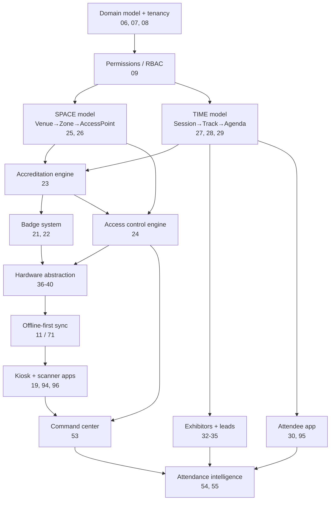

# ARZO Master Plan — Index

**Status:** Living document
**Last full code audit:** 2026-09-28
**Audited commit baseline:** `develop` @ `7dec84ca`
**Current platform maturity:** Ticketing & registration platform — production-capable in commerce, absent in on-site operations. Phase 0 defects closed; Phase 1 space/programme/identity schema in place (22 tables).
**Current roadmap phase:** Phase 1 in progress — Phase 0 complete, Phase 1 additive schema landed
**Documents:** 141 total — 34 WRITTEN (executable depth), 107 SCAFFOLD (purpose, verified current state, decisions, open questions)

---

## What this is

The blueprint for evolving ARZO from a self-serve ticketing platform into an end-to-end event
technology and operations platform.

ARZO today is a Hi.Events fork (AGPL-3.0, rebranded 2026-09). It models
`Order → Product → Attendee` and does that well. It has **no model of space** (zones, booths,
seats) and **no model of time within an event** (sessions, tracks, agenda). Those two absences
are the root cause of most capability gaps, and most of this plan follows from them.

## Evidence standard

Every claim in these documents carries one of these markers. This is enforced, not decorative —
a plan that overstates what exists produces a roadmap that under-budgets.

| Marker | Meaning |
|---|---|
| `CONFIRMED` | Verified by reading code, schema, or a live query. File path or query cited. |
| `PARTIAL` | Exists but incomplete, or exists in a shape unsuited to the target use |
| `PROTOTYPE` | Works in a narrow path; not production-hardened |
| `PRODUCTION READY` | Confirmed complete against the §128 definition of done |
| `MISSING` | Verified absent — searched and not found |
| `UNVERIFIED` | Not yet checked. **Never** treat as either present or absent. |

`UNVERIFIED` is a real state and appears in these documents. It is not a failure; an unaudited
claim marked honestly is more useful than a guess.

## Reading order

New readers, in order:

1. `01-executive-vision.md` — what ARZO is becoming and why
2. `02-current-state-audit.md` — **authoritative** record of what exists today
3. `03-gap-analysis.md` — the delta, grouped by root cause
4. `05-product-architecture.md` — the target shape
5. `06-domain-model.md` — **authoritative** entity model
6. `113-roadmap.md` — dependency-ordered sequence
7. `136-master-backlog.md` — executable work items

Executives who want the short version: `01`, then §"Bottom line" of `03`, then `113`.

## Authority

Documents are either **authoritative** (the source of truth for their subject; change them first)
or **derived** (restatements or expansions; must be updated when their source changes).

| Authoritative | Governs |
|---|---|
| `02-current-state-audit.md` | What exists today, with evidence |
| `06-domain-model.md` | Entities, relationships, lifecycle |
| `07-database-evolution.md` | Schema change sequence |
| `09-permissions-and-roles.md` | The authorization model |
| `113-roadmap.md` | Phase order and dependencies |
| `128-definition-of-done.md` | What "complete" means |
| `136-master-backlog.md` | Work items and priority |

Derived: `03`, `109`, `110`, `111`, `140`, and all phase documents (`114`–`118`).
If a derived document contradicts its source, the source wins and the derived document is stale.

## Dependency spine

The order below is derived from the code audit, not from difficulty. Each layer is unbuildable
until the one above it exists.

**The two hard constraints this graph encodes:**

1. **Access control cannot precede the space model.** A rules engine needs somewhere to point.
2. **Offline-first cannot precede hardware abstraction.** Sync semantics depend on what devices do.

Attempting either out of order produces rework, which is why the roadmap is not ordered by
difficulty.

## Document register

Status values: `WRITTEN` (complete to executable depth) · `SCAFFOLD` (purpose, dependencies and
open questions captured; expand before executing) · `PENDING`.

### Strategy & audit

| Doc | Purpose | Status |
|---|---|---|
| `00-master-index.md` | This file | WRITTEN |
| `01-executive-vision.md` | Target state, business rationale, non-goals | WRITTEN |
| `02-current-state-audit.md` | Capability-by-capability audit with evidence | WRITTEN |
| `03-gap-analysis.md` | Gaps grouped by root cause | WRITTEN |
| `04-product-strategy.md` | Positioning, buyer, build-vs-partner | WRITTEN |
| `05-product-architecture.md` | Target system architecture | WRITTEN |

### Foundation

| Doc | Purpose | Status |
|---|---|---|
| `06-domain-model.md` | Complete entity model | WRITTEN |
| `07-database-evolution.md` | Migration sequence, 72 → target | WRITTEN |
| `08-multi-tenancy.md` | Tenant isolation model | WRITTEN |
| `09-permissions-and-roles.md` | RBAC/ABAC replacing the 3-role enum | WRITTEN |

### Commerce & registration (largely exists)

| Doc | Purpose | Status |
|---|---|---|
| `10-registration-platform.md` | Registration flows | WRITTEN |
| `11-ticketing-commerce.md` | Products, orders, checkout | WRITTEN |
| `12-rsvp-registration.md` | RSVP as distinct from ticketing | WRITTEN |
| `13-pricing-and-promotions.md` | Tiers, early bird, promos | SCAFFOLD |
| `14-waitlist-and-capacity.md` | Waitlists, capacity pools | SCAFFOLD |
| `15-payments-invoicing-vat.md` | Payments, invoices, VAT | SCAFFOLD |
| `16-attendee-management.md` | Attendee lifecycle | SCAFFOLD |

### On-site operations (the main gap)

| Doc | Purpose | Status |
|---|---|---|
| `17-onsite-registration.md` | Walk-in / at-door registration | SCAFFOLD |
| `18-check-in.md` | Check-in engine evolution | WRITTEN |
| `19-kiosk-system.md` | Self-service kiosk | SCAFFOLD |
| `20-queue-management.md` | Queue modelling | SCAFFOLD |
| `21-badge-management.md` | Badge lifecycle, print jobs | WRITTEN |
| `22-badge-design-printing.md` | Designer + print pipeline | SCAFFOLD |
| `23-accreditation.md` | Accreditation engine | WRITTEN |
| `24-access-control.md` | Rules engine | WRITTEN |
| `25-zones-and-permissions.md` | Space model | WRITTEN |
| `26-seating-management.md` | Seat maps, assignment | SCAFFOLD |

### Programme

| Doc | Purpose | Status |
|---|---|---|
| `27-sessions-tracks.md` | Session/track model | WRITTEN |
| `28-speakers-management.md` | Speaker profiles, slots | SCAFFOLD |
| `29-agenda-scheduling.md` | Agenda, conflicts, calendar | SCAFFOLD |
| `30-mobile-event-app.md` | Attendee app scope | SCAFFOLD |
| `31-networking.md` | Networking, meetings | SCAFFOLD |

### Exhibitors

| Doc | Purpose | Status |
|---|---|---|
| `32-exhibitor-management.md` | Exhibitor entity, portal | SCAFFOLD |
| `33-exhibitor-lead-capture.md` | Lead capture + scoring | SCAFFOLD |
| `34-sponsor-management.md` | Sponsor packages | SCAFFOLD |
| `35-booth-management.md` | Booths as space | SCAFFOLD |

### Hardware

| Doc | Purpose | Status |
|---|---|---|
| `36-rfid-nfc.md` | RFID/NFC credentials | SCAFFOLD |
| `37-hardware-integration.md` | Vendor-swappable abstraction | SCAFFOLD |
| `38-scanner-platform.md` | Scanner abstraction | SCAFFOLD |
| `39-printer-integration.md` | Printer abstraction | SCAFFOLD |
| `40-device-management.md` | Registration, health, fleet | SCAFFOLD |

### Marketing, API, integrations

| Doc | Purpose | Status |
|---|---|---|
| `41-event-marketing.md` | Campaign tooling | SCAFFOLD |
| `42-email-marketing.md` | Segmentation, automation | SCAFFOLD |
| `43-sms-notifications.md` | SMS provider integration | SCAFFOLD |
| `44-push-notifications.md` | Push infrastructure | SCAFFOLD |
| `45-affiliate-referrals.md` | Existing affiliate system | SCAFFOLD |
| `46-promo-codes.md` | Existing promo system | SCAFFOLD |
| `47-crm-integrations.md` | HubSpot/Salesforce | SCAFFOLD |
| `48-api-platform.md` | Public API, keys, scopes | WRITTEN |
| `49-webhooks.md` | Existing webhook system | SCAFFOLD |
| `50-third-party-integrations.md` | Integration framework | SCAFFOLD |

### Intelligence

| Doc | Purpose | Status |
|---|---|---|
| `51-reporting.md` | Report catalogue | SCAFFOLD |
| `52-analytics.md` | Analytics architecture | SCAFFOLD |
| `53-live-event-command-center.md` | Event-day operations view | WRITTEN |
| `54-attendance-intelligence.md` | Attendance analytics | SCAFFOLD |
| `55-event-intelligence.md` | Cross-event intelligence | SCAFFOLD |

### Event operations (ARZO-as-operator)

| Doc | Purpose | Status |
|---|---|---|
| `56-event-operations.md` | Lifecycle workflow | SCAFFOLD |
| `57-manpower-and-staffing.md` | Staff, shifts, assignments | SCAFFOLD |
| `58-task-management.md` | Tasks, checklists | SCAFFOLD |
| `59-event-readiness.md` | Readiness gates | SCAFFOLD |
| `60-incident-management.md` | Incident capture | SCAFFOLD |
| `61-vendor-management.md` | Vendors | SCAFFOLD |
| `62-procurement.md` | Procurement | SCAFFOLD |
| `63-event-documentation.md` | Event record | SCAFFOLD |

### Security & compliance

| Doc | Purpose | Status |
|---|---|---|
| `64-security.md` | Security architecture, threat model | WRITTEN |
| `65-privacy-gdpr.md` | Privacy, existing GDPR flows | SCAFFOLD |
| `66-compliance.md` | PCI, local requirements | SCAFFOLD |
| `67-audit-logging.md` | Audit trail | SCAFFOLD |
| `68-fraud-prevention.md` | Existing spam checks, fraud | SCAFFOLD |

### Platform infrastructure

| Doc | Purpose | Status |
|---|---|---|
| `69-notifications-architecture.md` | Unified notification bus | SCAFFOLD |
| `70-background-jobs.md` | Queue architecture | SCAFFOLD |
| `71-realtime-architecture.md` | Realtime transport + offline sync | WRITTEN |
| `72-search.md` | Search strategy | SCAFFOLD |
| `73-file-management.md` | Media pipeline | SCAFFOLD |

### Non-functional

| Doc | Purpose | Status |
|---|---|---|
| `74-performance.md` | Targets with reasoning | WRITTEN |
| `75-scalability.md` | Scaling model | SCAFFOLD |
| `76-reliability.md` | Reliability targets | SCAFFOLD |
| `77-disaster-recovery.md` | DR design | SCAFFOLD |
| `78-observability.md` | Metrics, traces, logs | SCAFFOLD |

### Quality

| Doc | Purpose | Status |
|---|---|---|
| `79-testing-strategy.md` | Test strategy incl. hardware/offline | WRITTEN |
| `80-qa-strategy.md` | QA process | SCAFFOLD |
| `81-accessibility.md` | A11y standard | SCAFFOLD |
| `82-localization.md` | i18n, RTL/Arabic | SCAFFOLD |

### DevOps

| Doc | Purpose | Status |
|---|---|---|
| `83-devops.md` | Pipeline | SCAFFOLD |
| `84-infrastructure.md` | Target infrastructure | SCAFFOLD |
| `85-deployment.md` | Deployment model | SCAFFOLD |
| `86-monitoring.md` | Monitoring + alerting | SCAFFOLD |

### Surfaces

| Doc | Purpose | Status |
|---|---|---|
| `87-ui-ux-system.md` | UX principles per surface | SCAFFOLD |
| `88-design-system.md` | ARZO design system | SCAFFOLD |
| `89-admin-platform.md` | Platform admin | SCAFFOLD |
| `90-organizer-platform.md` | Organizer surface | SCAFFOLD |
| `91-attendee-platform.md` | Attendee surface | SCAFFOLD |
| `92-staff-platform.md` | Staff surface | SCAFFOLD |
| `93-exhibitor-platform.md` | Exhibitor surface | SCAFFOLD |

### Applications

| Doc | Purpose | Status |
|---|---|---|
| `94-mobile-scanner.md` | Scanner app | SCAFFOLD |
| `95-mobile-event-app.md` | Attendee app build | SCAFFOLD |
| `96-kiosk-application.md` | Kiosk app | SCAFFOLD |
| `97-onsite-operations-app.md` | Ops app | SCAFFOLD |

### Commercial

| Doc | Purpose | Status |
|---|---|---|
| `98-commercial-model.md` | SaaS vs services | SCAFFOLD |
| `99-pricing.md` | Pricing | SCAFFOLD |
| `100-saas-tenancy.md` | SaaS packaging | SCAFFOLD |
| `101-enterprise.md` | SSO, SAML, SCIM | SCAFFOLD |

### Hardware & on-site

| Doc | Purpose | Status |
|---|---|---|
| `102-hardware-procurement.md` | What to buy, cost envelope | SCAFFOLD |
| `103-hardware-deployment.md` | Staging, imaging, spares | SCAFFOLD |
| `104-onsite-infrastructure.md` | Network, power, contingency | SCAFFOLD |

### Operating model

| Doc | Purpose | Status |
|---|---|---|
| `105-event-lifecycle.md` | Lead → closeout | SCAFFOLD |
| `106-event-operating-model.md` | Roles, RACI | SCAFFOLD |
| `107-event-day-runbook.md` | Event-day procedure | SCAFFOLD |
| `108-post-event-closeout.md` | Closeout | SCAFFOLD |

### Competitive

| Doc | Purpose | Status |
|---|---|---|
| `109-feature-matrix.md` | Full feature matrix | SCAFFOLD |
| `110-evento-comparison.md` | Evento comparison | WRITTEN |
| `111-competitive-gap-closure.md` | Parity plan | SCAFFOLD |
| `112-arzo-differentiators.md` | Beyond parity | WRITTEN |

### Roadmap

| Doc | Purpose | Status |
|---|---|---|
| `113-roadmap.md` | Dependency-ordered roadmap | WRITTEN |
| `114-phase-1.md` | Foundation | WRITTEN |
| `115-phase-2.md` | Accreditation, badges, access | SCAFFOLD |
| `116-phase-3.md` | Programme, exhibitors | SCAFFOLD |
| `117-phase-4.md` | Hardware, offline, kiosk | SCAFFOLD |
| `118-phase-5.md` | Intelligence, AI | SCAFFOLD |

### Delivery

| Doc | Purpose | Status |
|---|---|---|
| `119-dependency-map.md` | Full dependency graph | SCAFFOLD |
| `120-risk-register.md` | Risks | WRITTEN |
| `121-technical-debt.md` | Known debt | SCAFFOLD |
| `122-migration-plan.md` | Data migration | SCAFFOLD |
| `123-release-strategy.md` | Release process | SCAFFOLD |

### Verification

| Doc | Purpose | Status |
|---|---|---|
| `124-security-testing-plan.md` | Security testing | SCAFFOLD |
| `125-performance-testing-plan.md` | Load/perf testing | SCAFFOLD |
| `126-disaster-recovery-plan.md` | DR runbook | SCAFFOLD |
| `127-production-readiness.md` | Readiness review | SCAFFOLD |
| `128-definition-of-done.md` | 100% definition | WRITTEN |
| `129-quality-gates.md` | Gates | SCAFFOLD |
| `130-launch-checklist.md` | Launch | SCAFFOLD |
| `131-event-readiness-checklist.md` | Per-event readiness | SCAFFOLD |

### Future

| Doc | Purpose | Status |
|---|---|---|
| `132-future-capabilities.md` | Longer-term | SCAFFOLD |
| `133-ai-capabilities.md` | AI, assessed for feasibility | WRITTEN |
| `134-advanced-analytics.md` | Advanced analytics | SCAFFOLD |
| `135-global-expansion.md` | Beyond Qatar | SCAFFOLD |

### Execution

| Doc | Purpose | Status |
|---|---|---|
| `136-master-backlog.md` | Full backlog | WRITTEN |
| `137-engineering-work-packages.md` | Work packages | SCAFFOLD |
| `138-acceptance-criteria.md` | Reusable criteria | SCAFFOLD |
| `139-test-matrix.md` | Traceability matrix | SCAFFOLD |
| `140-final-100-percent-checklist.md` | The 100% checklist | WRITTEN |

## Keeping this synchronized

The plan decays the moment code lands without the documents moving. Every merged feature must
update, in the same PR:

1. `02-current-state-audit.md` — status + evidence
2. `109-feature-matrix.md` — matrix row
3. `136-master-backlog.md` — item status
4. `140-final-100-percent-checklist.md` — checklist line
5. `139-test-matrix.md` — traceability
6. This index's register, if a document's status changed

`129-quality-gates.md` makes this a merge gate rather than a good intention.

## Terminology

Used precisely throughout. The first four are routinely conflated, and conflating them is how
access-control bugs get shipped.

| Term | Meaning |
|---|---|
| **Event** | The thing being run. Owns products, settings, programme. |
| **Occurrence** | A repeat of the whole event (RRULE). **Not** a session. |
| **Session** | A programme item *within* an occurrence — talk, workshop, meeting. Has room, time, capacity, speakers. |
| **Activity** | Non-programme happening (catering, transport). No speakers. |
| **Access window** | When a credential may pass an access point. |
| **Registration window** | When registration is open. |
| **Sale window** | When a price is purchasable. Drives early-bird. |
| **Zone** | A controlled space. Access is granted to zones, not rooms. |
| **Access point** | A physical door/gate where a scan happens. Belongs to a zone. |
| **Accreditation** | A *type* of person (VIP, Media, Speaker) with an approval workflow. |
| **Credential** | The issued right to access. Realized as a badge. |
| **Badge** | The physical artifact carrying a credential. |
