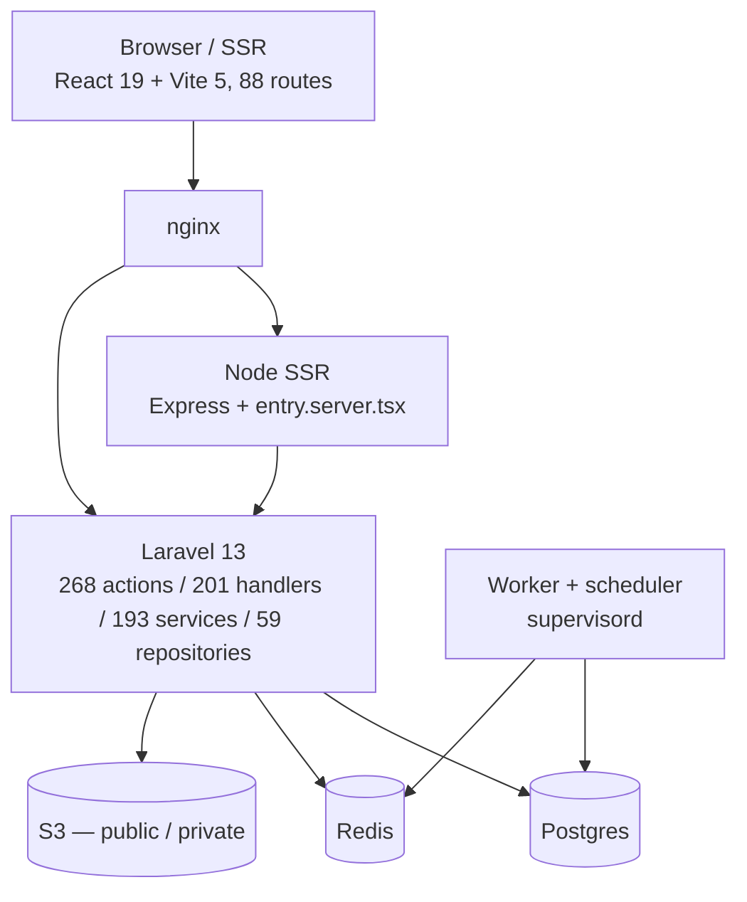
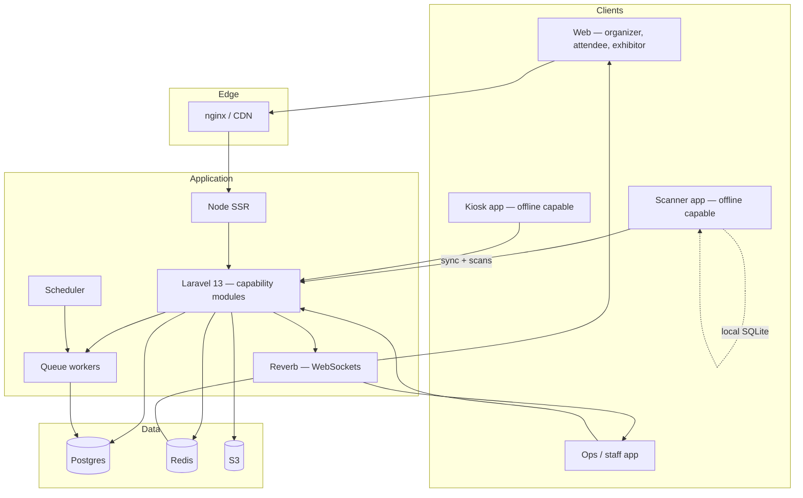

# Target Product Architecture

**Status:** WRITTEN · **Authority:** AUTHORITATIVE for system shape · **Audit date:** 2026-09-28
**Depends on:** `02-current-state-audit.md`, `06-domain-model.md`

---

## Current shape — `CONFIRMED`

Deployment is split: backend on Laravel Vapor (AWS Lambda, eu-west-1), frontend on DigitalOcean App
Platform, plus a single all-in-one container for self-hosting that runs nginx, php-fpm, node, a queue
worker and a scheduler under supervisord.

## The central decision: keep the monolith

**Extend inside the Laravel application. Do not extract services.**

The reasoning is specific, not dogmatic:

1. **The layering is sound.** Action → Handler → Domain Service → Repository is applied consistently
   across 268/201/193/59 classes. That is already a module boundary; it does not need a network hop
   to become one.
2. **No scaling wall was found.** The audit surfaced no evidence that Postgres or the monolith is the
   constraint. The real constraint is arrival-burst concurrency at gates, which offline-first
   addresses (`71`) — a service split would not help.
3. **Extracting services now would multiply the tenancy risk.** Tenant isolation currently rests on
   discipline (F11). Distributing it across service boundaries before the global scope exists would
   turn one hard problem into several.
4. **ARZO's team size is `UNVERIFIED`.** Microservices have a fixed operational cost that a small
   team pays disproportionately.

The one genuinely new runtime component is the realtime transport.

## Target shape

### Capability modules, not services

New subsystems are modules inside the monolith, each following the existing layering and owning its
own tables:

| Module | Owns | Doc |
|---|---|---|
| Space | venues, zones, access points, rooms, seats, booths | `25` |
| Programme | sessions, tracks, speakers, registrations, attendance | `27` |
| Accreditation | persons, accreditation types, applications, credentials | `23` |
| Access | rules, grants, access logs | `24` |
| Badging | templates, badges, print jobs | `21` |
| Exhibitors | exhibitors, staff, booth assignment, leads | `32` |
| Devices | registry, enrolment, sync state, health | `40` |
| Operations | staff, shifts, tasks, incidents, vendors | `56` |

A module may depend on another's **domain services**, never on its repositories directly. That keeps
a future extraction possible without requiring it now.

### Realtime — the one new component

`CONFIRMED`: there is no realtime capability today. `config/broadcasting.php` is Laravel's untouched
stub, the codebase reads the pre-Laravel-11 `BROADCAST_DRIVER` key (set to `log` where set at all),
no class implements `ShouldBroadcast`, and `routes/channels.php` references a namespace that does not
exist in this app.

Reverb is the choice (`71`): self-hosted, Redis-backed, no per-message cost, and attendee data stays
inside the perimeter.

**This does not fit Lambda.** Reverb needs a persistent process, so it is genuine new
infrastructure — ECS, a VM, or managed. That is a real cost of the command center, and `84` owns it.

### Offline devices are clients, not services

A scanner or kiosk holds a local replica and the **same** access decision function as the server
(`24`). It is an API client with a cache, not a node in the system. That framing matters: it keeps
the authoritative decision on the server and makes the device's divergence bounded and explainable
(`71`).

## What does not change

- The commerce core: products, prices, orders, checkout, tax, invoices, refunds
- The repository pattern and `runQuery()` state discipline
- Runtime env injection via `window.hievents` — one image across environments
- The embeddable widget
- Vapor + DigitalOcean deployment for web, all-in-one for self-host

## Known architectural debt to address in place

From the audit, each recorded in `121`:

| Item | Action |
|---|---|
| Two check-in write models (F10) | Consolidate onto `access_logs` (`18`) |
| Static tenant state, no global scopes (F11) | Request-scoped context + scope (`08`) |
| No declarative authorization (F12) | Policies (`09`) |
| Webhook payloads coupled to API resources (F14) | Versioned transformers (`48`, `49`) |
| `BaseRepository` stateful builder (F15) | Audit subclass `runQuery()` discipline |
| Two disagreeing hydration paths | Converge on `BaseRepository::hydrateDomainObjectFromModel()` |
| `ssrManifest` loaded and ignored | Emit preload hints (`74`) |

## Open questions

- **Does the command center need a read-optimized store?** Depends on load modelling (`74`, `125`). Do not build an OLAP pipeline speculatively; the rollup-table pattern already in use may suffice.
- **Where does badge rendering run?** It is CPU-heavy and event-day bursty. In-process risks starving web requests; a dedicated worker pool is more predictable. Decide with `22`.
- **Where does Reverb run**, and does it change the data-residency answer (`65`, `84`)?
- **Does the attendee app share the SSR frontend or become separate?** Affects `30`, `95`.

## Related

`02-current-state-audit.md` · `06-domain-model.md` · `08-multi-tenancy.md` ·
`71-realtime-architecture.md` · `74-performance.md` · `84-infrastructure.md` · `121-technical-debt.md`
