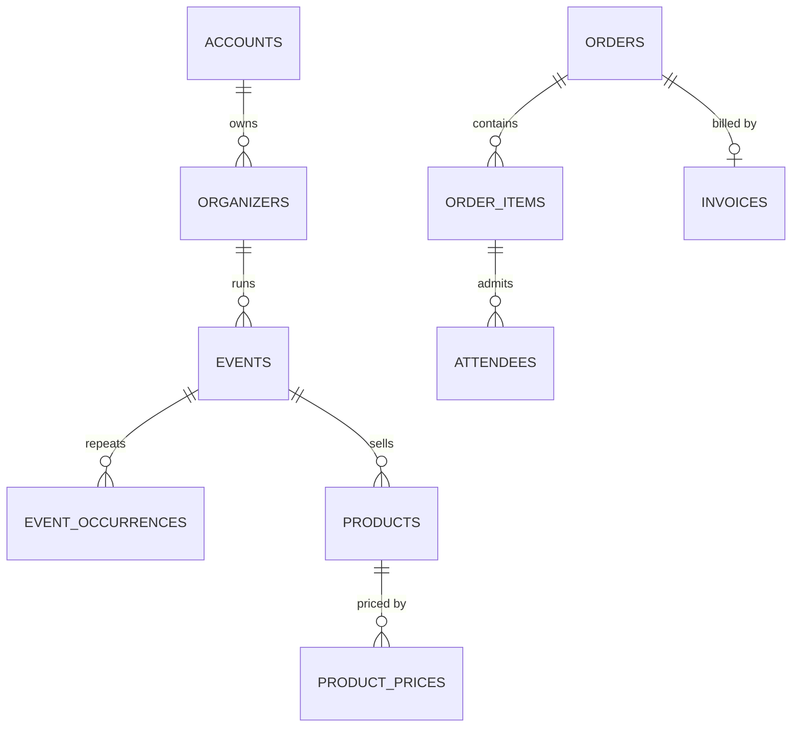
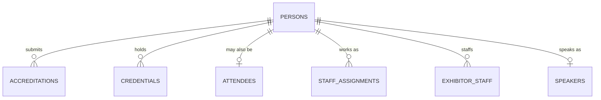
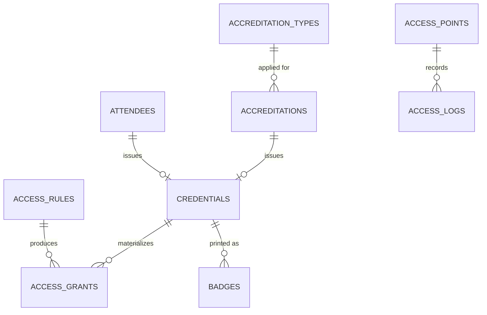

# Domain Model

**Status:** WRITTEN · **Authority:** AUTHORITATIVE for entities · **Audit date:** 2026-09-28

---

## Reading this

Existing entities are marked `CONFIRMED` with their live table name. New entities are marked `NEW`
and carry the document that owns them. Nothing here renames or removes an existing table.

The model has five clusters. The first (commerce) exists and is mature; the other four are mostly new.

## Cluster 1 — Commerce · exists

| Entity | Table | State |
|---|---|---|
| Account | `accounts` | `CONFIRMED` — tenant root, 15 inbound refs |
| Organizer | `organizers` | `CONFIRMED` |
| Event | `events` | `CONFIRMED` — the hub, 24 inbound refs |
| Occurrence | `event_occurrences` | `CONFIRMED` — RRULE repeat, **not a session** |
| Product | `products` | `CONFIRMED` |
| ProductPrice | `product_prices` | `CONFIRMED` — incl. TIERED |
| Order / OrderItem | `orders`, `order_items` | `CONFIRMED` |
| Attendee | `attendees` | `CONFIRMED` — only 3 inbound FKs; a **leaf** |
| Payment / Refund | `stripe_payments`, `order_refunds` | `CONFIRMED` |
| Invoice / Tax | `invoices`, `tax_and_fees` | `CONFIRMED` |
| PromoCode / Affiliate | `promo_codes`, `affiliates` | `CONFIRMED` |

**No changes** to this cluster beyond a nullable `attendees.person_id`.

## Cluster 2 — People · mostly new

The key decision: **`persons` is a new thin identity record**, not a widening of `attendees`.
`attendees` is order-bound and a leaf; a journalist has no order.

| Entity | State | Doc |
|---|---|---|
| Person | `NEW` | `23` |
| User | `CONFIRMED` `users` + `account_users` | `09` |
| Speaker | `NEW` | `28` |
| Staff / StaffAssignment / Shift | `NEW` | `57` |
| Exhibitor / ExhibitorStaff | `NEW` | `32` |
| Sponsor | `NEW` | `34` |
| Vendor | `NEW` | `61` |

## Cluster 3 — Space · all new

See `25-zones-and-permissions.md`. `locations` is retained unchanged as the addressing layer;
`venues.location_id` links to it.

| Entity | State | Note |
|---|---|---|
| Location | `CONFIRMED` `locations` | Flat geocoded address. Unchanged. |
| Venue | `NEW` | Reusable across events |
| Building / Floor | `NEW` | Optional middle of the hierarchy |
| **Zone** | `NEW` | The unit of access control; self-nesting |
| **AccessPoint** | `NEW` | Where a scan happens; has direction |
| Room | `NEW` | Where programme happens |
| Seat | `NEW` | Only for reserved seating |
| Booth | `NEW` | Exhibitor space |

## Cluster 4 — Time and programme · all new

See `27-sessions-tracks.md`. Note the deliberate distinction from `event_occurrences`.

| Entity | State |
|---|---|
| Session | `NEW` |
| Track | `NEW` |
| SessionSpeaker | `NEW` |
| SessionRegistration | `NEW` |
| SessionAttendance | `NEW` — append-only, no unique constraint |
| SessionProduct | `NEW` |

## Cluster 5 — Accreditation and access · all new

See `23-accreditation.md` and `24-access-control.md`.

| Entity | State | Note |
|---|---|---|
| AccreditationType | `NEW` | Per event, extensible |
| Accreditation | `NEW` | The application + approval |
| **Credential** | `NEW` | The issued right. One-of CHECK across 4 sources. |
| AccessRule | `NEW` | Declarative predicate |
| AccessGrant | `NEW` | Materialized for fast and offline decisions |
| **AccessLog** | `NEW` | Append-only. **Supersedes** `attendee_check_ins`. |
| Badge / BadgeTemplate / BadgePrintJob | `NEW` | `21`, `22` |

### Why `access_logs` supersedes rather than extends

`CONFIRMED`: `attendee_check_ins` carries a UNIQUE index on `(attendee_id, check_in_list_id)`, and
check-out is a soft-delete. The schema therefore forbids re-entry and destroys history. A new
append-only table is the only way forward; the old one stays for rollback (`18`).

## Cluster 6 — Operations and devices · all new

| Entity | State | Doc |
|---|---|---|
| Device | `NEW` | `40` |
| Task / Checklist / ReadinessItem | `NEW` | `58`, `59` |
| Incident | `NEW` | `60` |
| Asset / Equipment / ProcurementItem | `NEW` | `62` |
| ApiKey | `NEW` | `48` |
| Webhook | `CONFIRMED` `webhooks` | `49` |

## Cross-cutting rules

**Tenancy.** Every new root entity carries `account_id` and is covered by the global scope
introduced in `08`. Child entities inherit through their parent but must still be reachable by an
`account_id` join — the current parent-only scoping is finding F11.

**Soft deletes.** Follow the existing convention (`deleted_at`) except for append-only tables
(`access_logs`, `session_attendance`), which are never deleted.

**Identifiers.** Auto-incrementing `id` plus a `short_id` for external reference, matching the
existing pattern. Credential `identifier` values are opaque random tokens — never sequential,
never derived from personal data.

**Timestamps.** Existing tables use `timestamp without time zone`. New programme and access tables
use `timestamptz`, because agenda and access-window correctness across timezones is exactly where
naive timestamps fail. This divergence is deliberate and recorded in `121`.

**Audit.** State transitions on accreditations, credentials, badges and access overrides are
audited (`67`).

**Deletion.** Personal data deletion must cascade through `persons`, `credentials`, `access_logs`
and `badges`. The existing `AnonymizationStrategy` is the pattern to extend, not replace (`65`).

## Related

`07-database-evolution.md` · `08-multi-tenancy.md` · `09-permissions-and-roles.md` ·
`23-accreditation.md` · `24-access-control.md` · `25-zones-and-permissions.md` ·
`27-sessions-tracks.md`
