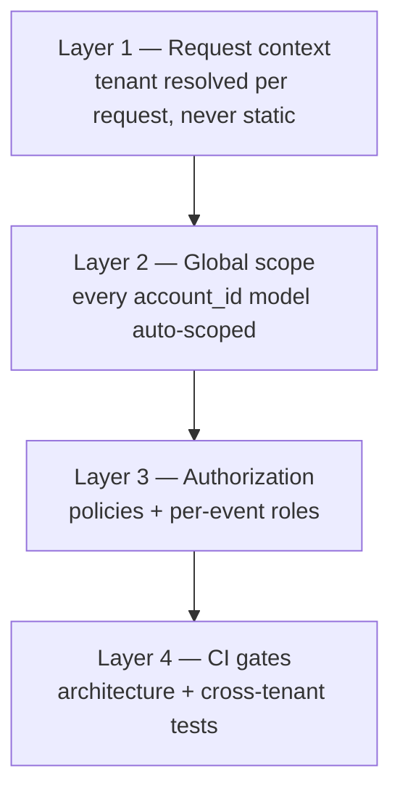

# Multi-Tenancy

**Status:** WRITTEN · **Authority:** AUTHORITATIVE for tenant isolation · **Audit date:** 2026-09-28
**Classification:** Extend + Infrastructure
**Depends on:** `09-permissions-and-roles.md`
**Blocks:** `48-api-platform.md`, `100-saas-tenancy.md`, `101-enterprise.md`

---

## Current state — `PARTIAL`, and the highest-risk area in the codebase

The hierarchy works. The *enforcement* is the problem.

`CONFIRMED`:

```
accounts (tenant root, 15 inbound refs)
  └── organizers (7 inbound refs)
        └── events (24 inbound refs)
              └── products, orders, attendees, …
```

`account_users` is the membership pivot, carrying `role`, `status` and `is_account_owner`.
`SetAccountContext` middleware reads `account_id` from the JWT on every API request.

### Four structural weaknesses

**1. No global scopes.** `grep addGlobalScope app/Models/` returns **zero**. Every query that must be
tenant-scoped is scoped by hand.

**2. Child resources are scoped by parent, not by account.** `GetProductsHandler` calls
`findByEventId($eventId)` with no `account_id` anywhere. Its safety depends *entirely* on the action
having called `isActionAuthorized($eventId, EventDomainObject::class)` first. **One omitted call is a
full cross-tenant read, with no second line of defence.**

**3. Tenant id lives in static mutable state.** `User::$currentAccountId` is a
`protected static ?int` set by middleware. In a queue worker, a console command, or any persistent
process (Octane/Swoole), that value survives across units of work — so a job can read a **stale
tenant**. When unset it throws `RuntimeException`, i.e. a 500 rather than a deny.

**4. `account_id` is baked into the JWT.** Membership revocation does not take effect until the
token refreshes. Partly mitigated: `validateUserStatus()` re-reads `account_users.status` on every
authorized call and force-logs-out non-ACTIVE users.

### What changed in Phase 0

`CrossTenantIsolationTest` (20 cases) now proves the boundary from outside: tenant A is refused on
17 of tenant B's endpoints, is absent from both listings, and cannot write to a foreign event.
`ActionAuthorizationTest` asserts every action authorizes or is explicitly declared public.

**This is detection, not defence.** The tests catch an omission in CI; they do not prevent one
reaching production if someone bypasses CI. Weaknesses 1–3 remain open.

Verified during Phase 0: removing a single `isActionAuthorized` call let tenant A read tenant B's
event with **HTTP 200**. That is the live failure mode, and the reason defence in depth matters.

## Target

Three independent layers, so no single omission is sufficient to leak data.



### Layer 1 — request-scoped tenant context

Replace `User::$currentAccountId` with a request-scoped container binding, resolved from the JWT by
middleware and explicitly *absent* outside an HTTP request.

For queue jobs, the tenant travels **in the job payload**, not ambiently. A job that needs an
account id takes it as a constructor argument. This is the same lesson as the SSR token leak fixed
in Phase 0: ambient mutable state plus concurrency equals cross-request bleed.

Unset context must **deny**, never throw a 500 — an exception is an information leak and an
availability bug.

### Layer 2 — tenant global scope

Every model with an `account_id` gets a scope that applies it automatically. Models reachable only
through a parent (`products` → `events`) get a scope that joins to the tenant root, so
`findByEventId()` becomes safe even when the caller forgets.

Two explicit escape hatches, both auditable:

| Case | Mechanism |
|---|---|
| Platform admin (`/admin/*`) reading across tenants | Explicit `withoutTenantScope()`, allowed only under a SUPERADMIN policy |
| Public storefront (`/public/*`) | Scoped by the resource itself (event short id), not by account |

The escape hatch must be **loud**: a named method, greppable, covered by its own test. A silent
bypass flag would recreate the current problem.

### Layer 3 — authorization

Policies plus per-event roles (`09`). Authorization answers *may this actor act on this resource*;
the global scope answers *can this actor see this row at all*. Both, not either.

### Layer 4 — CI gates

Already in place from Phase 0. Extend the cross-tenant suite as each new subsystem lands:
accreditation, credentials, badges, sessions, exhibitors, devices. A new tenant-scoped table
without a cross-tenant test is an untested boundary.

## Isolation guarantees

What ARZO can honestly claim, per phase:

| Guarantee | Today | After Phase 1 |
|---|---|---|
| Tenant A cannot read tenant B via the API | Tested | Tested + scoped |
| A forgotten authorization check leaks data | **Yes** | No — scope catches it |
| A queue job can act on the wrong tenant | **Possible** | No — tenant is explicit in the payload |
| Platform admin cross-tenant access is audited | Partial | Yes |
| Database-level isolation (RLS) | No | No — see open questions |

The middle row is the one to fix first; it is the difference between "we test for it" and "it cannot
happen".

## Migration

| Step | Change | Risk |
|---|---|---|
| 1 | Introduce request-scoped tenant context alongside the static property | Low |
| 2 | Move `User::currentAccount()` / `currentAccountUser()` onto it | Medium |
| 3 | Audit every queue job for ambient tenant reads; pass ids explicitly | Medium |
| 4 | Add the global scope to account-owned models, one at a time, each with a test | Medium |
| 5 | Add parent-join scopes to child models | **High** — touches hot query paths |
| 6 | Remove `User::$currentAccountId` | Low once 2–3 are done |

Step 5 is the risky one: adding a join to `products` or `attendees` queries affects performance on
the busiest paths. Measure before and after (`74`), and consider a denormalized `account_id` column
on high-traffic child tables instead of a join — `events` is already denormalized onto many tables
for exactly this reason.

## Open questions

- **Postgres Row-Level Security?** It would make isolation absolute rather than application-enforced. Cost: every connection must set a session variable, and the repository layer's `runQuery()` state handling makes that easy to get wrong. Worth it for a high-assurance client; overkill otherwise. Not planned.
- **Denormalize `account_id` onto hot child tables** instead of joining in the scope? Faster, but it is another column that can drift. The codebase already does this with `event_id`.
- **Should organizers be a tenancy boundary too?** Today any account member can act across all of the account's organizers. A multi-brand agency may want organizer-level isolation. Needs a customer asking before building.
- **Cross-tenant venue sharing** (`25`) — deliberately refused for now; a shared platform venue registry crosses this boundary.

## Related

`09-permissions-and-roles.md` · `02-current-state-audit.md` (F11) · `48-api-platform.md` ·
`64-security.md` (T1) · `74-performance.md` · `100-saas-tenancy.md` · `120-risk-register.md` (R2)
