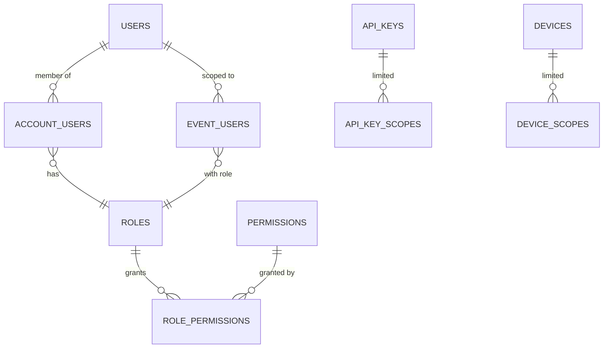

# Permissions and Roles

**Status:** WRITTEN · **Authority:** AUTHORITATIVE for authorization · **Audit date:** 2026-09-28
**Classification:** Replace

---

## Current state — `PARTIAL`, 25%, and the weakest area found

`CONFIRMED` by reading the code:

| Fact | Evidence |
|---|---|
| Exactly 3 roles | `Enums/Role.php` — `SUPERADMIN`, `ADMIN`, `ORGANIZER` |
| No policies, no gates | `AuthServiceProvider` has `$policies = []`, empty `boot()`, `Gate` import commented out. No `app/Policies/`. |
| Authorization is imperative | 159 `isActionAuthorized()` + 50 `minimumAllowedRole()` call sites |
| **The default role gate is a no-op** | `validateUserRole()` has branches for ADMIN and SUPERADMIN only. `Role::ORGANIZER` — the default — checks nothing. |
| Only 6 entity types authorizable | `match` over Event, Account, User, TaxAndFees, Organizer, Image — **no default arm**, so a 7th type throws `UnhandledMatchError` (500, not 403) |
| No per-event permissions | Any ORGANIZER in an account can act on **every** event in that account |
| `/admin` not group-gated | Route group carries only `auth:api`; SUPERADMIN is per-action, so a forgotten check exposes an admin endpoint |
| Role/account baked into the JWT | A role change does not take effect until token refresh |
| Effectively untested | Only **7 of 268** Actions have a Feature test |

The file carries its own admission: `@todo This is a very simplistic way of handling roles`.

**Mitigation that does exist:** `validateUserStatus()` re-reads `account_users.status` on every
authorized call and force-logs-out non-ACTIVE users, so deactivation is immediate.

## Why this must be replaced, not extended

Everything multi-party in this plan needs granularity the current model cannot express:

| Need | Blocked by |
|---|---|
| A scanner operator who can check in but not refund | No capability model |
| A media officer who approves only MEDIA accreditation | No delegation |
| Event staff scoped to one event | No per-event roles |
| An exhibitor seeing only their own leads | No per-resource permissions |
| An API key with read-only scope | No scopes |
| A device key that can only submit scans | No non-user principals |

## Target model

**RBAC with capabilities, plus ABAC where resource attributes matter.**



### Permissions

Named capabilities, not booleans on a role. Format `resource.action`:

```
event.view  event.create  event.update  event.publish  event.delete
product.*   order.view    order.refund
attendee.view  attendee.checkin  attendee.edit
accreditation.view  accreditation.approve  accreditation.reject
credential.issue  credential.revoke
badge.print  badge.reprint  badge.void
access.override  access.logs.view
zone.manage  venue.manage
session.manage  speaker.manage
exhibitor.manage  lead.view
device.manage  device.submit_scan
report.view  report.export
staff.manage  incident.manage
account.manage  user.manage  apikey.manage
```

### Roles

Named bundles of permissions, seeded and then editable per account. The three existing roles map
forward so nothing breaks:

| Role | Maps from | Scope |
|---|---|---|
| `SUPERADMIN` | existing | Platform |
| `ACCOUNT_OWNER` / `ADMIN` | existing ADMIN | Account |
| `ORGANIZER` | existing ORGANIZER | Account or per-event |
| `EVENT_MANAGER` | new | Per event |
| `CHECKIN_OPERATOR` | new | Per event — `attendee.checkin` only |
| `ACCREDITATION_OFFICER` | new | Per event — approve/reject |
| `BADGE_OPERATOR` | new | Per event — print/reprint |
| `EXHIBITOR` | new | Own exhibitor record only |
| `SPEAKER` | new | Own sessions only |
| `VIEWER` | new | Read-only |

### Per-event scoping

```
event_users   id, event_id, user_id, role_id, granted_by, granted_at,
              expires_at NULL, timestamps
              UNIQUE (event_id, user_id)
```

Resolution: account-level role grants baseline permissions; `event_users` grants additional or
narrower permissions for that event. A CHECKIN_OPERATOR on event A has no access to event B.

`expires_at` matters operationally — temporary staff should lose access automatically after the
event, not when someone remembers.

### Non-user principals

Three kinds of actor, one authorization model:

| Principal | Auth | Scopes |
|---|---|---|
| User | JWT (existing) | Role + per-event |
| API key | `Bearer` key (`48`) | Explicit scope list |
| Device | Device key (`40`) | Usually `device.submit_scan` only |

A device holding `device.submit_scan` and nothing else is the concrete answer to F3 — a lost
tablet cannot do anything except submit scans, and its key is revocable independently.

## Enforcement — three layers, because one is not enough

The present failure mode is a single layer that can be forgotten.

1. **Declarative policies.** Laravel policies per entity, replacing the 6-arm `match`. A new entity
   type gets a policy, not a new match arm; an unhandled type denies rather than 500s.
2. **Tenant global scope.** Every `account_id`-bearing model scoped automatically (`08`). Defence in
   depth: a forgotten authorization check no longer leaks another tenant's rows.
3. **Architecture tests in CI.** Every non-public Action must authorize; no Eloquent above
   repositories. This converts the convention into a mechanical guarantee (Phase 0, `129`).

Layer 3 is the one that makes the other two durable.

## Migration

| Step | Change | Risk |
|---|---|---|
| 1 | Create `permissions`, `role_permissions`, `event_users`; seed roles matching current behaviour | Low |
| 2 | Introduce `Gate`/policies alongside `isActionAuthorized`; both must agree | Medium |
| 3 | Add the tenant global scope; verify with the cross-tenant test suite | Medium |
| 4 | Migrate Actions to policies incrementally, behind the architecture test | **High** — 159 sites |
| 5 | Add per-event roles and new role types | Low |
| 6 | Add API key and device scopes | Low |
| 7 | Remove `isActionAuthorized` once no callers remain | Low |

Step 4 is the risk. It must be sequenced **after** the Phase 0 cross-tenant test suite exists,
otherwise a regression is invisible until a customer finds it.

Seeded roles must reproduce today's effective permissions exactly, so step 1 is a no-op behaviourally.

## Open questions

- **Is `ORGANIZER` currently intended to be unrestricted within an account?** The no-op gate may be deliberate or a bug. Changing it could break existing customer expectations — confirm before tightening.
- **Custom roles per account?** Flexible and a support burden. Recommend seeded roles first, custom later if asked.
- **Should the JWT carry permissions, or should they be read per request?** In-token is fast but stale; per-request is correct but adds a lookup. Leaning per-request with a short cache, given the existing staleness problem.
- **Permission inheritance across the account → organizer → event hierarchy** — needs explicit rules to avoid surprising grants.

## Related

`08-multi-tenancy.md` · `23-accreditation.md` (approval delegation) · `40-device-management.md` ·
`48-api-platform.md` · `64-security.md` · `92-staff-platform.md` · `93-exhibitor-platform.md` ·
`129-quality-gates.md`
