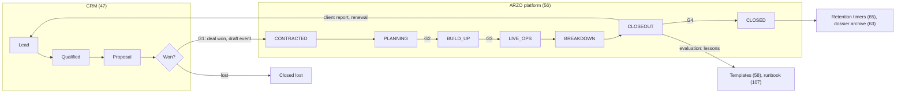

# Event Lifecycle

**Status:** WRITTEN · **Audit date:** 2026-09-29 · **Baseline:** `develop` @ `e7228c1d`
**Classification:** Process · **Priority:** P3 — software via ARZ-201, ARZ-204, ARZ-180 · **Phase:** process now; software in Phase 5
**Depends on:** `56-event-operations.md`, `47-crm-integrations.md`
**Blocks:** `106-event-operating-model.md`, `108-post-event-closeout.md`

---

The whole life of an operated event, from the first sales lead to the archived record, with the
owner, the system of record and the exit condition of each stage. `56` models the operational stages
and gates inside the platform; `47` keeps the sales pipeline in the CRM. This document joins them
and adds what neither covers: evaluation, archive, and what lives in documents rather than in either
system.

## Current state — `PARTIAL`, ~30%

| Stage | State | Evidence |
|---|---|---|
| Lead, qualification, proposal | `MISSING` in the platform **by design**; no CRM integration either | `47`; no HubSpot, Salesforce or Pipedrive code in `app/` or `config/` |
| Contract — G1 | `MISSING` — nowhere to record a contract or deal reference | No `event_operations` table (live DB, 109 tables) |
| Draft event from a template | `PARTIAL` — duplication copies commerce configuration and none of the ARZO tables | `DuplicateEventService` (`56`) |
| Planning, build-up | `PARTIAL` — venues, zones, accreditation and programme tables exist; no stages, gates or tasks | `56`, `58` |
| Commerce state | `CONFIRMED` — `EventStatus` `DRAFT`/`LIVE`/`ARCHIVED`/`PENDING_MANUAL_REVIEW`; lifecycle `UPCOMING`/`ONGOING`/`ENDED` computed from dates | `Status/EventStatus.php`; `EventDomainObject.php:320-341` |
| Live operations | `PARTIAL` — check-in; the access-scan route was uncommitted, in progress at audit time | `18`, `38` |
| Closeout and evaluation | `PARTIAL` — nine commerce reports; no G4, no benchmark facts, no lessons record | `51`, `108` |
| Archive | `MISSING` — no dossier; anonymization runs only on account deletion | `AccountDeletionService.php:81-86,188-232`; `63` |
| Status back to the CRM | `PARTIAL` — `event.created/updated/archived` webhooks exist, but retries never run (W1) and `event.*` goes to the default queue (W10) | `49` |

## The lifecycle

| Stage | Starts when | Owner | System of record | Exit |
|---|---|---|---|---|
| Lead → proposal | Enquiry | Commercial | CRM | Won or lost |
| **G1 Contracted** | Contract signed | Commercial | CRM (deal); document store (contract); platform (`contract_reference`, `crm_deal_id`) | Draft event exists |
| Planning | G1 | Event Director | Platform + team PM tool (`58`) | **G2** plan approved |
| Build-up | `build_up_starts_at` | Duty Manager | Platform | **G3** go / no-go (`59`, `131`) |
| Live ops | `doors_open_at` | Duty Manager | Platform | Last exit |
| Breakdown | Last exit | Device Lead, Duty Manager | Platform | `breakdown_ends_at`; devices synced (`103`) |
| Closeout **and evaluation** | Breakdown ends | Duty Manager | Platform + dossier | **G4** (`108`) |
| Closed | G4 | — | Platform | Retention timers run (`65`) |
| Archive | Retention elapses | Data Protection Lead | Dossier (`63`), `event_benchmark_facts` (`55`) | Personal data gone; aggregates kept |

Owners are the operating roles of `106`.

## Decision: two systems, one hand-off

`56` and `47` both concluded that the pipeline stays in the CRM, and nothing found here argues
otherwise. A CRM is someone else's core competence (`04`), and ARZO's operations begin when a deal
becomes an event. The hand-off is a single event — **deal won → draft event** — carrying client,
dates, venue and expected size.

Until API keys exist (ARZ-090) the CRM cannot call ARZO, so the hand-off is manual. That is fine at
ARZO's current volume, provided it is a checklist rather than a habit:

1. Commercial marks the deal won and names the Event Director.
2. The Event Director duplicates the closest past event or template (`56`), then **resets every
   check-in list's activation and expiry** — duplication keeps the original's absolute times (`56`).
3. The deal id and contract reference go into the dossier (`63`). There is no platform field until
   `event_operations` exists; do not improvise one in `events.attributes`.
4. Timeline dates are set; planning tasks are created from the template.

Back to the CRM, deliberately little: event status by webhook through Zapier once W1 is fixed, the
client report link at G4, and a renewal opportunity at evaluation. Nothing else flows back — ARZO
has no reason to push attendee data into its own sales CRM (`47` problem B is a separate decision).

## What lives where

| Artefact | System of record | Why there |
|---|---|---|
| Lead, contacts, proposal, price negotiation | CRM | Its core competence; `04` non-goal |
| Signed contract, statement of work | Document store; referenced by the platform | Legal documents have their own system and retention |
| Client company | Platform `companies` (`32`), mapped to the CRM account | Operations need it; sales own it |
| Event configuration: products, programme, zones, accreditation, access rules | Platform | Only the platform can execute it |
| General project tasks — caterer, hotels | Team PM tool (`58`) | Duplicating a PM tool guarantees neither is used |
| Event-anchored, verifiable tasks; readiness; gate decisions | Platform (`58`, `59`, `56`) | Only the platform can see the data |
| Venue certificates, insurance, risk assessments, floor plans | Files attached as task evidence (`73`), indexed by the dossier | Evidence for a gate, not free-floating documents |
| Vendor contracts, purchase orders, costs | Finance, with cost capture per event (`61`, `62`, ARZ-203) | Not an accounting system (`04`) |
| Client invoice, event P&L | Accounting system | Same |
| Attendance, access, incidents, device health | Platform | Append-only logs are the evidence |
| Client report | Generated by the platform; delivered as a document; a copy in the dossier | ARZ-222; `108` |
| Lessons learned | Platform templates (`58`), runbook (`107`), dossier | Where the next event will actually read them |
| Benchmarks | `event_benchmark_facts` (`55`) | Aggregates that outlive the personal data |

## Decision: evaluation happens inside closeout, before G4

The scaffold lists evaluation after closeout. **Move it inside.** Once an event is marked closed,
nobody reconvenes; a retrospective scheduled "after" is a retrospective that does not happen. So
G4 (`108`) requires the lessons to be recorded, each with an owner and a target — a template item,
a runbook line, a backlog entry — and the client report to be delivered.

Evaluation has two audiences. The **client's** is the post-event report and whatever satisfaction
feedback the contract calls for; a survey tool is not built here (`04`: not a marketing suite). The
**internal** one is the blameless retrospective that feeds templates. This is the scaffold's point
made concrete: closeout is where repeat events get cheaper.

## Decision: a cancelled event still closes out

`56` makes `CANCELLED` terminal from planning and build-up. The stage is terminal; the obligations
are not. Refunds (commerce), revocation of issued credentials, sanitization of any device already
staged (`103`), release of held booths (`35`) and the dossier all still apply. Record them as closeout
tasks on the cancelled event rather than adding a stage — the lightest change that stops them being
forgotten.

## Adoption

`56`'s warning governs: an unused workflow is worse than none. Start with the manual G1 hand-off, the
G3 decision and G4 as a checklist. Add software for each only when the team asks why it cannot
record something.

## Migration

| Step | Change | When |
|---|---|---|
| 1 | Manual G1 hand-off checklist; G4 checklist on paper (`108`) | Now |
| 2 | `event_operations` with `crm_deal_id`, `contract_reference`, timeline; `event_gate_decisions` | Phase 5 (`56` step 4) |
| 3 | Webhook retries (W1), so status reaches the CRM reliably | Now (`49` step 1) |
| 4 | Task templates carrying lessons forward | ARZ-201 |
| 5 | CRM workflow calls ARZO's API on deal won | After ARZ-090; ARZ-180 |
| 6 | Retention timers anchored to G4 | With `65` |

## Open questions

- **Which CRM does ARZO use?** `47` asks the same; the manual hand-off works with any, the automated one waits on the answer.
- **Who is "Commercial" at G1** — one sales owner, or whoever signed? The Event Director must be named at the same moment, or the event has no owner between G1 and G2.
- **Multi-edition series** — is each edition its own lifecycle? Yes: one `event_operations` row per edition, with lessons carried by the template rather than by a series entity.
- **Does the client co-sign G2 or G3?** Government clients may require it (`59`); it is a contract term, recorded as gate evidence when it applies.

## Related

`56-event-operations.md` · `47-crm-integrations.md` · `58-task-management.md` ·
`59-event-readiness.md` · `63-event-documentation.md` · `65-privacy-gdpr.md` ·
`106-event-operating-model.md` · `107-event-day-runbook.md` · `108-post-event-closeout.md` ·
`55-event-intelligence.md` · `62-procurement.md` · `04-product-strategy.md`
