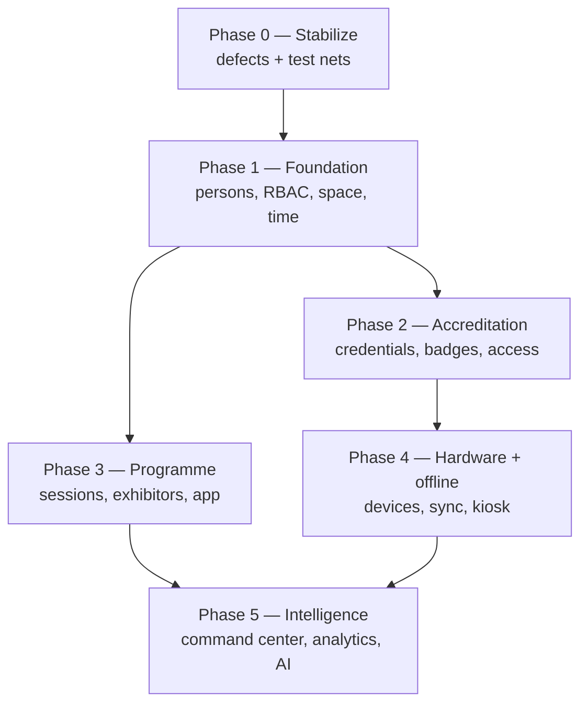

# Roadmap

**Status:** WRITTEN · **Authority:** AUTHORITATIVE for phase order · **Audit date:** 2026-09-28

---

## Ordering principle

**Dependency order, not difficulty order** — derived from the audit, not from convenience. Each
phase exists because the next cannot be built without it.

Two hard constraints from `02-current-state-audit.md`:

1. **Access control cannot precede the space model** — a rules engine needs somewhere to point.
2. **Offline-first cannot precede hardware abstraction** — sync semantics depend on device behaviour.

Estimates are **relative complexity**, not dates. Without a team size, velocity, or start date,
calendar dates would be false precision.

## Phase 0 — Stabilize · complexity **S**

Not in the original brief. It earns its place because the audit found a **live bug** and no safety
net, and because every later phase lands on these same foundations.

| Work | Why |
|---|---|
| Fix F1 — scan loss + dedupe-before-await ordering | Live event risk; small isolated fix |
| Fix F5 — request-scoped SSR state (`AsyncLocalStorage`) | Possible cross-request data bleed |
| Fix F6 — remove `define: {"process.env": process.env}` | Secret exposure in the client bundle |
| Architecture test: no Eloquent models outside repositories | Catches the 4 known handler violations, prevents regression |
| Architecture test: every non-public Action authorizes | Makes F12 structurally impossible |
| Cross-tenant 403 test suite | Proves F11 isolation, currently unproven |
| Frontend test runner + CI lint/typecheck | F9 — no net exists today |
| Align queue config across dev/prod/e2e; pin Postgres version | F7, F13 |

**Exit:** the defect list is closed; CI gates architecture and tenancy invariants; the frontend has a
test runner. Nothing below is safe to build at scale without this.

## Phase 1 — Foundation · complexity **L**

The two missing dimensions plus identity and permissions. Almost entirely additive, so risk is low
relative to size.

| Work | Doc | Classification |
|---|---|---|
| `persons` + `attendees.person_id` | `23` | Extend |
| RBAC/ABAC replacing the 3-role enum; per-event roles; global scopes | `09` | Replace |
| **Space:** venues, buildings, floors, zones, access points, rooms | `25` | New |
| **Time:** sessions, tracks, speakers | `27` | New |
| Consolidate the two check-in write models (F10) | `18` | Refactor |
| `access_logs` append-only table | `24` | New |

**Exit:** a venue can be described with zones and access points; an event can have a programme; a
person exists independently of an order; permissions are per-event and enforced by a global scope.

**Risk:** the RBAC replacement touches 159 authorization call sites. Sequence it behind the Phase-0
architecture tests so regressions are caught mechanically rather than by review.

## Phase 2 — Accreditation, badges, access · complexity **L**

The first phase delivering visible new capability to an event operator.

| Work | Doc |
|---|---|
| Accreditation types, applications, approval workflow | `23` |
| Credentials with the one-of CHECK constraint | `23` |
| Access rules engine + grant materialization | `24` |
| Badge templates, designer, print jobs | `21`, `22` |
| Real print pipeline replacing `window.print()` (F8) | `22` |
| Photo capture at the desk | `23` |
| Dual-write migration from `attendee_check_ins` | `18` |

**Exit:** ARZO can accredit a journalist, issue a photo badge, and enforce that the badge opens the
press zone but not backstage — online.

**Hardware dependency:** badge printing needs **physical printers and badge stock**. Software is
planned in `22`; the procurement commitment is `102`. This phase is not complete on software alone.

## Phase 3 — Programme, exhibitors, attendee app · complexity **L**

Parallelizable with Phase 2 — it depends on Phase 1, not on Phase 2.

| Work | Doc |
|---|---|
| Sessions: registration, capacity, waitlist reuse, check-in | `27` |
| Speakers, agenda, conflict detection, calendar export | `28`, `29` |
| Exhibitors, booths, staff passes, lead capture + export | `32`–`35` |
| Attendee app: agenda, ticket, notifications, venue map | `30`, `95` |
| SMS + push — the app needs a notification channel | `43`, `44` |
| Public API with keys and scopes | `48` |
| Versioned webhook payload boundary (F14) | `49` |

**Exit:** a conference runs a full programme with per-session attendance; exhibitors capture and
export leads; attendees have an app.

## Phase 4 — Hardware and offline · complexity **XL**

The largest and riskiest phase, and the one that actually separates an event platform from a
ticketing website.

| Work | Doc |
|---|---|
| Device registry, enrolment, scoped device keys, fleet health | `40` |
| Hardware abstraction: scanners, printers, RFID/NFC readers | `37`–`39` |
| **Offline-first:** local store, sync protocol, conflict rules, emergency mode | `71` |
| Realtime transport (Reverb) | `71` |
| Kiosk app: self check-in, walk-in registration, badge print | `19`, `96` |
| Queue management | `20` |
| Native scanner app | `94` |

**Exit:** a venue-wide network failure does not stop check-in, badge printing, or access control, and
scans reconcile cleanly on reconnect.

**Why XL:** offline changes the shape of every write path it touches; the access decision function
must be provably identical on server and device; and testing needs network-partition, clock-skew and
replay simulation that does not exist today (`79`).

## Phase 5 — Intelligence · complexity **M–L**

Everything here consumes data the earlier phases produce, so it cannot be pulled forward.

| Work | Doc |
|---|---|
| Live command center | `53` |
| Attendance, session and exhibitor analytics | `51`, `52`, `54` |
| Demographics | `52` |
| Post-event reporting | `108` |
| Staffing, tasks, incidents, vendors, procurement | `56`–`63` |
| AI capabilities, feasibility-assessed | `133` |

## Not sequenced here

`102`–`104` (hardware procurement, deployment, on-site infrastructure) and the staffing agency in
`57` are **business commitments**, not engineering phases. In reality they gate Phases 2 and 4. This
plan states the dependency; the decision belongs to the business.

## Related

`00-master-index.md` (dependency spine) · `03-gap-analysis.md` · `114`–`118` (phase detail) ·
`120-risk-register.md` · `136-master-backlog.md` · `137-engineering-work-packages.md`
