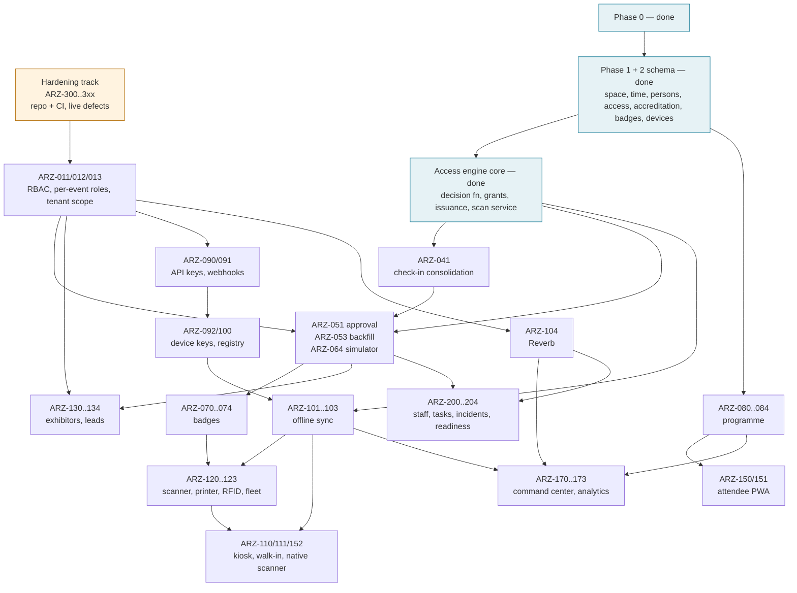

# Dependency Map

**Status:** WRITTEN · **Audit date:** 2026-09-29 · **Baseline:** `develop` @ `e7228c1d`
**Classification:** Derived (from `136`, `113`) · **Priority:** — · **Phase:** all
**Depends on:** `136-master-backlog.md`, `113-roadmap.md`
**Blocks:** nothing — it is a view

---

## What this is

The dependency graph across work items, drawn from `136`'s `Depends on` columns, the spine in `00`,
and the prerequisites discovered while writing documents 13–140. `136` is authoritative; where this
map and the backlog disagree, the backlog wins and this map is stale.

## The shape in one picture



## The hard edges, with reasons

The edges that cannot be reordered without rework. Each is a finding, not a preference.

| Edge | Reason | Source |
|---|---|---|
| Space → access rules | A rules engine needs somewhere to point | `00` |
| Hardware abstraction → offline sync | Sync semantics depend on what devices do | `00` |
| **ARZ-300 repository + CI → everything** | Nothing is backed up or gated without it; the Phase 0 tests run nowhere automatically | `123` |
| **ARZ-011/012 RBAC → ARZ-051 review UI** | An officer approving `MEDIA` must not see the account's orders; today every account user sees everything | `115` |
| **ARZ-011/012 → exhibitor logins** | Per-resource authorization; magic links are the stopgap that removes this edge for v1 | `32` |
| **ARZ-303 encrypted ID fields → any ID-collecting accreditation type** | Plaintext passport numbers are a reportable exposure | `65` |
| **ARZ-302 venue timezone → any rule UI** | Windows evaluate in UTC today | `115` |
| **ARZ-320 rule subjects → rule CRUD, golden vectors** | Rules ignore their subject; vectors would copy the bug to every device | `124` |
| **ARZ-321 scan endpoint trust → the scan route merging** | Access points unchecked against the event; replay lookup crosses tenants | `94` |
| **ARZ-323 anonymization of new tables → first data-bearing deploy** | Deletion would leave names and emails in `persons` | `108` |
| **ARZ-317 licence position → sharing the ARZO repository or any public deployment** | Attribution is suppressed in the working tree | `98` |
| **ARZ-307 occupancy path → any live access scanning** | Per-scan cost grows with the zone's history | `74` |
| **ARZ-313 identifier format → first printed badge** | After printing, a format is permanent for that event | `38` |
| **ARZ-314 schema corrections → first service writing those tables** | Cheap while empty, a data migration afterwards | `35`, `36`, `40`, `54` |
| ARZ-041 consolidation → reads from `access_logs` | F10 — two sources of truth otherwise | `18` |
| ARZ-051 → ARZ-132 exhibitor staff passes | Passes are `EXHIBITOR` accreditations | `32` |
| ARZ-051 → ARZ-200 staff | Staff credentials are `STAFF` accreditations | `57` |
| ARZ-304 working webhook retries → ARZ-180 CRM | A CRM that is briefly down loses events otherwise | `47`, `49` |
| ARZ-090 API keys → ARZ-092 device keys → ARZ-100 | Shared prefix-and-hash resolver | `40`, `48` |
| ARZ-101 sync prototype → ARZ-110 kiosk dates | R4 — do not date the kiosk before partition and replay tests pass | `117` |
| `event_benchmark_facts` at closeout → cross-event benchmarks | Benchmarks must survive raw-log deletion | `55` |

## Business gates

Not engineering, and each blocks engineering:

| Gate | Blocks | Owner |
|---|---|---|
| **Licence position** (R1, `66`) | Phase 2 onward — and any sharing of the ARZO repository | Business + legal |
| **Hardware families chosen** (R5, `102`) | ARZ-121 printer adapters, ARZ-122 tags | Business |
| **Buyer question** (`04`) | SaaS packaging (`100`), tier gating, MFA priority | Business |
| **Arabic scope** (`82`) | Whether RTL outranks Phases 3–5 on attendee surfaces | Business |
| **Largest intended event** (`74`) | Every performance target; `125` profiles | Business |
| **Where ARZO hosts** (`84`) | Reverb, staging, production, DR | Business + engineering |

## Parallel lanes

With enough people, four lanes can run at once without stepping on each other:

| Lane | Items | Shared dependency |
|---|---|---|
| Hardening | ARZ-300..3xx | — |
| Identity and access | ARZ-011/012/013 → ARZ-041 → ARZ-051/053/064 → badges | RBAC |
| Programme and attendees | ARZ-080..084 → ARZ-150/151 | Phase 1 schema only |
| Integration | ARZ-090/091, ARZ-304 → ARZ-180 | RBAC for key scopes |

Phase 4 cannot start in earnest until the identity lane has credentials and badges and the
programme lane has sessions; its sync prototype (`117` step 1) can start as soon as ARZ-300 exists.

## The critical path

```
ARZ-300 → ARZ-011/013 → ARZ-012 → ARZ-041 → ARZ-051 → ARZ-053
        → ARZ-071/072 → ARZ-101 prototype → ARZ-100/092 → ARZ-101 → ARZ-152 / ARZ-110
        → ARZ-104 → ARZ-170
```

The longest chain runs through RBAC and offline sync. Everything that shortens it is on one of
those two.

## Generated, not hand-drawn — eventually

Hand-maintained graphs drift. Once the backlog lives as issues in ARZO's repository (`137`), generate
this graph from the issues' dependency links, and keep only the hard-edge table and the business gates
here — those carry reasons, which a generator cannot write.

## Related

`136-master-backlog.md` · `113-roadmap.md` · `00-master-index.md` · `114-phase-1.md` ·
`115-phase-2.md` · `116-phase-3.md` · `117-phase-4.md` · `118-phase-5.md` ·
`123-release-strategy.md` · `137-engineering-work-packages.md` · `120-risk-register.md`
