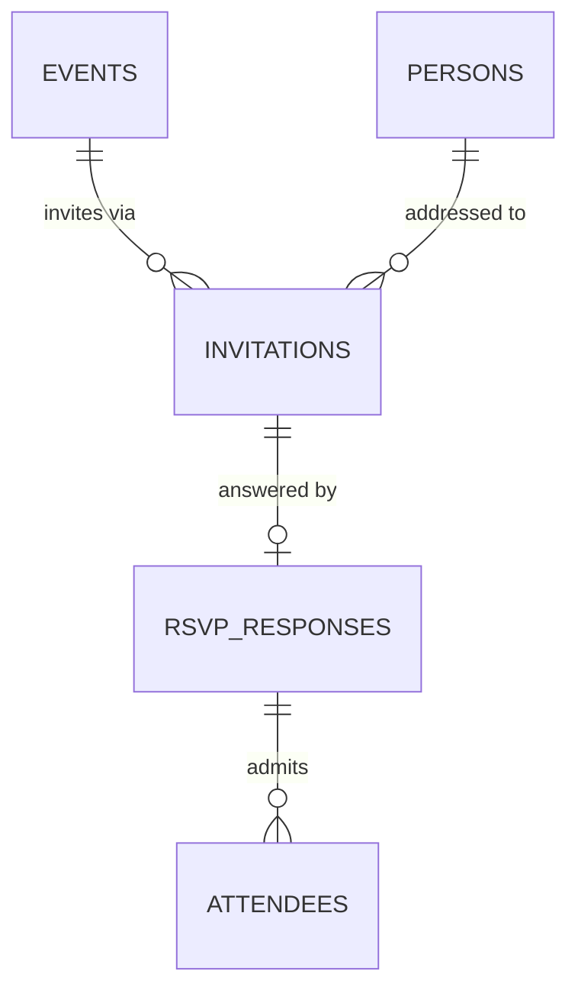

# RSVP

**Status:** WRITTEN · **Audit date:** 2026-09-28
**Classification:** New subsystem (small) · **Priority:** P2
**Depends on:** `10-registration-platform.md`, `23-accreditation.md`

---

## Current state — `MISSING` as a distinct flow

`CONFIRMED`: free tickets exist (`ProductPriceType::FREE`, price 0), but they traverse the **full
order pipeline** — order creation, an advisory lock, an order record, order items, an invoice path,
and order-confirmation emails.

That is correct for a free *ticket*. It is heavy for an RSVP, where the question is just "are you
coming?".

## Why RSVP deserves its own flow

Not because free tickets do not work, but because the semantics differ in ways that leak into the UX
and the data:

| | Free ticket | RSVP |
|---|---|---|
| Mental model | A purchase costing nothing | Answering an invitation |
| Produces | Order, order items, attendee, invoice path | An attendance intention |
| Can be declined | No — you either buy or do not | **Yes** — "no" is a meaningful answer |
| Plus-ones | Buy more tickets | A party size on one response |
| Capacity | Product quantity | Guest-list limit |
| Typical event | Public free event | Private or corporate event, gala, wedding |
| Invite-led | No | Usually — there is a list first |

The decisive one is **declining**. An order has no representation for "no", so a free-ticket RSVP
cannot distinguish *declined* from *never responded* — and for a private event that distinction is the
entire point of asking.

ARZO runs private and corporate events in Qatar, so this is closer to a core need than the P2
priority suggests. Worth revisiting if ARZO's event mix is invite-led.

## Design

Deliberately small, and reusing three things that already exist.



**`invitations`** — the guest list, which exists before any response.

```
id, short_id, event_id, person_id NULL,
first_name, last_name, email, phone NULL,
token,                          -- unguessable; the RSVP link
max_party_size int default 1,
status,                         -- PENDING | SENT | RESPONDED | EXPIRED | CANCELLED
sent_at NULL, expires_at NULL,
metadata jsonb, timestamps, deleted_at
UNIQUE (event_id, email) WHERE deleted_at IS NULL
```

**`rsvp_responses`** — the answer, including "no".

```
id, short_id, invitation_id, event_id,
response,                       -- ATTENDING | NOT_ATTENDING | TENTATIVE
party_size int default 1,
responded_at, responded_from_ip NULL,
form_data jsonb,                -- reuses the question engine (10)
notes text NULL,
metadata jsonb, timestamps
UNIQUE (invitation_id)
```

### Reuse, not reinvention

| Concern | Reuses |
|---|---|
| Custom fields | The question engine (`10`) via `form_data` |
| Identity | `persons` (`23`) — landed in Phase 1 |
| Access | An ATTENDING response issues a credential, exactly as a ticket does (`23`) |
| Magic-link access | The `ticket_lookup_tokens` pattern already in the codebase |
| Capacity | Guest-list size, not product quantity |

An ATTENDING response creates `attendees` rows (one per party member) so that **everything
downstream — check-in, badges, access control, session registration — works unchanged**. That is the
key design constraint: RSVP is a different front door, not a parallel universe.

## Flows

**Invite-led (the main case):** import a guest list → send invitations → guest opens the tokenised
link → responds yes/no/tentative with party size → on yes, attendees and credentials are created →
confirmation email.

**Open RSVP:** a public page where anyone responds, creating the invitation on the fly. Useful for
free public events that do not want ticket semantics.

**Declines are first-class.** Reporting must show attending / declined / no response, because chasing
non-responders is the actual job for a private event.

## Out of scope

- Seating assignment from RSVP (`26`)
- Meal choice as a first-class concept — use a custom question
- Multi-stage invitations (save-the-date then formal) — unless asked for

## Open questions

- **Does ARZO's event mix actually need this?** If most events are invite-led private functions, this outranks its P2 priority. Genuinely unknown to this plan and answerable by the business in a sentence.
- **Can an RSVP convert to a paid order?** A gala with a paid upgrade tier would need it. Not designed.
- **Reminder cadence for non-responders** — needs the notification bus (`69`).
- **Should declining free up capacity automatically?** Yes if the guest list is capped; interacts with waitlist (`14`).

## Related

`10-registration-platform.md` · `11-ticketing-commerce.md` · `23-accreditation.md` ·
`14-waitlist-and-capacity.md` · `69-notifications-architecture.md`
