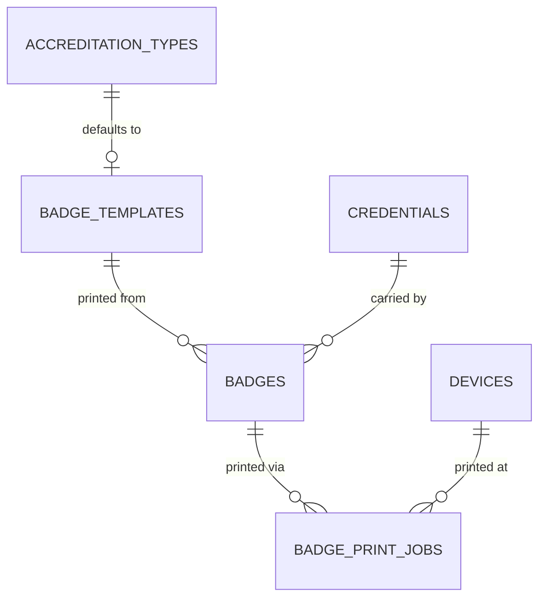

# Badge Management

**Status:** WRITTEN · **Authority:** AUTHORITATIVE for badge lifecycle · **Audit date:** 2026-09-28
**Classification:** New subsystem
**Depends on:** `23-accreditation.md` (credentials), `73-file-management.md` (photos)

---

## Current state — `MISSING`

There is no badge entity, template, or print pipeline. What exists is **ticket** printing, which is a
different object with different requirements.

`CONFIRMED`:

- `TicketDesigner` — accent colour, logo, footer, date mode, live preview, and a print route using mock data for proofing. Good work, aimed at tickets.
- Three print routes, all `window.print()` behind a 500ms `setTimeout`, with `@media print` CSS in 3 files and exactly one `@page` rule.
- `@react-pdf/renderer@^4.5.1` is a **production dependency with zero imports** — dead weight, or an abandoned intention.
- Server-side PDF exists only for invoices (`GenerateOrderInvoicePDFService`, dompdf).

**Why ticket printing cannot become badge printing:** no page-size control, no print-dialog bypass,
no label or thermal path, no print queue, no failure recovery. Badge-on-demand at a door with a queue
forming needs all five.

## Badge vs credential

Kept distinct deliberately (`23`):

- **Credential** — the *right* of access. Survives reprints. Revocable.
- **Badge** — a *physical artifact* carrying a credential. One credential may be printed many times.

This is why a lost badge does not invalidate the credential, and why a reprint does not need
re-approval.

## Model



### `badge_templates`

```
id, short_id, account_id, event_id NULL,
name, description,
width_mm numeric, height_mm numeric, orientation,
dpi int default 300,
layout jsonb,                  -- the element tree
background_image_id NULL, is_default bool, version int,
metadata jsonb, timestamps, deleted_at
```

`layout` holds positioned elements. Element types: `TEXT`, `FIELD`, `QR`, `BARCODE`, `PHOTO`,
`IMAGE`, `SHAPE`, `ZONE_COLOUR_BAR`. Each carries position, size, style and binding.

`FIELD` bindings resolve at render: person name, company, job title, accreditation type, zone list,
event name, dates, credential identifier.

`ZONE_COLOUR_BAR` renders the colours of the zones the credential grants — which is why `colour`
lives on `zones` (`25`) rather than on the template. One change propagates to every badge.

`version` matters: a reprint must reproduce **what was originally printed**, not the current
template. Otherwise a reprinted badge can differ visually from its neighbours.

### `badges`

```
id, short_id, event_id, credential_id, badge_template_id, template_version int,
status,                        -- PENDING | PRINTED | VOIDED | REPLACED
rendered_pdf_path NULL, rendered_at NULL,
printed_at NULL, printed_by NULL, printed_on_device_id NULL,
print_count int default 0,
voided_at NULL, voided_by NULL, void_reason NULL,
replaces_badge_id NULL,
snapshot jsonb,                -- the field values at print time
metadata jsonb, timestamps
INDEX (credential_id), INDEX (event_id, status)
```

`snapshot` is the audit answer to "what did that badge actually say?" — names and titles change, and
a photo of a badge in an incident report must be reconcilable with the record.

### `badge_print_jobs`

```
id, short_id, badge_id, device_id NULL, printer_identifier NULL,
status,                        -- QUEUED | RENDERING | SENT | CONFIRMED | FAILED | CANCELLED
attempts int, last_error NULL,
queued_at, sent_at NULL, confirmed_at NULL,
client_generated_id uuid,      -- offline idempotency
metadata jsonb, timestamps
UNIQUE (client_generated_id)
```

A print job is a **first-class retryable entity**, not a fire-and-forget call. A jam must not lose
the badge — `128` gate 21.

## Render pipeline

Server-side render is authoritative. A browser cannot bypass the print dialog, so it cannot serve
badge-on-demand.

```
badge requested
  -> resolve credential, person, grants, zone colours
  -> load template at pinned version
  -> render to PDF at exact mm dimensions and DPI
  -> store, snapshot field values
  -> create print job
  -> device pulls, prints, confirms
```

Offline: a device holds cached badge data and its template, renders locally, and queues the print job
for reconciliation (`71`). This is why the template is cached on the device, not fetched per print.

**Target:** render under 2s p95, because a person is standing at a desk.

## Reprints and voids

| Action | Effect |
|---|---|
| **Reprint** | New `badges` row, `replaces_badge_id` set, old row `REPLACED`. Credential unchanged. |
| **Void** | Badge `VOIDED` with reason. Credential unaffected unless separately revoked. |
| **Lost badge** | Void old, revoke old credential, issue new credential, print new badge. `replaces_credential_id` links them (`23`). |

The distinction matters for clone detection: a voided-and-reissued credential appearing at a gate is
a signal, not noise (`68`).

## Physical dependencies — not software

Named plainly because this phase is not deliverable on code alone:

- Badge printers and spares (a printer failing at 08:00 with a queue is a business risk)
- Badge stock, ribbons, lanyards, holders — recurring consumables per event
- Eco-friendly stock if that is a brand commitment
- Hologram or security stock for high-security events

Planned in `102-hardware-procurement.md`. Vendor choice drives `39-printer-integration.md`.

## Open questions

- **Designer build vs buy.** A drag-and-drop canvas editor is a substantial UI project. Assess a commercial component.
- **Which printer families first?** Zebra and Evolis dominate and speak their own languages (ZPL and SDKs). This decision has procurement lead time.
- **Direct-to-printer from the device, or via a local print host?** A host is more reliable and more hardware to manage.
- **Photo normalization.** Badge photos need consistent crop, size and background. `73` notes there is no resize pipeline today.
- **Do badges need to be pre-printed for known attendees, or always on demand?** Pre-printing is faster at the door and creates waste plus a sorting problem.

## Related

`22-badge-design-printing.md` · `23-accreditation.md` · `24-access-control.md` ·
`25-zones-and-permissions.md` (zone colours) · `39-printer-integration.md` ·
`71-realtime-architecture.md` · `73-file-management.md` · `102-hardware-procurement.md`
