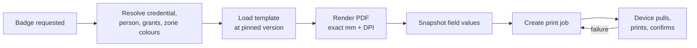

# Badge Design and Print Pipeline

**Status:** WRITTEN · **Audit date:** 2026-09-29
**Classification:** Replace (printing) + New (designer) · **Phase:** 2 software, 4 hardware
**Depends on:** `21-badge-management.md`, `71-realtime-architecture.md`
**Blocks:** `19-kiosk-system.md`, `39-printer-integration.md`

---

## Current state — `MISSING`, and the existing print path cannot be extended

`CONFIRMED`:

| Fact | Detail |
|---|---|
| All printing is `window.print()` | Behind a 500ms `setTimeout`, in 3 routes |
| Print CSS in 3 files | Exactly **one** `@page` rule, in `AttendeeTicket.module.scss` |
| `@react-pdf/renderer@^4.5.1` | **Zero imports.** A dead production dependency. |
| Server-side PDF exists | Only for invoices, via `barryvdh/laravel-dompdf` |
| Ticket designer exists | `TicketDesigner/` — accent colour, logo, footer, date mode, live preview |

### Why the browser path cannot become badge printing

Five blockers, each independently fatal for badge-on-demand at a door:

1. **No print-dialog bypass.** Every print requires a human to confirm. At a queue of 40 walk-ins that
   is 40 dialogs.
2. **No page-size control** beyond a single `@page` rule. Badges are 54×86mm or 100×70mm, not A4.
3. **No label or thermal path.** Zebra and Evolis printers speak ZPL or vendor SDKs, not CSS.
4. **No print queue.** A jam loses the badge with no record and no retry.
5. **No offline printing.** The browser path needs the page, which needs the network.

**Therefore: replace, do not extend.** The ticket designer's *mock-data preview* pattern is worth
reusing for badge preview; the print mechanism is not.

## Target pipeline

Server-side render is authoritative. Offline devices render locally from a cached template and queue
the job (`71`), which is why the template is cached on the device rather than fetched per print.

**Target: render under 2s p95** — someone is standing at a desk.

## The designer

A canvas editor placing elements on a fixed-size artboard.

Element types: `TEXT`, `FIELD`, `QR`, `BARCODE`, `PHOTO`, `IMAGE`, `SHAPE`, `ZONE_COLOUR_BAR`.

Two design rules that matter more than they look:

**Template versioning.** A reprint must reproduce **what was originally printed**, not the current
template. `badges.template_version` pins it (`21`). Without this, a reprinted badge can differ
visibly from its neighbours mid-event.

**Zone colour comes from the zone.** `ZONE_COLOUR_BAR` renders `zones.colour` (`25`), so changing a
zone's colour propagates to every badge rather than requiring a template edit per accreditation type.

### Build or buy

A production-quality drag-and-drop canvas with snapping, alignment, undo and z-ordering is weeks of
UI work with **no ARZO-specific value**. `04` recommends assessing a commercial component.

A defensible middle path: ship **template presets** (name-prominent, photo-prominent, exhibitor,
speaker) with editable fields but a fixed layout, and defer the free-form canvas until an organizer
actually needs it. Most events use three layouts.

## Printer integration

Owned by `39`. The decision that gates procurement:

| Option | Trade-off |
|---|---|
| **Network printer** | Simpler; depends on venue network; fails exactly when the network does |
| **USB to a local print host** | Works fully offline; more hardware to stage and manage (`103`) |

Given that offline operation is a stated success criterion (`01`), the print host is the more
consistent answer — but it is more kit per desk.

## Physical, not software

Named plainly (`102`): badge printers **and spares**, badge stock, ribbons, lanyards, holders, plus
hologram or eco stock if those are brand or security commitments. Consumables recur per event.

A printer failing at 08:00 with a queue forming is a business risk, not an inconvenience — which is
why spares are not optional.

## Open questions

- **Which printer family first?** Zebra and Evolis dominate. This has procurement lead time and drives `39`.
- **Presets or full canvas?** Recommend presets first.
- **Photo normalization** — badge photos need consistent crop, size and background. `73` confirms there is **no resize pipeline** today, only LQIP and average-colour extraction.
- **Pre-print for known attendees, or always on demand?** Pre-printing is faster at the door and creates waste plus an alphabetical sorting problem.
- **Delete `@react-pdf/renderer`, or use it?** If the render is server-side, it is the wrong tool. Recommend removing it.

## Related

`21-badge-management.md` · `19-kiosk-system.md` · `25-zones-and-permissions.md` ·
`39-printer-integration.md` · `71-realtime-architecture.md` · `73-file-management.md` ·
`102-hardware-procurement.md`
