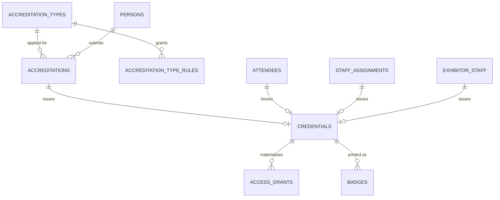
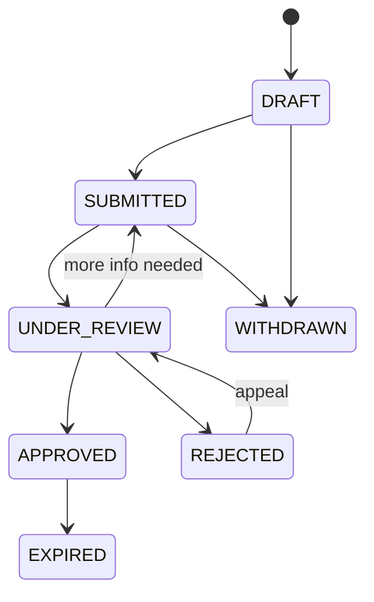

# Accreditation Engine

**Status:** WRITTEN · **Authority:** Authoritative for credentials and accreditation · **Audit date:** 2026-09-28
**Classification:** New subsystem
**Depends on:** `09-permissions-and-roles.md`, `25-zones-and-permissions.md`
**Blocks:** `21-badge-management.md`, `24-access-control.md`, `32-exhibitor-management.md`

---

## Current state — `MISSING`

`CONFIRMED`: no accreditation, application, approval, or credential entity exists.

The only approval workflows in the codebase are unrelated to people:
`event_spam_checks` (AI-assisted event screening, admin approve/confirm) and message pending-review
(`api.php:573`). `CONFIRMED` — both are platform moderation, not person accreditation.

The existing person model is thin. `CONFIRMED`:

- `attendees` — bought or was assigned a ticket. Has `first_name`, `last_name`, `email`, `status`, and a single `checked_in_at`.
- `users` + `account_users` + `roles` — platform logins. `CONFIRMED`: `Role` enum has exactly three values — `SUPERADMIN`, `ADMIN`, `ORGANIZER`.

There is no representation of a person who is neither a ticket-buyer nor a platform user: a
journalist, a contractor, a security guard, a speaker, an exhibitor's booth staff. At a real event
these are a large fraction of the people on site.

## The core distinction

These three are routinely conflated, and conflating them is why accreditation systems get rebuilt.

| Concept | Is | Lifecycle |
|---|---|---|
| **Accreditation type** | A *category* of person — VIP, Media, Speaker | Defined per event, reusable |
| **Accreditation** | An *application* by a person for a type | Applied → reviewed → approved/rejected |
| **Credential** | The *issued right* of access | Issued → active → suspended/revoked/expired |

A badge (`21-badge-management.md`) is the physical artifact carrying a credential. One credential
may be reprinted as several badges; the credential survives the badge.

An attendee who buys a ticket gets a credential **without** an accreditation — the ticket is the
entitlement. That path must stay simple: no approval workflow for ordinary ticket buyers.

## Model



### `persons` — the unifying identity

The key modelling decision. Today an `attendee` is the only person-like record, and it is
order-bound (`CONFIRMED` — `attendees.order_id` is non-null in practice). A journalist has no
order.

`persons` is a thin identity record that anything person-shaped can point at:

```
id, short_id, account_id,
first_name, last_name, email NULL, phone NULL,
company NULL, job_title NULL, nationality NULL,
photo_image_id NULL → images,
id_document_type NULL, id_document_number NULL,   -- encrypted at rest
date_of_birth NULL,                               -- encrypted at rest
metadata jsonb, timestamps, deleted_at
INDEX (account_id, email)
```

**Deliberately not** merged with `attendees` or `users`. `attendees` stays exactly as is — it is
load-bearing for commerce with 3 inbound FKs and heavy query use. Instead, `attendees` gains a
nullable `person_id`, populated opportunistically. **Extend, not Replace.**

`id_document_number`, `date_of_birth` and `nationality` are collected for accreditation at
government or high-security events and are **personal data under Qatar's PDPL and GDPR**. They are
encrypted at rest, excluded from exports by default, and covered by the retention rules in
`65-privacy-gdpr.md`. Collecting them must be opt-in per event, not default-on.

### `accreditation_types`

```
id, short_id, event_id, code, name, description,
colour,                            -- badge colour-coding
requires_approval bool default true,
requires_photo bool default false,
requires_id_document bool default false,
auto_approve_domains NULL text[],  -- e.g. trusted press domains
application_opens_at NULL, application_closes_at NULL,
max_issuable NULL int,
badge_template_id NULL → badge_templates,
sort_order, is_active bool,
metadata jsonb, timestamps, deleted_at
UNIQUE (event_id, code) WHERE deleted_at IS NULL
```

Seeded defaults per event, all editable and extensible:

`ATTENDEE` · `VIP` · `SPEAKER` · `MEDIA` · `STAFF` · `ORGANIZER` · `EXHIBITOR` · `SPONSOR` ·
`CONTRACTOR` · `SECURITY` · `PRODUCTION` · `VOLUNTEER`

`requires_approval = false` covers the ordinary attendee path — a ticket buyer is auto-accredited,
no human in the loop.

### `accreditation_type_rules`

Declares which zones/sessions a type grants, compiled into `access_grants` on issue.

```
id, accreditation_type_id, zone_id NULL, session_id NULL, room_id NULL,
starts_at NULL, ends_at NULL, days_of_week NULL int[],
time_from NULL, time_to NULL,
allow_reentry bool default true, max_entries NULL,
timestamps
```

This is the template; `access_rules` (`24-access-control.md`) is the event-level rule set. A type's
rules are the reusable part.

### `accreditations` — the application

```
id, short_id, event_id, person_id, accreditation_type_id,
status,
submitted_at NULL, reviewed_at NULL, reviewed_by NULL → users,
rejection_reason NULL text, internal_notes NULL text,
expires_at NULL,
form_data jsonb,                   -- answers to type-specific questions
documents jsonb,                   -- uploaded supporting files (image ids)
requested_zones NULL bigint[],     -- applicant's requested access
approved_zones NULL bigint[],      -- what was actually granted
metadata jsonb, timestamps, deleted_at
INDEX (event_id, status)
UNIQUE (event_id, person_id, accreditation_type_id) WHERE deleted_at IS NULL
```

`status`: `DRAFT` → `SUBMITTED` → `UNDER_REVIEW` → `APPROVED` | `REJECTED` | `WITHDRAWN` | `EXPIRED`



`requested_zones` vs `approved_zones` is a real operational need: press ask for backstage and are
frequently granted less. Storing both preserves what was asked, which matters in disputes.

### `credentials` — the issued right

```
id, short_id, event_id, person_id,
accreditation_id NULL → accreditations,
attendee_id NULL → attendees,
staff_assignment_id NULL, exhibitor_staff_id NULL,
credential_type,                   -- mirrors accreditation type code
status,
identifier text,                   -- the scannable value, unique per event
identifier_hash,                   -- indexed lookup
rfid_uid NULL, nfc_uid NULL,       -- populated when encoded
issued_at, issued_by NULL → users,
valid_from NULL, valid_until NULL,
suspended_at NULL, revoked_at NULL, revoked_by NULL, revocation_reason NULL,
replaces_credential_id NULL → credentials,   -- reissue chain
metadata jsonb, timestamps
UNIQUE (event_id, identifier)
INDEX (identifier_hash)
INDEX (person_id), INDEX (event_id, status)
```

`status`: `PENDING` → `ACTIVE` → `SUSPENDED` | `REVOKED` | `EXPIRED`

**Exactly one** of `accreditation_id`, `attendee_id`, `staff_assignment_id`, `exhibitor_staff_id`
is non-null — enforced by a CHECK constraint. This is what lets one access engine serve ticket
buyers, accredited press, staff, and exhibitor booth staff without four parallel code paths.

`replaces_credential_id` models lost-badge reissue: the old credential is revoked, a new one
points back. Anti-passback and clone detection need that chain.

`identifier` must be unguessable — a random opaque token, never a sequential id or a hash of the
email. A predictable credential identifier is a forgery vector.

## Issue flow

```
Approved accreditation (or paid attendee / staff assignment / exhibitor staff)
  → create credential (identifier, status PENDING)
  → materialize access_grants from type rules + event access_rules + approved_zones
  → status ACTIVE
  → optionally create badge print job (21-badge-management.md)
  → optionally encode RFID/NFC (36-rfid-nfc.md)
```

Materialization is synchronous and must meet the < 500 ms target in `24-access-control.md` — badge
issue happens with a person standing at a desk.

## Revocation

Revocation must take effect at doors that may be **offline**. This is the hard part.

| Mechanism | Latency | Notes |
|---|---|---|
| Server-side status check | Immediate | Online scans only |
| Push to connected devices | Seconds | Requires realtime — `71` |
| Revocation delta on device sync | Next sync | The offline floor |
| Deny-list bundle pushed to devices | Next sync | Small, bounded, gossip-able between devices on LAN |

A revoked badge may still open a door on a disconnected device until it syncs. That residual risk
is real, must be stated to clients, and is mitigated by short sync intervals plus a printed
deny-list at supervised points for high-security events. Pretending otherwise would be the
dangerous choice. Tracked in `120-risk-register.md`.

## Audit

Every transition writes to the audit trail (`67-audit-logging.md`): who, when, from → to, reason.
`CONFIRMED` that a pattern exists to follow — `order_audit_logs` and `event_logs` are already in
the schema.

Accreditation decisions are contestable — a rejected journalist may escalate — so the trail is a
requirement, not a nice-to-have.

## Migration

Additive.

| Step | Change |
|---|---|
| 1 | Create `persons`; add nullable `attendees.person_id` |
| 2 | Create `accreditation_types` + `accreditation_type_rules`; seed defaults per existing event |
| 3 | Create `accreditations` |
| 4 | Create `credentials` with the one-of CHECK constraint |
| 5 | Backfill: one `ACTIVE` credential per existing non-cancelled attendee, `credential_type = ATTENDEE` |
| 6 | Backfill `persons` from distinct attendee (email, name) per account |

Step 5 is what makes the access engine usable on day one — every existing attendee becomes
scannable under the new model without organizer action.

Identity resolution in step 6 is deliberately naive (exact email match within an account). Fuzzy
matching people is its own project and a privacy hazard; `UNVERIFIED` whether duplicates matter
enough to invest further.

## Open questions

- **Self-service accreditation portal.** Do applicants apply directly, or does ARZO staff enter them? Portal is more work and more valuable. Affects `91`/`93`.
- **Cross-event person identity.** Should a journalist accredited in March be recognized in June? Account-scoped `persons` allows it; needs a privacy position first.
- **Photo capture at the desk.** Webcam capture for badges implies image pipeline + consent. `CONFIRMED`: an `images` table and `ImageType` enum already exist to extend.
- **Approval delegation.** Can a media officer approve only `MEDIA`? Needs `09-permissions-and-roles.md` granularity — a hard dependency, not a detail.

## Related

`09-permissions-and-roles.md` · `24-access-control.md` · `21-badge-management.md` ·
`25-zones-and-permissions.md` · `32-exhibitor-management.md` · `57-manpower-and-staffing.md` ·
`65-privacy-gdpr.md` · `67-audit-logging.md` · `120-risk-register.md`
