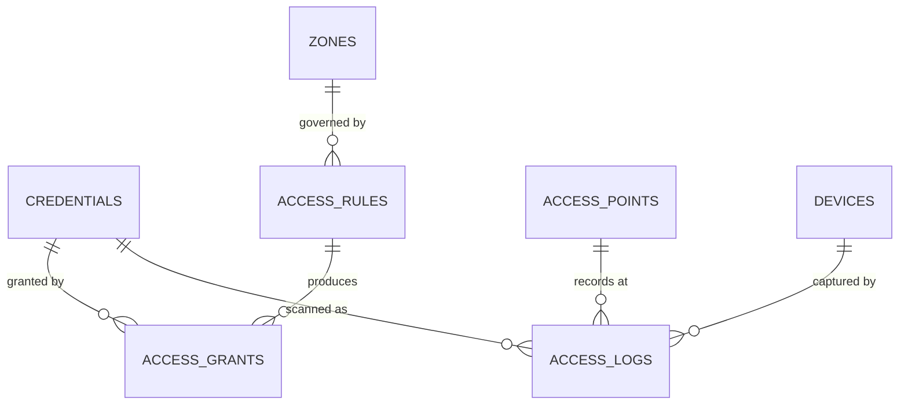

# Access Control Engine

**Status:** WRITTEN · **Authority:** Authoritative for access decisions · **Audit date:** 2026-09-28
**Classification:** New subsystem (supersedes, does not extend, `attendee_check_ins`)
**Depends on:** `25-zones-and-permissions.md` (space), `23-accreditation.md` (credentials)
**Blocks:** `36-rfid-nfc.md`, `38-scanner-platform.md`, `53-live-event-command-center.md`

---

## Current state — `PARTIAL`, and blocked by a schema constraint

`CONFIRMED`: what exists is **product-scoped check-in**, not access control.

```
check_in_lists          id, short_id, name, description, event_id,
                        activates_at, expires_at,          -- time window
                        event_occurrence_id,
                        public_show_attendee_notes / _question_answers / _order_details,
                        is_system_default

product_check_in_lists  -- which product types a list accepts

attendee_check_ins      id, short_id, check_in_list_id, product_id, attendee_id,
                        ip_address inet, event_id, order_id, event_occurrence_id,
                        timestamps, deleted_at
```

This expresses: *"this ticket type may be checked in against this list during this window."*
Genuinely useful, and roughly 40% of an access engine — it has a time window and a
ticket-type predicate.

What it cannot express: **where**. There is no zone, no door, no direction.

### The blocking constraint

`CONFIRMED` by live index query on `attendee_check_ins`:

```sql
CREATE UNIQUE INDEX attendee_check_ins_unique_attendee_list
  ON attendee_check_ins (attendee_id, check_in_list_id)
  WHERE deleted_at IS NULL;
```

Plus `attendees.checked_in_at` is a **single scalar** column, and `attendees.checked_in_by` /
`checked_out_by` are single user references.

**Consequence:** the database *forbids* recording the same attendee twice against the same list.
Re-entry, anti-passback, and multi-point access are not missing features — they are prevented by a
uniqueness constraint. "Check out" is implemented as a soft-delete of the check-in row
(`CONFIRMED` — the delete route at `api.php:661`), which destroys the event history that access
logging exists to preserve.

**Therefore:** access control introduces a new append-only `access_logs` table. It does **not**
extend `attendee_check_ins`. Attempting to extend would require dropping a unique index that
current check-in logic depends on for idempotency.

`attendee_check_ins` is retained for existing check-in behaviour and migrated in Phase 2
(`18-check-in.md`). Both run in parallel during transition.

## What the engine must answer

```
WHO       — which credential (→ accreditation, ticket, staff assignment)
CAN DO    — enter / exit / re-enter
WHAT      — which zone, room, or session
WHERE     — at which access point
WHEN      — within which time window, on which event days
CONDITIONS— capacity, anti-passback, escort, one-time use, custom predicate
```

Worked example:

```
Speaker credential → BACKSTAGE zone → 08:00–22:00 → event days only
                   → re-entry allowed → not while zone at capacity
```

## Model



### `access_rules`

A declarative predicate. Evaluated in priority order; first terminal match wins.

```
id, short_id, event_id, name, priority int,
effect,                          -- ALLOW | DENY
subject_type, subject_id,        -- ACCREDITATION_TYPE | PRODUCT | TICKET_TYPE |
                                 -- STAFF_ROLE | EXHIBITOR | CREDENTIAL | ALL
target_type, target_id,          -- ZONE | ROOM | SESSION | ACCESS_POINT | EVENT
starts_at NULL, ends_at NULL,    -- absolute window
days_of_week NULL int[],         -- recurring day filter
time_from NULL time, time_to NULL time,   -- wall-clock daily window
max_entries NULL int,            -- lifetime scan cap (0 = unlimited)
allow_reentry bool default true,
min_reentry_seconds NULL int,    -- cooldown
enforce_capacity bool default false,
requires_escort bool default false,
conditions jsonb,                -- escape hatch, see below
is_active bool,
metadata jsonb, timestamps, deleted_at
INDEX (event_id, is_active, priority)
```

`DENY` rules at higher priority than `ALLOW` give explicit blacklisting (a revoked badge, a
banned attendee) without deleting grants.

`conditions jsonb` is a deliberately narrow escape hatch for predicates not worth first-class
columns. Rule: anything used by more than two clients gets promoted to a column. Left unchecked,
a jsonb rule blob becomes an unqueryable, untestable DSL — so its use is reviewed, not free.

### `access_grants`

Materialized from rules at credential issue time. Denormalization is intentional: a door scan
must not evaluate the full rule set, and an offline device must carry its grants locally.

```
id, short_id, credential_id → credentials,
zone_id NULL, room_id NULL, session_id NULL, access_point_id NULL,
source_rule_id NULL → access_rules,
starts_at NULL, ends_at NULL,
days_of_week NULL int[], time_from NULL, time_to NULL,
max_entries NULL, entries_used int default 0,
allow_reentry bool, min_reentry_seconds NULL,
status,                          -- ACTIVE | SUSPENDED | REVOKED | EXPIRED
revoked_at NULL, revoked_by NULL, revocation_reason NULL,
metadata jsonb, timestamps
INDEX (credential_id, status)
INDEX (zone_id, status)
```

`entries_used` is a counter and therefore drifts under offline replay. It is an **advisory**
figure for UI; authoritative enforcement of `max_entries` counts `access_logs`. Documented here
because a future reader will otherwise assume it is authoritative.

### `access_logs` — append-only

The audit spine. Never updated, never deleted.

```
id, short_id, event_id,
credential_id NULL → credentials,      -- NULL when scan matched nothing
access_point_id → access_points,
zone_id,                               -- denormalized for query speed
device_id NULL → devices,
occurred_at timestamptz,               -- when the scan happened (device clock)
recorded_at timestamptz,               -- when the server received it
direction,                             -- ENTRY | EXIT
result,                                -- GRANTED | DENIED_NO_CREDENTIAL |
                                       -- DENIED_NO_GRANT | DENIED_TIME_WINDOW |
                                       -- DENIED_CAPACITY | DENIED_ANTIPASSBACK |
                                       -- DENIED_MAX_ENTRIES | DENIED_REVOKED |
                                       -- DENIED_DUPLICATE | GRANTED_OVERRIDE
matched_rule_id NULL, matched_grant_id NULL,
raw_identifier text,                   -- what was actually scanned
identifier_type,                       -- QR | BARCODE | RFID | NFC | MANUAL
operator_user_id NULL,
override_by NULL, override_reason NULL,
client_generated_id uuid,              -- offline idempotency key
is_offline_replay bool default false,
metadata jsonb, created_at
UNIQUE (client_generated_id)
INDEX (event_id, occurred_at DESC)
INDEX (credential_id, occurred_at DESC)
INDEX (zone_id, occurred_at DESC)
INDEX (result) WHERE result <> 'GRANTED'
```

Three design points that matter:

1. **Denials are logged.** A denied scan is the most operationally interesting event — it is how you find a cloned badge or a misconfigured rule. Logging only successes makes incidents uninvestigable.
2. **`occurred_at` vs `recorded_at`.** Offline devices submit late, and device clocks skew. Separating capture time from receipt time is what makes replay analysable; a single timestamp column loses this permanently.
3. **`client_generated_id UNIQUE`** is the idempotency key. Replaying a queued offline scan is a no-op on conflict — which is what makes at-least-once delivery safe.

Retention: `access_logs` grows fast at scale. Partition by `event_id` or month once volume
justifies it; see `74-performance.md`. `UNVERIFIED` — needs realistic volume modelling.

## Decision algorithm

Must be a **pure function** of (identifier, access point, timestamp, grant set). Purity is what
lets the identical implementation run server-side and on an offline device, and is the only
realistic way to guarantee they agree.

```
decide(identifier, access_point, now, grants) -> AccessDecision

 1. Resolve identifier → credential.        miss → DENIED_NO_CREDENTIAL
 2. credential.status ACTIVE?               no   → DENIED_REVOKED
 3. Find grants matching access_point.zone_id (or room/session).
                                            none → DENIED_NO_GRANT
 4. Filter by window: starts_at/ends_at, days_of_week, time_from/time_to (venue-local).
                                            none → DENIED_TIME_WINDOW
 5. Evaluate DENY rules first, by priority.  match → DENIED_* (rule reason)
 6. max_entries: count GRANTED ENTRY logs for this credential+zone.
                                            exceeded → DENIED_MAX_ENTRIES
 7. Anti-passback: if last log for credential+zone is ENTRY and this is ENTRY,
    and !allow_reentry                      → DENIED_ANTIPASSBACK
    if within min_reentry_seconds           → DENIED_ANTIPASSBACK
 8. enforce_capacity: zone occupancy >= capacity
                                            → DENIED_CAPACITY
 9. → GRANTED
```

Operator override is always available and always logged as `GRANTED_OVERRIDE` with
`override_by` + `override_reason`. Real events need a supervisor who can let someone through; the
requirement is accountability, not prevention.

**Offline divergence is accepted and bounded.** An offline device cannot know global zone occupancy
or scans at other doors. Offline mode therefore evaluates steps 1–5 and 7-local, skipping 6 and 8,
and marks the log `is_offline_replay`. Server-side reconciliation flags retrospective violations
for review rather than silently correcting them. This is a conscious trade: a door that stops
working when the network drops is worse than a door that occasionally over-admits. See
`71-realtime-architecture.md`.

## Performance targets

Reasoning in `74-performance.md`; summarized because scanner latency drives hardware choice.

| Operation | Target | Why |
|---|---|---|
| Online decision, p95 | < 150 ms | Above ~200 ms a queue forms at a busy gate |
| Offline decision, p95 | < 50 ms | Local SQLite lookup, no excuse to be slow |
| Grant materialization per credential | < 500 ms | Badge issue must feel instant |
| Occupancy read (cached) | < 100 ms | Command-center refresh |

## Migration from `attendee_check_ins`

Parallel run, not a flag day. `18-check-in.md` owns the cutover.

| Step | Action |
|---|---|
| 1 | Build `access_rules` / `access_grants` / `access_logs`. Nothing reads them yet. |
| 2 | Dual-write: existing check-in also writes an `access_logs` row at the venue's default access point. |
| 3 | Backfill historical `attendee_check_ins` → `access_logs` (`source = IMPORT`, `is_offline_replay = false`). |
| 4 | Move UI reads to `access_logs`; keep writing both. |
| 5 | New scanner writes only `access_logs`. `attendee_check_ins` becomes read-only legacy. |
| 6 | Decide whether to drop `attendee_check_ins` — deferred; no urgency and it is the rollback path. |

Step 2 is the safety property: at every point before step 5, turning the new system off restores
exactly the old behaviour.

## Open questions

- **Is `check_in_lists` retained as a concept?** It maps loosely onto "access point + product predicate". Cleanest is to keep it as an organizer-facing abstraction that compiles to rules, so existing UI and the public scanner link survive. Decide in Phase 2 design.
- **Anti-passback across access points.** Per-zone (enter Hall A, must exit Hall A) or per-venue? Per-zone assumed; per-venue needs a global occupancy model that is offline-hostile.
- **Rule conflict UX.** With priorities and ALLOW/DENY, organizers will build contradictory rule sets. A simulator ("would this credential get in at this door at this time?") is likely mandatory, not optional.
- **Credential cloning detection.** Two GRANTED entries for one credential at distant points within seconds is a strong clone signal. Worth a detector; needs a false-positive strategy. Deferred to `68-fraud-prevention.md`.

## Related

`25-zones-and-permissions.md` (space) · `23-accreditation.md` (credentials) ·
`18-check-in.md` (migration) · `21-badge-management.md` · `36-rfid-nfc.md` ·
`38-scanner-platform.md` · `71-realtime-architecture.md` (offline) ·
`53-live-event-command-center.md` · `67-audit-logging.md` · `74-performance.md`
