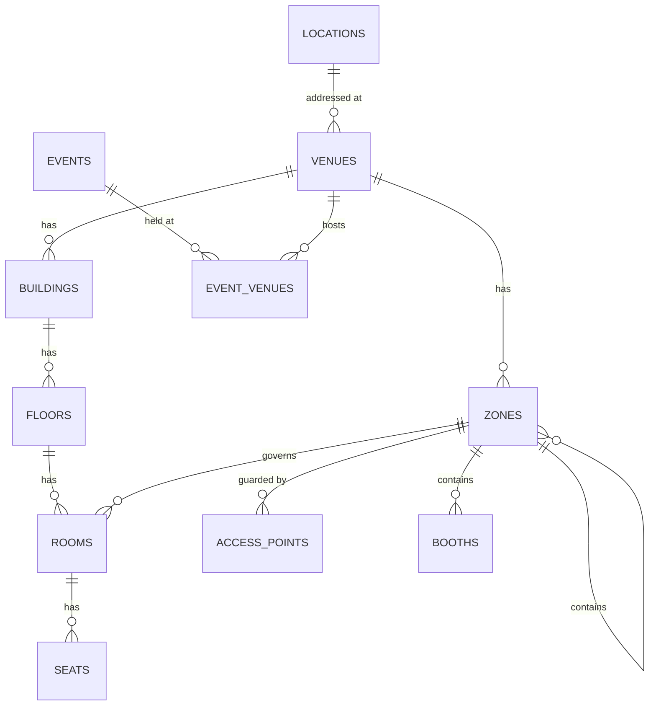

# The Space Model — Venues, Zones, Access Points

**Status:** WRITTEN · **Authority:** Authoritative for the space dimension · **Audit date:** 2026-09-28
**Classification:** New subsystem
**Blocks:** `24-access-control.md`, `26-seating-management.md`, `35-booth-management.md`, `27-sessions-tracks.md` (rooms), `53-live-event-command-center.md`

---

## Why this document exists first

Access control, seating, booths, and session rooms all need somewhere to point. None of them can
be built until space exists as a modelled thing. This is the first of the two missing dimensions
identified in `01-executive-vision.md`.

## Current state — `MISSING`

`CONFIRMED` by search of `backend/app/DomainObjects/` and `backend/database/migrations/`: no
entity exists for zone, booth, seat, room, floor, building, entrance, turnstile, or access point.
Term matches are incidental — `zone` appears only inside `timezone`
(`TimezoneDomainObject.php`, `CheckInListDomainObject::isExpired(string $timezone)`), `venue` only
inside `revenue` (`OrganizerReportTypes.php`).

What does exist `CONFIRMED` (live schema query):

```
locations         id, short_id, account_id, organizer_id, name, structured_address jsonb,
                  latitude numeric, longitude numeric, provider, provider_place_id,
                  raw_provider_response jsonb, timestamps, deleted_at

event_locations   id, short_id, event_id, type, location_id,
                  online_event_connection_details text, timestamps, deleted_at
```

Assessment: `locations` is a **geocoded postal address** — a pin on a map, populated via Google
Places (`provider`, `provider_place_id`). It answers "where is this event?" It cannot answer "is
this person allowed through this door?" There is no hierarchy and no interior.

`event_locations.type` distinguishes physical from online (`CONFIRMED` — the
`online_event_connection_details` column). Useful, and unrelated to interior space.

**Verdict:** `locations` is retained unchanged as the addressing layer. The space model is new
alongside it, linked by `venues.location_id`. This is an **Extend**, not a Replace — nothing
about event addressing changes.

## Design principles

Four rules, each of which prevents a specific failure mode seen in event systems:

1. **Access is granted to zones, never to rooms.** Rooms are where things happen; zones are what
   is controlled. A zone may contain many rooms. Granting per-room produces an unmanageable
   permission matrix.
2. **Scans happen at access points, not at zones.** A zone may have six doors. The log must say
   which one, or you cannot investigate an incident or measure a queue.
3. **The hierarchy is optional in the middle.** A conference in one ballroom must not be forced to
   invent a building and a floor. Only `Venue` and `Zone` are required.
4. **Capacity is a property of space, enforced by occupancy.** Occupancy is derived from access
   logs, not stored as a counter — a counter drifts under concurrency and offline sync.

## Target model



### Entities

**`venues`** — a physical site usable across many events. Reusable: ARZO runs repeat events at the
same Doha venues, so venue definitions must outlive a single event.

```
id, short_id, account_id, organizer_id NULL, location_id → locations,
name, timezone, default_capacity NULL, notes,
metadata jsonb, timestamps, deleted_at
```

`organizer_id NULL` = account-level shared venue. `timezone` is stored on the venue because
access windows are wall-clock local and an account may operate across timezones.

**`buildings`**, **`floors`** — optional structure. Both skippable.

```
buildings  id, short_id, venue_id, name, sort_order, metadata jsonb, timestamps, deleted_at
floors     id, short_id, building_id, name, level int, sort_order, metadata jsonb, timestamps, deleted_at
```

**`zones`** — the unit of access control. Self-referencing for nesting (Venue → Hall A → VIP
Lounge). Nesting depth capped at 5 in validation to keep rule evaluation bounded.

```
id, short_id, venue_id, parent_zone_id NULL → zones,
name, code, zone_type, capacity NULL, colour,
requires_credential bool default true,
sort_order, metadata jsonb, timestamps, deleted_at
UNIQUE (venue_id, code) WHERE deleted_at IS NULL
```

`zone_type` enum: `GENERAL`, `VIP`, `BACKSTAGE`, `STAFF_ONLY`, `EXHIBITION`, `SESSION`,
`CATERING`, `MEDIA`, `SECURE`, `EXTERNAL`.

`colour` exists because badges are colour-coded by access level on-site — it belongs to the zone,
not the badge template, so one change propagates.

`requires_credential = false` models genuinely open space (a public foyer) without special-casing
it in the rules engine.

**`access_points`** — a physical door, gate, or turnstile where scanning happens.

```
id, short_id, zone_id → zones, name, code,
direction,            -- ENTRY | EXIT | BIDIRECTIONAL
access_point_type,    -- DOOR | GATE | TURNSTILE | RECEPTION_DESK | VIRTUAL
is_active bool, position jsonb NULL,
metadata jsonb, timestamps, deleted_at
UNIQUE (zone_id, code) WHERE deleted_at IS NULL
```

`direction` is what makes anti-passback possible: without knowing a reader is an exit, you cannot
tell that someone left. `VIRTUAL` covers app-based or online check-in so the rules engine has one
code path.

`position jsonb` holds `{x, y}` on a floor plan for the command-center map — deliberately loose,
since floor-plan coordinate systems vary.

**`rooms`** — where programme happens. Governed by a zone.

```
id, short_id, venue_id, floor_id NULL, zone_id NULL → zones,
name, code, capacity NULL, room_type,
layout jsonb NULL, metadata jsonb, timestamps, deleted_at
```

`zone_id NULL` means the room is not access-controlled. `capacity` here is the fire/physical
limit; a session in the room may set a lower one (`27-sessions-tracks.md`).

**`seats`** — created only for reserved-seating events. See `26-seating-management.md`.

```
id, short_id, room_id → rooms, section, row, number, label,
seat_type, position jsonb NULL, is_accessible bool,
status, metadata jsonb, timestamps, deleted_at
UNIQUE (room_id, section, row, number) WHERE deleted_at IS NULL
```

**`booths`** — exhibitor space. Lives in the space model, not the exhibitor module, because a
booth is a place before it is a commercial unit. See `35-booth-management.md`.

```
id, short_id, venue_id, zone_id NULL, floor_id NULL,
code, name, size_sqm numeric NULL, booth_type, status,
position jsonb NULL, metadata jsonb, timestamps, deleted_at
UNIQUE (venue_id, code) WHERE deleted_at IS NULL
```

**`event_venues`** — join, because one event may use multiple venues and one venue serves many events.

```
id, event_id, venue_id, event_occurrence_id NULL, is_primary bool,
timestamps
UNIQUE (event_id, venue_id, event_occurrence_id)
```

`event_occurrence_id` lets a recurring event change venue per occurrence — a real case for a
touring or multi-city series.

## Occupancy

Live occupancy per zone is **derived**, never stored:

```sql
-- entries minus exits, per attendee, within the current event window
SELECT zone_id, COUNT(*) FILTER (WHERE net_inside > 0) AS occupancy
FROM (
  SELECT ap.zone_id, al.credential_id,
         SUM(CASE WHEN ap.direction = 'EXIT' THEN -1 ELSE 1 END) AS net_inside
  FROM access_logs al
  JOIN access_points ap ON ap.id = al.access_point_id
  WHERE al.event_id = :event_id AND al.result = 'GRANTED'
    AND al.occurred_at >= :window_start
  GROUP BY ap.zone_id, al.credential_id
) t
GROUP BY zone_id;
```

A stored counter is tempting and wrong: offline devices replay scans out of order, so any
increment/decrement counter diverges. Derived occupancy is replay-safe and idempotent.

**Performance:** this aggregate is too slow to run per request at scale. Target is a materialized
`zone_occupancy_snapshots` row refreshed every 5–10s by a scheduled job, with the live query as
the authoritative fallback. Sizing in `74-performance.md`. `UNVERIFIED` — needs load testing
against realistic scan volume before committing to the refresh interval.

## Permissions

Zone permissions are expressed in the access-control rules engine (`24-access-control.md`), not
here. This document owns only the space graph. The split matters: space is stable
infrastructure, rules change per event.

`09-permissions-and-roles.md` covers who may *administer* venues, which is a separate concern
from who may *enter* a zone.

## Migration

Additive throughout. No existing table is altered, so there is no rollback risk to current
functionality.

| Step | Change | Risk |
|---|---|---|
| 1 | Create `venues`, backfill one per distinct `event_locations.location_id` | Low — additive |
| 2 | Create `buildings`, `floors`, `zones`, `access_points`, `rooms` | Low |
| 3 | Create `event_venues`, backfill from `event_locations` | Low |
| 4 | Create `booths`, `seats` (empty) | Low |
| 5 | Per venue, create a default `GENERAL` zone + one `RECEPTION_DESK` access point | Low |

Step 5 matters for continuity: it gives every existing event a zone and an access point, so the
new access-control path has somewhere to write from day one, and current check-in behaviour maps
onto the new model without a flag day.

`locations` and `event_locations` keep working untouched. Existing check-in continues through
`attendee_check_ins` until Phase 2 cuts over (`18-check-in.md`).

## Open questions

- **Floor-plan coordinates.** Is `{x, y}` in `position` enough, or does the command center need real geo/SVG mapping? Affects `53`. Defer until the command-center UX is designed.
- **Venue sharing across accounts.** Should a Doha convention centre be a platform-level record shared by all tenants? Tempting, but it crosses tenant isolation (`08-multi-tenancy.md`). Default: no; account-scoped.
- **Zone nesting depth.** Capped at 5 by validation. `UNVERIFIED` whether real venues need more.
- **Seat-level access control.** Does a seat ever need its own access rule, or is zone + ticket sufficient? Assumption: zone is sufficient. Revisit if a client requires per-seat enforcement.

## Related

`01-executive-vision.md` · `06-domain-model.md` · `07-database-evolution.md` ·
`24-access-control.md` (consumes this) · `26-seating-management.md` · `35-booth-management.md` ·
`27-sessions-tracks.md` (rooms) · `53-live-event-command-center.md` (occupancy, map)
