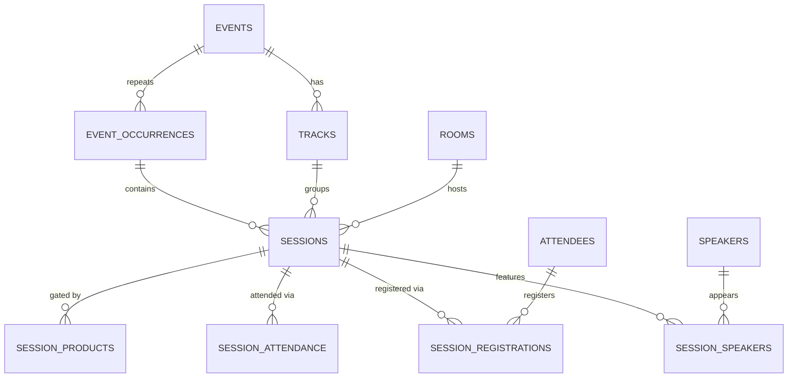

# The Time Model — Sessions, Tracks, Programme

**Status:** WRITTEN · **Authority:** Authoritative for the time dimension · **Audit date:** 2026-09-28
**Classification:** New subsystem
**Blocks:** `28-speakers-management.md`, `29-agenda-scheduling.md`, `30-mobile-event-app.md`, `31-networking.md`, `54-attendance-intelligence.md`

---

## Why this document exists

This is the second of the two missing dimensions (`01-executive-vision.md`). An attendee app
without an agenda is a ticket wallet; session analytics without sessions is impossible. Most of
the conference-platform capability set hangs off this one model.

## Current state — `MISSING`

`CONFIRMED` by search: no `session`, `track`, `speaker`, `agenda`, `workshop`, or `timeslot`
entity exists in `backend/app/DomainObjects/` or `backend/database/migrations/`. The word
`session` appears only as `OrderDomainObject::$sessionIdentifier` — a **checkout session** string
for payment resumption, entirely unrelated.

### The occurrence trap

`event_occurrences` exists and looks like it might already model sessions. It does not, and
conflating the two is the most likely architectural mistake available here.

`CONFIRMED` — `event_occurrences` is an **RRULE recurrence** of the whole event, with supporting
machinery: `product_occurrence_visibility`, `product_price_occurrence_overrides`,
`event_occurrence_statistics`, `event_occurrence_daily_statistics`, and
`attendee_check_ins.event_occurrence_id`.

| | Occurrence | Session |
|---|---|---|
| Means | A repeat of the entire event | A programme item inside one occurrence |
| Example | Yoga class, every Monday × 52 | "Keynote, 09:00–10:00, Hall A" |
| Sold? | Yes — has products, prices, capacity | Usually not; registered for, not bought |
| Has speakers? | No | Yes |
| Has a room? | No — the venue is event-level | Yes |
| Cardinality | 1 event → N occurrences | 1 occurrence → N sessions |

A one-day conference with 40 talks has **one occurrence and forty sessions**. Modelling those
talks as occurrences would give each its own products, prices, and statistics rows — and would
make the conference look like 40 separate events in every report.

**Sessions are a new model, nested inside occurrences.**

## The five windows

`00-master-index.md` defines these; restated here because session work is where they get
confused, and confusing them produces access bugs.

| Window | Question | Owner |
|---|---|---|
| Sale window | When can this price be bought? | `product_prices` — exists |
| Registration window | When can someone register? | `event_settings` — exists |
| Occurrence window | When does this repeat run? | `event_occurrences` — exists |
| **Session window** | When does this programme item run? | `sessions` — new |
| **Access window** | When may a credential pass a point? | `access_rules` — new (`24`) |

A session window and an access window are different things: a talk runs 09:00–10:00, but the hall
may admit from 08:30 and lock at 09:15. Both are needed.

## Target model



### `sessions`

```
id, short_id, event_id, event_occurrence_id NULL → event_occurrences,
track_id NULL → tracks, room_id NULL → rooms,
title, description text, session_type, status,
starts_at timestamptz, ends_at timestamptz, timezone,
capacity NULL int,
requires_registration bool default false,
registration_opens_at NULL, registration_closes_at NULL,
allow_waitlist bool default false,
check_in_enabled bool default false,
is_published bool default false,
sort_order, metadata jsonb, timestamps, deleted_at
```

`session_type`: `KEYNOTE`, `TALK`, `PANEL`, `WORKSHOP`, `BREAKOUT`, `MEETING`, `BREAK`,
`NETWORKING`, `CEREMONY`, `OTHER`.

`status`: `DRAFT`, `SCHEDULED`, `LIVE`, `COMPLETED`, `CANCELLED`, `POSTPONED`.

`event_occurrence_id NULL` supports the common case — a single-occurrence event whose sessions
need no occurrence pinning — while allowing a recurring event to vary its programme per
occurrence.

`capacity NULL` = inherit the room's capacity. An explicit value must be validated as
`<= rooms.capacity`.

`requires_registration` separates "turn up" sessions from limited workshops. When false, session
check-in may still record attendance.

**Timestamps are `timestamptz`.** `CONFIRMED` that existing tables use `timestamp without time
zone` (see `attendees`, `check_in_lists`), with timezone handling in application code. New
programme tables should store `timestamptz` — agenda correctness across timezones is exactly where
naive timestamps cause bugs. This is a deliberate divergence from existing convention and is
flagged in `121-technical-debt.md` as an inconsistency to converge later, not to replicate now.

### `tracks`

```
id, short_id, event_id, name, description, colour, sort_order,
metadata jsonb, timestamps, deleted_at
```

Thematic grouping, event-scoped, not occurrence-scoped — a track spans the whole event.

### `speakers`

Detailed in `28-speakers-management.md`. Separate from `attendees` and `users` on purpose: a
speaker may never register, may not have an account, and has public-facing bio/photo content with
a different lifecycle and privacy profile.

```
id, short_id, account_id, event_id NULL,
first_name, last_name, email NULL, title, company,
bio text, photo_image_id NULL → images,
social jsonb, is_published bool,
metadata jsonb, timestamps, deleted_at
```

`event_id NULL` = reusable across an account's events.

### `session_speakers`

```
id, session_id, speaker_id, role, sort_order, timestamps
UNIQUE (session_id, speaker_id)
```

`role`: `SPEAKER`, `MODERATOR`, `PANELLIST`, `HOST`, `TRANSLATOR`.

### `session_registrations`

```
id, short_id, session_id, attendee_id, status,
registered_at, cancelled_at NULL, waitlist_position NULL,
metadata jsonb, timestamps
UNIQUE (session_id, attendee_id) WHERE deleted_at IS NULL
```

`status`: `REGISTERED`, `WAITLISTED`, `CANCELLED`, `ATTENDED`, `NO_SHOW`.

Uniqueness here is correct — one registration per attendee per session — unlike the check-in case
below.

### `session_attendance`

**Append-only. No unique constraint.** This is the deliberate lesson from
`attendee_check_ins_unique_attendee_list`, which `CONFIRMED` forbids re-scanning and so cannot
express leaving and returning.

```
id, short_id, session_id, attendee_id,
scanned_at timestamptz, direction,     -- IN | OUT
access_point_id NULL → access_points,
device_id NULL → devices,
recorded_by NULL → users,
source,                                -- SCAN | MANUAL | KIOSK | API | IMPORT
client_generated_id uuid,              -- offline idempotency
metadata jsonb, timestamps
UNIQUE (client_generated_id)
INDEX (session_id, attendee_id, scanned_at)
```

`client_generated_id` is the offline-sync idempotency key: a device generates it before the scan,
so replaying a queued scan cannot double-record. See `71-realtime-architecture.md`.

Dwell time per attendee is derived from IN/OUT pairs — which is what makes engagement analytics
possible (`54-attendance-intelligence.md`).

### `session_products`

Gates a session behind ticket types — "workshop open to Full Pass only".

```
id, session_id, product_id, timestamps
UNIQUE (session_id, product_id)
```

Empty set = open to all registered attendees. Mirrors the existing
`product_check_in_lists` pattern (`CONFIRMED` — that table exists), so the concept is already
familiar in this codebase.

## Conflict detection

Three classes, all enforced server-side on save:

1. **Room double-booking** — two published sessions, same `room_id`, overlapping `[starts_at, ends_at)`. Hard error.
2. **Speaker clash** — one speaker in two overlapping sessions. Hard error unless overridden.
3. **Attendee clash** — an attendee registered for overlapping sessions. Warning only; attendees legitimately register then choose.

Overlap uses `tstzrange` with `&&`, and a GiST exclusion constraint on
`(room_id, tstzrange(starts_at, ends_at))` for published sessions gives database-level
enforcement rather than trusting application checks.

## Capacity and waitlist

Reuse the existing pattern rather than inventing one. `CONFIRMED`:
`WaitlistEntryDomainObject` and `waitlist_entries` already implement join / offer / expire with
mails. Session waitlists should extend that machinery (add a nullable `session_id`) rather than
duplicate it — **Extend**, not New subsystem.

`UNVERIFIED`: whether `waitlist_entries` is cleanly extensible or too event-coupled. Requires
reading the offer/expiry service before committing. Flagged in `137-engineering-work-packages.md`.

## Calendar export

`CONFIRMED`: `frontend/src/utilites/calendar.ts` already generates ICS for events, and
`spatie/icalendar-generator` is a backend dependency. Session-level ICS and a full personal-agenda
feed are an extension of existing code, not new work.

## Migration

Fully additive. No existing table changes.

| Step | Change |
|---|---|
| 1 | Create `tracks`, `speakers` |
| 2 | Create `sessions` with room/track FKs, plus the GiST exclusion constraint |
| 3 | Create `session_speakers`, `session_products` |
| 4 | Create `session_registrations`, `session_attendance` |
| 5 | Extend `waitlist_entries` with nullable `session_id` (pending the check above) |

No backfill: no event currently has a programme. Existing events gain an empty programme, which
renders as "no sessions" and changes nothing for them.

## Open questions

- **Do sessions ever get sold?** Paid workshops would need `products` linkage, making a session a purchasable thing and pulling in tax/VAT. Assumption: no, Phase 3 treats sessions as free-with-registration. Revisit before Phase 3 exit.
- **Multi-occurrence programme templating.** Should a recurring event clone its programme per occurrence? Probably, but it interacts with occurrence bulk-generation. Defer.
- **Speaker portal.** Self-service bio/slide upload for speakers is a separate surface (`93` covers exhibitors; speakers may need equivalent). Not planned yet.
- **Session-level access enforcement.** Does entering a session room require an access scan, or is session check-in separate from zone access? Assumption: session check-in writes `session_attendance`; zone access writes `access_logs`; a session in a controlled room produces both. Confirm with `24-access-control.md` during Phase 3.

## Related

`01-executive-vision.md` · `06-domain-model.md` · `25-zones-and-permissions.md` (rooms) ·
`24-access-control.md` · `28-speakers-management.md` · `29-agenda-scheduling.md` ·
`30-mobile-event-app.md` · `14-waitlist-and-capacity.md` · `54-attendance-intelligence.md`
