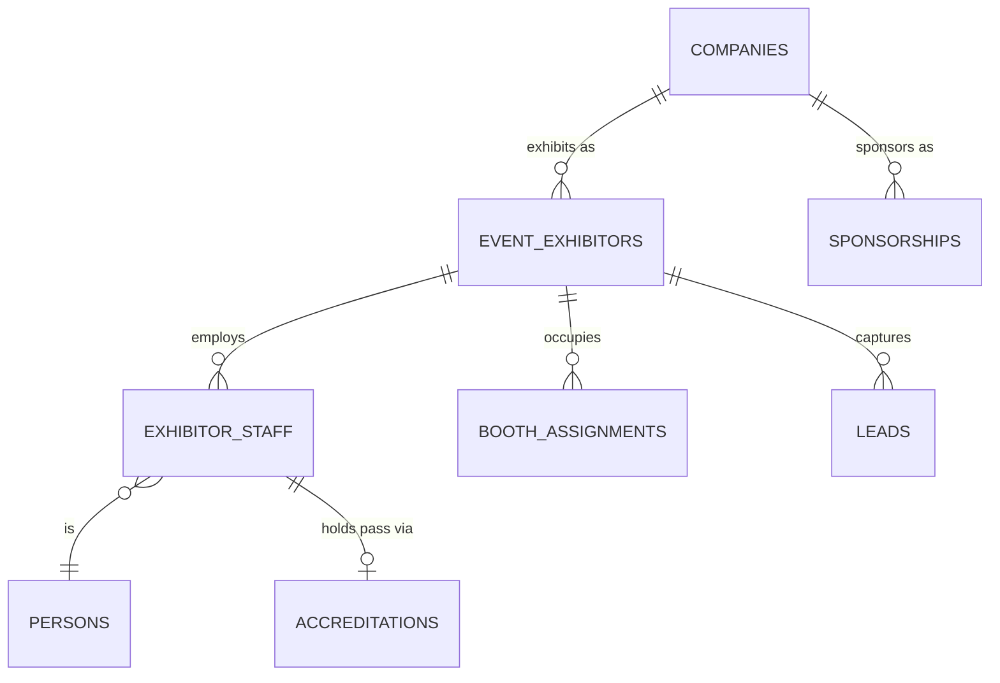
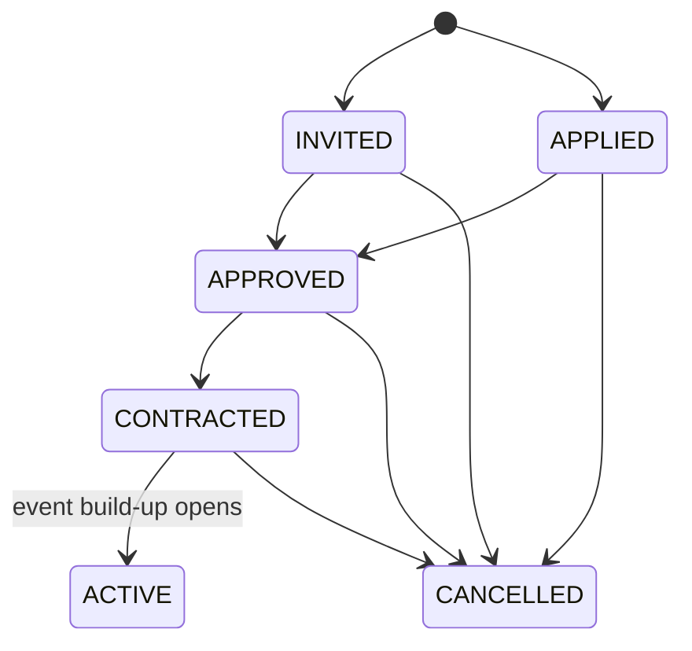

# Exhibitor Management

**Status:** WRITTEN · **Audit date:** 2026-09-29 · **Baseline:** `develop` @ `e7228c1d`
**Classification:** New subsystem · **Priority:** P2 (ARZ-130, ARZ-131, ARZ-132) · **Phase:** 3
**Depends on:** `09-permissions-and-roles.md`, `23-accreditation.md`, `25-zones-and-permissions.md`
**Blocks:** `33-exhibitor-lead-capture.md`, `34-sponsor-management.md`, `35-booth-management.md`, `93-exhibitor-platform.md`

---

## Current state — `MISSING`, 0%, with four constraints discovered

`CONFIRMED`: no exhibitor, sponsor or company entity. The hits for "exhibitor" are the seeded
permission strings `exhibitor.manage` and `lead.view` (`2026_09_29_000007:31`), which nothing reads,
and demo seeders. `ConferenceDemoEvent.php` seeds no exhibitor entities; it fakes "Company VAT
number" as a free-text order question (line 279), which is itself evidence that B2B buyers need
company fields the platform does not have.

The audit found four facts that shape the design more than the absence does:

| # | Fact | Evidence | Consequence |
|---|---|---|---|
| 1 | **A third-party login today sees the whole account.** `account_users` has no organizer or event scoping; `IsAuthorizedService` compares `account_id` only; `ORGANIZER` passes every check. `event_users` exists with 0 rows and no reader. | `IsAuthorizedService.php:36-47,70-77` | An exhibitor portal **cannot** be built on account membership until ARZ-011/012/013 land |
| 2 | **`credentials_exactly_one_source` covers two sources, not four.** Only `accreditation_id` and `attendee_id`; there is no `exhibitor_staff_id` column. | `2026_09_30_000001:162-170`, live DB | `23`'s diagram (exhibitor staff → credential directly) is not what was built |
| 3 | **Only an order can be invoiced.** `invoices.order_id` is NOT NULL; the sole creator is `InvoiceCreateService::createInvoiceForOrder()`. | `InvoiceCreateService.php:21` | Booth packages cannot be invoiced without an order |
| 4 | **A `GENERAL` product creates no attendee.** Non-ticket lines are skipped at attendee creation. | `CompleteOrderHandler.php:160-167` | A package can be sold as a product without minting a ticket |

Also `CONFIRMED`: `orders` has no company or VAT column, yet the frontend declares
`Order.company_name` (`types.ts:930`) and renders it (`OrdersTable/index.tsx:122-124`). The backend
never sends it — **dead UI**, logged for `121`.

## What an exhibitor is

An **organization participating in one event**, with staff, a booth, a public listing, obligations,
and leads. Not a variant of attendee: it has no ticket, many people, and a commercial relationship
with the organizer rather than with the event's audience.

The same company returns year after year and often also sponsors (`34`). That gives the model its
shape: a reusable **company profile**, plus a per-event **participation**.

## Target model



```
companies                        -- account-scoped, reused across events (shared with 34)
  id, short_id, account_id,
  name, legal_name NULL, website NULL, description NULL,
  logo_image_id NULL → images, country NULL, vat_number NULL,
  metadata jsonb, timestamps, deleted_at
  INDEX (account_id)

event_exhibitors                 -- one company, one event
  id, short_id, event_id, company_id,
  status,                        -- INVITED | APPLIED | APPROVED | CONTRACTED | ACTIVE | CANCELLED
  package_name NULL,
  staff_pass_quota int NULL,
  listing_published bool default false,
  listing jsonb,                 -- category, tags, public description override
  contract_value numeric NULL, currency NULL,
  payment_status,                -- NOT_INVOICED | INVOICED | PAID | WAIVED
  metadata jsonb, timestamps, deleted_at
  UNIQUE (event_id, company_id) WHERE deleted_at IS NULL

exhibitor_staff
  id, short_id, event_exhibitor_id, person_id,
  role,                          -- ADMIN | STAFF
  accreditation_id NULL → accreditations,
  timestamps, deleted_at                -- portal access via person_login_links / person_sessions (92, 93)
  UNIQUE (event_exhibitor_id, person_id) WHERE deleted_at IS NULL
```

`companies` is **account-scoped**, not platform-wide. A convention-centre-style shared registry of
companies across tenants is tempting and crosses tenant isolation (`08`), the same reasoning `25`
applied to venues.

## Decision: staff passes come through accreditation, not a third credential source

Given fact 2, there are two ways to give exhibitor staff a credential:

| Option | Cost |
|---|---|
| Add `exhibitor_staff_id` to `credentials` and widen the CHECK | Every credential consumer — materialization, badge render, device sync, reports — learns a new source. Repeated again for staff (`57`). |
| **Issue an `EXHIBITOR` accreditation per staff member** | Zero schema change to `credentials`. Reuses approval, audit (`67`), type rules and `max_issuable`. |

**Recommendation: accreditation.** An exhibitor admin naming a staff member creates an accreditation
of type `EXHIBITOR`, auto-approved while the exhibitor is within `staff_pass_quota`, routed to an
organizer for approval beyond it. The credential follows through the existing path.

This supersedes the `EXHIBITOR_STAFF → CREDENTIALS` edge in `06` and `23`, and the same reasoning
is applied to event staff in `57`. The two-source CHECK is then the permanent design rather than an
unfinished one.

## Lifecycle



Cancelling a `CONTRACTED` exhibitor must release its booth assignment (`35`) and suspend its staff
accreditations — a cascade that is easy to forget and produces badges for a company that is not
there.

## The portal — magic link first

Fact 1 rules out giving exhibitors `account_users` membership: under today's authorization that is
read access to every event, order and attendee in the account.

**v1: tokenized per-person links**, the `ticket_lookup_tokens` pattern already proven for
attendees. An `ADMIN` exhibitor-staff member receives a revocable, expiring link scoped to one
`event_exhibitors` row. What it can do:

- Edit the company listing and logo
- Name and remove staff within quota (creates and withdraws accreditations)
- See booth assignment, deadlines and documents requested
- View and export their own leads (`33`)

**v2: real logins** with the `EXHIBITOR` role from `09`, once per-resource authorization exists.
That is the point at which `93` becomes a full surface.

## Billing

**v1: record, do not transact.** B2B booth sales run on contracts, purchase orders, bank transfer and
net terms, not card checkout. `contract_value` and `payment_status` record the position.

**v2, if wanted:** facts 3 and 4 give a cheap path — a booth package as a hidden `GENERAL` product,
bought through an organizer-created offline order, which yields an invoice with VAT through
existing machinery and mints no ticket. `UNVERIFIED`: whether an organizer can create an order
containing only `GENERAL` products today; nothing found blocks it, but it has not been exercised
end to end.

## Obligations and deadlines

Exhibitor manuals are long: stand design approval, insurance certificate, rigging and power
requests, staff names by a cutoff. Model them as **tasks with due dates** attached to the
participation (`58`) and **documents** (`73`), not as bespoke columns.

Ordering stand services (furniture, electrics, catering) is a commerce product in its own right —
**out of scope**.

## Build-up and breakdown

Exhibitor staff need hall access days before the doors open. That is an access window, not a
feature: the `EXHIBITOR` accreditation type's rules grant the exhibition zone during build-up and
breakdown windows (`23`, `24`). Stand builders are `CONTRACTOR` accreditations **requested by the
exhibitor, approved by the organizer**.

## Migration and backlog

Additive, Phase 3. `companies`, `event_exhibitors`, `exhibitor_staff` are new; nothing existing
changes.

| Item | Scope |
|---|---|
| ARZ-130 | `companies`, `event_exhibitors`, organizer CRUD, magic-link portal |
| ARZ-131 | Booth assignment (`35`) |
| ARZ-132 | Staff passes via `EXHIBITOR` accreditation — **approach changed** from a direct credential source |

## Open questions

- **Self-registration or ARZO-onboarded?** An application form is `APPLIED`; invitation is `INVITED`. Both states exist so the answer can differ per event.
- **Billing through the platform at all?** If never, v2 above is not built.
- **Exhibitor categories** — a fixed taxonomy per event, or free tags? Matters for the directory and for matchmaking (`31`).
- **Should exhibitors get their own affiliate code** to invite customers? One `affiliates` row per exhibitor gives attribution for free (`45`).
- **Does the public directory need an Arabic listing** (`82`)? Company descriptions are organizer-facing marketing copy.

## Related

`33-exhibitor-lead-capture.md` · `34-sponsor-management.md` · `35-booth-management.md` ·
`23-accreditation.md` · `09-permissions-and-roles.md` · `45-affiliate-referrals.md` ·
`58-task-management.md` · `93-exhibitor-platform.md` · `121-technical-debt.md`
