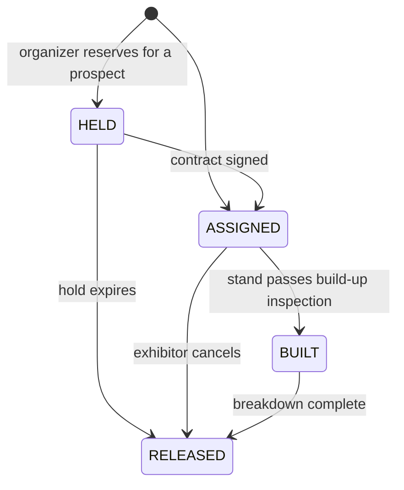

# Booth Management

**Status:** WRITTEN · **Audit date:** 2026-09-29 · **Baseline:** `develop` @ `e7228c1d`
**Classification:** Extend (table exists) + one correction · **Priority:** P2 (ARZ-131) · **Phase:** 3
**Depends on:** `25-zones-and-permissions.md`, `32-exhibitor-management.md`
**Blocks:** nothing directly

---

## Current state — table exists, wrong-shaped for its main use

`CONFIRMED`: Phase 1 created `booths` (`2026_09_29_000003:38-63`):

```
booths  id, short_id, venue_id → venues (NOT NULL, cascade),
        zone_id NULL → zones, floor_id NULL → floors,
        code varchar(64), name NULL, size_sqm numeric(10,2) NULL,
        booth_type varchar(32) default 'STANDARD',
        status varchar(32) default 'AVAILABLE',
        position jsonb NULL, metadata jsonb, timestamps, deleted_at
        UNIQUE (venue_id, code) WHERE deleted_at IS NULL
        INDEX (venue_id), (zone_id), (venue_id, status)
```

- 0 rows. A model and repository landed in `602b2b5a`; no service, action or route uses them.
- `booth_type` and `status` are free `varchar` with no enum class and no CHECK.
- There is **no `event_id`, no exhibitor reference and no order reference**. Nothing can say who
  holds a booth at which event.

## The shape problem

`25` placed booths in the space model because "a booth is a place before it is a commercial unit".
That is right, and it produced two errors in the landed table.

### Error 1 — allocation status lives on a venue-scoped row

`booths` is venue-scoped, so one booth row serves every event at that venue. Its `status`
(`AVAILABLE`, `HELD`, `ASSIGNED`…) is **per event**: a booth can be sold for the March show and free
for the June show. A single `status` column cannot say both. The first time two events share a
venue, the column is wrong for one of them.

### Error 2 — exhibition layouts are usually per event

Most exhibition halls are empty floor. The organizer draws a **new** booth plan per edition —
different sizes, aisles and numbering. Venue-scoped booths assume a permanent layout, which is true
only of fixed kiosks and permanent stands.

### Correction

| Change | Why |
|---|---|
| Add `booths.event_id NULL` | `NULL` = permanent venue booth; set = this event's layout. Covers both cases. |
| Narrow `booths.status` to physical state: `ACTIVE`, `OUT_OF_SERVICE` | What is true regardless of event |
| Move allocation to a new `booth_assignments` | Per-event state belongs on a per-event row |
| Uniqueness becomes `(venue_id, COALESCE(event_id, 0), code)` | Two editions may both have "A12" |

Nothing reads the table and it has no rows, so this is a cheap correction **now** and an expensive
migration later.

**The same defect exists in `seats`**: `seats.status` defaults to `AVAILABLE` on a room-scoped row,
and seat allocation is per event. Flagged to `26`, which defers seating anyway.

## Target model

```
booth_assignments
  id, short_id, event_id, booth_id, event_exhibitor_id NULL → event_exhibitors,
  role,             -- PRIMARY | CO_EXHIBITOR
  status,           -- HELD | ASSIGNED | BUILT | RELEASED
  held_until timestamptz NULL,
  assigned_at NULL, assigned_by NULL → users,
  released_at NULL, release_reason NULL,
  notes NULL, timestamps
  UNIQUE (event_id, booth_id) WHERE status <> 'RELEASED' AND role = 'PRIMARY'
```



- **`HELD` expires.** A hold is a sales tool; a forgotten one silently takes a booth off the market.
  A sweep job releases expired holds, the same pattern as `ProcessExpiredWaitlistOffersJob`, which
  already runs every minute.
- **`CO_EXHIBITOR`** covers shared stands and country pavilions — several companies, one booth.
- **`BUILT`** gives operations a build-up checklist state (`58`): a booth that is assigned but not
  built at T-12h is a problem the command center should show.

## Does a booth drive access grants?

The scaffold asked whether booth assignment should grant exhibitor staff access. **No — the zone
does.** An open-plan booth has no door and cannot be access-controlled; the controlled space is the
hall. Exhibitor staff receive the exhibition zone through their `EXHIBITOR` accreditation, with
build-up and breakdown windows (`32`). Adding booth-level grants would create rules no scanner can
ever enforce.

The exception is a **walled or enclosed stand with its own entrance** (a private meeting room on a
double-decker stand). Model that as a small zone with an access point, not as a booth grant.

## The floor plan

Seat maps (`26`) and booth plans share the authoring question, and `04` already concluded *buy or
defer* for seat maps. The same answer applies:

| Stage | Capability |
|---|---|
| v1 | List entry and CSV import of booths (code, size, type, zone); upload the organizer's floor-plan image |
| v2 | Booth rectangles positioned on that image via `position` `{x, y, w, h}` in image coordinates; clickable in the exhibitor portal and the attendee app |
| Not planned | A CAD-style drawing tool. Organizers already produce plans in CAD; ARZO should consume them, not replace them. |

`position` in image coordinates is deliberately loose, consistent with `access_points.position`
(`25`), until the command center decides on a real coordinate system.

## Pricing

Booth price is usually area-based with premiums (corner, island, main aisle). **Out of scope for
v1** — price lives on the contract (`32`). If the `GENERAL`-product billing path is ever adopted, a
booth package is a product and the booth is still assigned separately.

## Migration

| Step | Change | Risk |
|---|---|---|
| 1 | Add `booths.event_id NULL`; replace the unique index | Low — 0 rows |
| 2 | Constrain `booths.status` to `ACTIVE` / `OUT_OF_SERVICE`; add enum classes for status and type | Low |
| 3 | Create `booth_assignments` | Low |
| 4 | Hold-expiry sweep job | Low |

Steps 1–2 should land **before** any service or action writes booths — the model and repository
exist, so the window is closing.

## Open questions

- **Booth types** — `STANDARD` is the only value in use. Shell scheme, space only, island, pavilion is the usual set; confirm against ARZO's venues.
- **Does ARZO run exhibitions at venues with permanent booths?** If never, `event_id` could be NOT NULL and the venue case dropped.
- **Who sees the floor plan** — public (attendee wayfinding, `30`) or exhibitors only (sales)? Probably both, with held booths hidden publicly.

## Related

`25-zones-and-permissions.md` · `26-seating-management.md` · `32-exhibitor-management.md` ·
`58-task-management.md` · `53-live-event-command-center.md` · `30-mobile-event-app.md` ·
`04-product-strategy.md`
