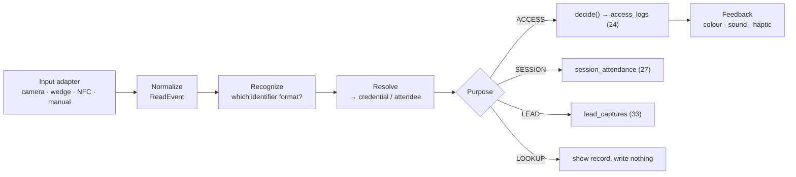

# Scanner Platform

**Status:** WRITTEN · **Audit date:** 2026-09-29 · **Baseline:** `develop` @ `e7228c1d`
**Classification:** Extend (QR) + New (pipeline, identity) · **Priority:** P2 (ARZ-120) · **Phase:** 4, with fixes now
**Depends on:** `37-hardware-integration.md`, `24-access-control.md`, `71-realtime-architecture.md`, `40-device-management.md`
**Blocks:** `94-mobile-scanner.md`, `33-exhibitor-lead-capture.md`, `36-rfid-nfc.md`

---

## Current state — `PARTIAL`, ~70% for QR on a good network

`CONFIRMED` in `frontend/src/components/layouts/CheckIn/` (route `/check-in/:checkInListShortId`,
`router.tsx:664`).

### Camera
`qr-scanner@1.4.2`, used only in `tabs/InlineCameraScanner.tsx`: `maxScansPerSecond: 1`, default
rear camera, torch toggle when `hasFlash()`, camera picker via `listCameras(true)`, decodes debounced
1000 ms.

### Keyboard wedge (USB and Bluetooth scanners)
A `window` `keypress` listener appends `e.key` to a buffer and processes it on `Enter`, or after a
100 ms pause if the buffer starts with `A-` (`index.tsx:429-474`, prefix check at `:411`, `:455`).

### After the F1 fix (`455585b3`)
`handleCheckInAction` returns `Promise<boolean>`; a code enters the dedupe set only after a confirmed
check-in; offline, the operator is told "not checked in — scan it again". **There is still no retry,
no outbox and no persistence** — `networkMode: "always"`, mutation retry 0, no IndexedDB.

### What the QR contains
The bare attendee `public_id` — `A-` + 7 upper-cased random characters (`IdHelper.php:32-35`),
rendered by `react-qr-code` at level M (`AttendeeTicket/index.tsx:151-156`). Random, not
sequential — roughly 36 bits after upper-casing folds 62 symbols into 36. No signature.

## Defects found — fix ahead of the roadmap

Independent of Phase 4, small, and each one is live:

| # | Defect | Evidence | Severity |
|---|---|---|---|
| S1 | **Arabic keyboard layout silently breaks USB scanners.** A wedge scanner emits key codes; with an Arabic layout active the OS maps them to Arabic characters, the `A-` check fails, and the scan is ignored with no message. | `index.tsx:411,455` uses `e.key` | **High in Qatar** |
| S2 | The 100 ms no-Enter path is probably dead: the effect depends on the buffer, so its cleanup clears the timer on every keystroke | `index.tsx:470-472` — `UNVERIFIED` at runtime | Medium |
| S3 | Camera path skips the `A-` check entirely; any QR payload is submitted | `InlineCameraScanner.tsx` | Low |
| S4 | Camera `processed` list never expires while mounted — after an undo, re-scanning by camera does nothing, silently | `InlineCameraScanner.tsx:20,81` | Medium |
| S5 | A probe `getUserMedia` stream is discarded without stopping its tracks | `InlineCameraScanner.tsx:32` | Low — camera stays busy on some devices |
| S6 | Scans arriving while one is in flight are dropped silently | `isProcessingRef`, `index.tsx:332-334` | Medium at a busy gate |
| S7 | "Just scanned" compares against the last scan of **any** code, not this code | `index.tsx:337-338` | Low — misleading message |
| S8 | Scanned value interpolated into the URL path without `encodeURIComponent` | `api/check-in.client.ts:29` | Low |
| S9 | `attendees.public_id` has **no unique index** — only a `lower()` btree and a trigram index | Live DB | Low per event; no guard at all |

**S1 fix:** read `KeyboardEvent.code` (the physical key, layout-independent) and map through a
US-layout table, rather than `e.key`. Scanners emit physical key codes; interpreting them as
characters in the active layout is the bug.

## Security gaps on the public check-in surface

`CONFIRMED`: the seven public check-in routes (`api.php:655-661`) authenticate on the list's
`short_id` alone (`cil_` + 13 random characters). They carry **no per-route throttle** — only the
global 180/min per IP (`RouteServiceProvider.php:27`).

- **Anyone holding the link can also undo check-ins** (`DELETE .../check-ins/{id}`).
- **The attendee search matches email** though it does not return it (`AttendeeRepository.php:130`).
  Anyone with a link can test whether an address belongs to a named attendee — an enumeration
  oracle.
- Attribution is `ip_address` only (`CreateAttendeeCheckInService.php:254`). This is F3.

Short-term: a tight per-route throttle, and drop email from the public search. Structural: operator
identity, below.

### The first identity-bearing scan path — in progress

`AccessScanService` (`e7228c1d`) gathers the decision context, calls the pure
`AccessDecisionService`, and writes `access_logs` with `operator_user_id`. At audit time a route for
it — `POST /events/{id}/access-scans`, under `auth:api`, operator taken from the logged-in user — was
in the working tree, uncommitted. It closes F3 **for staff with platform logins**. It does not help
link-based volunteers or devices, which need device keys (`40`); and until ARZ-041, neither existing
check-in path writes `access_logs`.

## Target pipeline

One pipeline, whatever the input and whatever the purpose:

**Purpose is device configuration** (`40`), not an operator choice mid-queue. A device at a session
door records attendance; a device at a booth captures leads; the same scan must never do both by
accident.

### Recognizers — replace the hardcoded `A-`

A registry of formats, each a pure function shared by web and native builds and covered by the
golden vectors in `37`:

| Format | Pattern | Resolves via |
|---|---|---|
| Legacy ticket | `A-[A-Z0-9]{7}` | `attendees.public_id`, scoped to the event → `credentials.attendee_id` |
| Credential | **landed:** 40 random lower-case alphanumerics, no prefix (`CredentialIssuanceService.php:86`) | `credentials.identifier_hash` (SHA-256) |
| HF/UHF tag | by reader source, not pattern | `credential_media.uid_hash` (`36`) |
| Manual | operator search | name, order reference — never email on public surfaces |

The landed credential format is distinguishable from `A-` codes by shape alone, so recognition
works today. Two recommendations before the first badge is printed, while no credential has left the
building:

- **Add a short versioned prefix** (e.g. `C1`), so the format can change later without ambiguity
  and a recognizer never has to guess from length.
- **Upper-case the token.** QR *alphanumeric* mode encodes only `0-9`, `A-Z` and a few symbols;
  lower-case forces *byte* mode. At error-correction level M, a version-3 code holds 61 alphanumeric
  characters but only 42 bytes. Forty lower-case characters already use 40 of those 42 bytes, so any
  prefix longer than two characters spills into a larger, denser version-4 code that reads more
  slowly on a phone camera; upper-case leaves room to spare. Entropy is unaffected — 40 characters
  from 36 symbols is over 200 bits.
- **Resolve case-insensitively either way.** A keyboard-wedge scanner on a host with Caps Lock on
  inverts the case of everything it types (S1's cousin), so normalize before hashing.

**Legacy tickets stay valid for their events.** Tickets already emailed carry `A-` codes and cannot
be recalled. After the credential backfill (ARZ-053), new tickets should render the credential
identifier; old ones keep resolving through the attendee.

### Signed QR — assessed, deferred

A signed payload would let a device verify authenticity with no roster. Deferred: devices need the
roster anyway for names and photos, revocation still needs a deny-list, and a longer payload makes a
denser, slower-to-read code. Revisit only for very large events where roster sync is the bottleneck.

## Operator identity — closing F3

| Layer | Mechanism |
|---|---|
| Device | Its own scoped key (`40`) — authenticates the tablet |
| Operator | Scans **their own staff credential** at shift start (`57`). No interim PIN — staff credentials arrive with Phase 2, before the native app in Phase 4 (`92`) |
| Every log | `operator_user_id`, or the operator's person, on each `access_logs` row |

Badge-scan login is the elegant end state `18` pointed at: no typing, and it proves the operator
holds a valid staff credential. **The volunteer link must stay nearly as easy**, or it will be worked
around: a device-bound link with a short-lived token, issued from the admin UI.

## Feedback

| Result | Screen | Sound | Haptic |
|---|---|---|---|
| Granted | Green, name, photo where required | Single tone | Short |
| Granted, re-entry | Green with "re-entry" | Single tone | Short |
| Denied | Red, **reason category** — "not valid for this area", "outside access hours" | Distinct tone | Long |
| Offline decision | Amber banner with data age (`71` emergency mode) | — | — |

Operators see a reason category, never the rule internals. Photo display at supervised points is the
main defence against passback and against a borrowed badge (`68`).

## Open questions

- **Which dedicated scanner hardware?** Zebra and Honeywell Android devices work as keyboard wedges today and as native integrations later. Affects `102`.
- **Scanner app stack** — if `94` chooses React Native, the pipeline above is a shared TypeScript module. If fully native, recognizers are shared only via golden vectors.
- **Does a session door write both `access_logs` and `session_attendance`?** `27` and `18` assume both when the room is access-controlled. Decide with the purpose model above.
- **Camera throughput** — `maxScansPerSecond: 1` caps a device at 60 scans a minute. Not the bottleneck today (a person takes several seconds); revisit if RFID lanes are not adopted.

## Related

`18-check-in.md` · `24-access-control.md` · `33-exhibitor-lead-capture.md` · `36-rfid-nfc.md` ·
`37-hardware-integration.md` · `40-device-management.md` · `68-fraud-prevention.md` ·
`71-realtime-architecture.md` · `82-localization.md` · `94-mobile-scanner.md`
