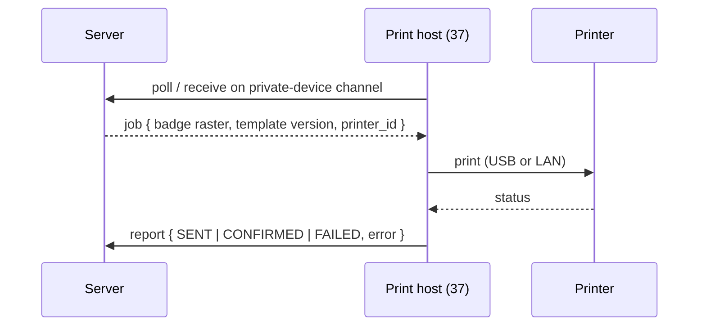

# Printer Integration

**Status:** WRITTEN · **Audit date:** 2026-09-29 · **Baseline:** `develop` @ `e7228c1d`
**Classification:** New subsystem · **Priority:** P2 (ARZ-121) · **Phase:** 4 (hardware), render pipeline Phase 2
**Depends on:** `22-badge-design-printing.md`, `37-hardware-integration.md`, `40-device-management.md`
**Blocks:** `19-kiosk-system.md`, `17-onsite-registration.md`

---

## Current state — `MISSING` for badges; job table landed

`CONFIRMED`:

| Fact | Evidence |
|---|---|
| All printing is `window.print()` behind a 500 ms timeout, 3 sites | `PrintProduct/index.tsx:19`, `PrintOrder/index.tsx:17`, `TicketDesignerPrint.tsx:28` |
| One `@page` rule: `size: A4; margin: 8mm` | `AttendeeTicket.module.scss:2-5` |
| Server-side PDF is invoices only, via dompdf | `GenerateOrderInvoicePDFService.php:58`; attached in `Mail/Order/OrderSummary.php:87` |
| `@react-pdf/renderer@^4.5.1` in `package.json`, imported nowhere | Search excluding `node_modules` |
| No ZPL, ESC/POS, CUPS, IPP, Zebra, Evolis, Brother or DYMO references | Case-insensitive search |
| `badge_print_jobs` exists as of `c34f6a59` | `2026_09_30_000003` |

The landed job table:

```
badge_print_jobs  id, short_id, badge_id → badges,
                  printer_identifier varchar NULL,
                  status default 'QUEUED', attempts, last_error,
                  queued_at, sent_at NULL, confirmed_at NULL,
                  client_generated_id uuid UNIQUE NULL,
                  metadata jsonb, timestamps
                  INDEX (status, queued_at), (badge_id)
```

It has **no `device_id` and no printer reference** — only a free-text `printer_identifier`. `21`
specified `device_id`; it was not built, because printers and print hosts have no table to point at.
That is the gap this document closes.

Ticket printing by customers stays as it is. `window.print()` is the right tool for a person
printing their own ticket at home. Everything below concerns **operator-side badge printing**.

## Printer classes

| Class | Examples | Media | Language | Use |
|---|---|---|---|---|
| **Thermal label** | Zebra ZD-series, Brother QL | Paper badge stock, direct thermal or ribbon | ZPL, EPL, raster | **On-demand paper badges** — fast, cheap per badge |
| **Card (CR80)** | Evolis, Zebra ZC, HID Fargo | PVC cards, dye-sub colour | Vendor SDK or driver | Photo IDs, staff and media credentials, RFID-encoded cards (`36`) |
| **Desktop laser/inkjet** | Any office printer | Pre-perforated A4 badge sheets | PDF via driver | **Pre-printing** batches before the event — cheapest |
| Receipt (ESC/POS) | 80 mm thermal | Receipts | ESC/POS | Walk-in cash receipts (`17`) — optional |

**Recommendation for the first event:** one thermal label family for on-demand paper badges, plus
desktop pre-printing for known attendees. Card printers only when photo ID or RFID cards are
committed (`102`). Throughput per printer is `UNVERIFIED` — measure at the pilot rather than quote a
datasheet.

## Decision: raster at the printer's DPI, not printer fonts

The server renders the badge (`22`). The question is what travels to the printer.

| Option | Problem |
|---|---|
| Printer-native text commands (ZPL `^FD` with internal fonts) | Printer fonts cannot shape Arabic and do not match the template's typography |
| PDF straight to the printer | Only some models accept PDF directly (`UNVERIFIED` per model) |
| **A 1-bit or colour raster at the exact printer DPI** | Larger payload — trivial on USB or LAN |

**Raster wins**, and the Arabic argument alone decides it: `82` makes Arabic a likely home-market
requirement, and a badge whose Arabic name prints disconnected or back to front is unusable.
Adapters convert raster to the printer's language (ZPL `^GF`, a vendor SDK image call, or a driver).

The PDF is still rendered and stored (`badges.rendered_pdf_path`) as the record of what was printed.

**Renderer check before committing:** dompdf, the only server PDF renderer in use, has weak
complex-script shaping (`UNVERIFIED` in this codebase). The badge renderer must pass an Arabic name
test before it is chosen — a headless-Chromium renderer is the likely alternative. That decision
belongs to `22`; it is raised here because the printer path cannot fix it.

## Transport: the print host pulls

The server **never connects into the venue LAN.** Venue networks are NATed, firewalled and
untrusted, and inbound connections to them are both fragile and a security hole.



Offline, the host renders from its cached template and credential data (`22`, `71`) and queues the
report with the job's `client_generated_id`.

## Job lifecycle — and what "confirmed" can honestly mean

`QUEUED` → `RENDERING` → `SENT` → `CONFIRMED` | `FAILED` | `CANCELLED`

| State | Meaning |
|---|---|
| `SENT` | The host handed the job to the printer. The last state software **always** knows. |
| `CONFIRMED` | The printer's SDK or status query reported completion, **or** the operator tapped "printed OK" |

Many printers cannot report that a physical badge came out intact. Pretending `SENT` means printed
is how a jam loses a badge without anyone noticing — `128` gate 21. Where the printer cannot confirm,
the UI asks the operator.

**Retry versus reprint** (`21`): a retry re-sends the *same* job for the *same* badge; a reprint
creates a *new* `badges` row. A jam is a retry. A damaged badge is a reprint.

## Model — the missing printer registry

```
printers
  id, short_id, account_id, event_id NULL,
  device_id → devices,              -- the print host it is attached to
  name, make, model,
  printer_class,     -- THERMAL_LABEL | CARD | DESKTOP | RECEIPT
  language,          -- ZPL | EPL | VENDOR_SDK | DRIVER | ESC_POS
  connection,        -- USB | NETWORK
  address NULL,      -- LAN address, for NETWORK
  media_width_mm, media_height_mm, dpi,
  capabilities jsonb,                -- colour, duplex, encoder, cutter
  status,            -- READY | PAPER_OUT | RIBBON_LOW | HEAD_OPEN | OFFLINE | ERROR
  supplies jsonb NULL,               -- ribbon %, labels remaining, where reported
  last_status_at NULL, timestamps, deleted_at
```

Follow-on migration on `badge_print_jobs`: add `printer_id NULL → printers` and `device_id NULL →
devices`, and treat `printer_identifier` as a fallback for printers not yet registered.

## Supplies and health

The command center (`53`) alerts on "printer offline or out of stock **with a queue**" as High. That
needs `status` and `supplies` reported by the host on every heartbeat (`40`). Where a printer cannot
report supplies, count badges printed since the last recorded refill and warn at a threshold — crude
and better than discovering it at 08:00.

## Pre-printing

For known attendees, batch printing the night before is the cheapest throughput there is:

- Sort order chosen for the collection desk — surname, or accreditation type then surname
- A4 sheets of N badges via the desktop class and a PDF
- Each badge still gets a `badges` row and a job, so reprints and voids work the same way

The trade-offs are waste (no-shows) and the sorting problem at collection (`21`, `22`).

## Open questions

- **Which thermal family first?** Zebra ZPL is the most documented; Brother is cheaper. Procurement decides (`102`).
- **Card printers at all for the first event?** Only if photo ID or RFID cards are required.
- **One printer per desk, or shared?** Shared is fewer printers and one failure stopping several desks.
- **Remove `@react-pdf/renderer`?** Recommended, with `22`.

## Related

`21-badge-management.md` · `22-badge-design-printing.md` · `37-hardware-integration.md` ·
`40-device-management.md` · `19-kiosk-system.md` · `53-live-event-command-center.md` ·
`82-localization.md` · `102-hardware-procurement.md` · `128-definition-of-done.md`
