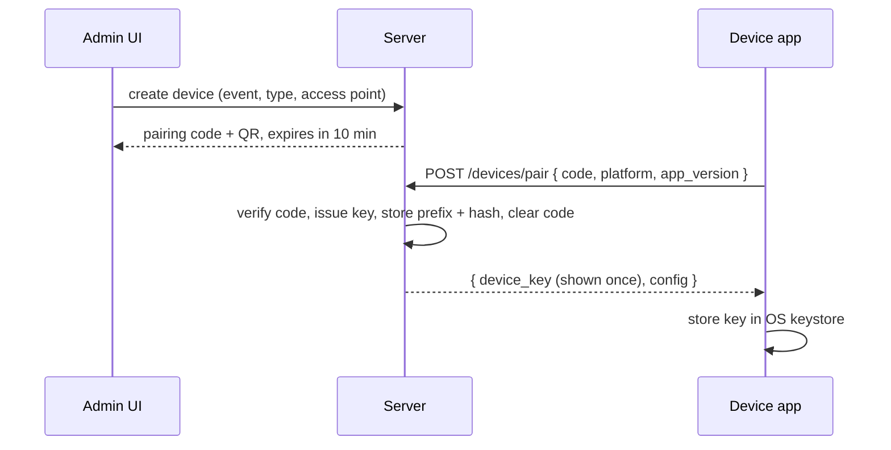

# Device Management

**Status:** WRITTEN · **Audit date:** 2026-09-29 · **Baseline:** `develop` @ `e7228c1d`
**Classification:** New subsystem (table exists) · **Priority:** P1 (ARZ-092, ARZ-100) + P2 (ARZ-123) · **Phase:** 4
**Depends on:** `48-api-platform.md`, `37-hardware-integration.md`, `09-permissions-and-roles.md`
**Blocks:** `19-kiosk-system.md`, `38-scanner-platform.md`, `39-printer-integration.md`, `53-live-event-command-center.md`, `59-event-readiness.md`, `71-realtime-architecture.md`, `94-mobile-scanner.md`, `96-kiosk-application.md`

---

## Current state — table landed, no behaviour

`CONFIRMED` in `c34f6a59` (`2026_09_30_000003:132-166`, live DB):

```
devices  id, short_id, account_id, event_id NULL, access_point_id NULL,
         name, device_type default 'SCANNER', platform NULL, app_version NULL,
         api_key_prefix NULL, api_key_hash NULL,
         pairing_code NULL, pairing_code_expires_at NULL,
         status default 'PENDING', last_seen_at NULL, last_sync_cursor NULL,
         battery_level smallint NULL, metadata jsonb, timestamps, deleted_at
         UNIQUE (pairing_code) WHERE pairing_code IS NOT NULL AND deleted_at IS NULL
         INDEX (api_key_prefix), (account_id), (event_id, status)
```

No route, guard, middleware, pairing or heartbeat endpoint exists. `config/auth.php` has two guards,
`web` (session) and `api` (JWT). Sanctum is installed and unused. A `Device` model and repository
landed in `602b2b5a`; nothing else uses them.

### What the table is missing

| Gap | Consequence |
|---|---|
| **No `device_id` on `access_logs`** | `24` and `71` specify it; it was not built because `devices` did not exist in Phase 1. Every scan is unattributable to a device. |
| No `device_id` on `session_attendance` or `badge_print_jobs` | Same, for attendance and printing (`27`, `39`) |
| No scopes | `09` gives devices a scope list; a device key would otherwise carry implicit full device power |
| No key expiry, no revocation fields | A key lives until someone deletes the row |
| `status` would have to mean both lifecycle and connectivity | See below |

All of these are nullable additions — one follow-on migration.

## Principles

1. **A device authenticates as itself, never as a user.** `71` and `48` already decided this; a
   shared user JWT on twenty tablets cannot be revoked per tablet (F3).
2. **Device identity and operator identity are different things.** The key says *which tablet*; the
   operator's credential scan or PIN says *which person* (`38`). Both are recorded per scan.
3. **Lifecycle is not connectivity.** `status` is `PENDING | ACTIVE | SUSPENDED | RETIRED` — what an
   administrator decided. Online and offline are **derived** from `last_seen_at`. Storing
   `OFFLINE` in `status` would have a background job fighting an administrator over one column.
4. **Request-scoped context.** The device resolved by the guard lives in the request, not in static
   state — the direct lesson of F11.

## Enrolment



- Pairing codes are short-lived, single-use and **throttled per IP** — the pair endpoint is public
  by necessity, so it is a brute-force target.
- Keys follow `48`'s scheme — a recognizable prefix for leak scanning, hashed at rest, plaintext
  returned once.
- **Keys expire with the event**: `api_key_expires_at` = event end plus a grace period, mirroring
  `event_users.expires_at`. A tablet from last month's event must not still hold a working key.

### Default scopes by type

| `device_type` | Scopes |
|---|---|
| `SCANNER` | `device.submit_scan`, `device.sync` |
| `KIOSK` | `device.submit_scan`, `device.sync`, `device.print`, `device.walk_in` |
| `PRINTER_HOST` | `device.print`, `device.sync` |
| `TABLET` (supervisor) | `device.submit_scan`, `device.sync`, plus the operations scopes in `97` |

**Override is a person's right, not a device's** (`97`): any gate device accepts an override when a
supervisor scans their own badge for that one action, and the log records both the device and the
supervisor's credential. That replaces an earlier draft of this table in which only supervisor
tablets carried `access.override`.

`device.submit_scan` and `device.manage` are already seeded in `permissions`; `device.sync`,
`device.print` and `device.walk_in` are to add.

## Heartbeat and health

Every 30–60 s while connected:

```
POST /devices/{id}/heartbeat
{ app_version, battery_level, storage_free, clock, sync_cursor,
  unsynced_count, peripherals: [{ printer_id, status, supplies }] }
```

- The **latest** values update the `devices` row.
- **Transitions only** are appended to `device_status_events` (came online, went silent, printer
  error, clock skew exceeded, app outdated). Appending every heartbeat would be volume with no
  analytical value.
- Clock skew is computed from the heartbeat's `clock` against server time. `71` depends on it to
  interpret `occurred_at` on offline replays.

## Commands

Revoke, wipe, reconfigure, force resync. Devices are often offline, so commands are **queued
rows**, delivered on next contact, with the realtime channel (`private-device.{id}`, `71`) as a
fast path only:

```
device_commands  id, device_id, command, payload jsonb,
                 issued_by → users, issued_at,
                 delivered_at NULL, acknowledged_at NULL, result NULL
```

### Remote wipe — stated honestly

A stolen device that never reconnects **never receives a wipe command.** The real controls are:

1. Encryption at rest in the OS keystore (native apps — `94`)
2. Key expiry at event end
3. Revocation: a revoked key is refused at sync, and the app wipes its store on that refusal
4. Short on-device retention of synced logs (`71` open question)

Wipe-on-command is a convenience for recovered or reassigned devices, not a breach control.

## MDM

**Not integrated in software for v1.** Kiosk lockdown (`19`) uses the platform's managed mode —
Android Enterprise, Apple Business Manager, Windows Assigned Access — administered with an MDM
product as an operational tool. ARZO's device registry records *what the device is for*; MDM
controls *what else it can do*. Integrating the two is worth it only at fleet sizes ARZO does not yet
have.

## Fleet view — ARZ-123

Per event: online or silent with duration, last sync, battery, app version (outdated versions
flagged), unsynced queue depth, clock skew, assigned access point, attached printers and their
status. This is the "is the equipment working?" block of the command center (`53`) and the device
section of the readiness check (`59`).

## Migration

| Step | Change |
|---|---|
| 1 | Add to `devices`: `purpose` (`ACCESS`/`SESSION`/`LEAD`/`LOOKUP`, `38`), `scopes jsonb`, `api_key_expires_at`, `revoked_at`, `revoked_by`, `revocation_reason`, `last_ip`, `clock_skew_ms`, `unsynced_count` |
| 2 | Add `device_id NULL → devices` to `access_logs`, `session_attendance`, `badge_print_jobs` |
| 3 | Create `device_status_events`, `device_commands` |
| 4 | Device guard + request-scoped device context; pair, heartbeat and sync endpoints |
| 5 | Admin UI: create, pair, assign, suspend, retire; fleet view |

## Open questions

- **Remote wipe beyond the app's own store** — needs MDM. Worth it for a fleet ARZO owns; not for staff phones.
- **Bring-your-own-device for volunteers?** Staff phones cannot be MDM-managed and should hold no roster; they fit lead capture (`33`) and lookup-only scanning, not door control.
- **Heartbeat cadence** — 30 s is a guess balancing battery against staleness. `UNVERIFIED`.
- **Does a device belong to one event or move between events?** `event_id` is nullable, so both work; key expiry must follow the current assignment.

## Related

`48-api-platform.md` · `09-permissions-and-roles.md` · `37-hardware-integration.md` ·
`38-scanner-platform.md` · `39-printer-integration.md` · `53-live-event-command-center.md` ·
`59-event-readiness.md` · `71-realtime-architecture.md` · `94-mobile-scanner.md` ·
`103-hardware-deployment.md`
