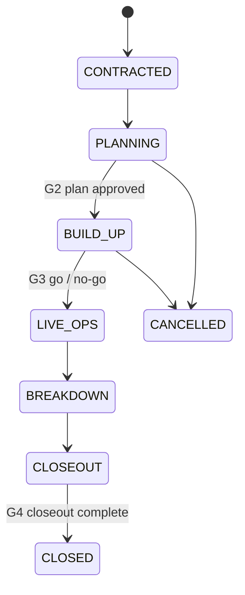

# Event Operations Lifecycle

**Status:** WRITTEN · **Audit date:** 2026-09-29 · **Baseline:** `develop` @ `e7228c1d`
**Classification:** New (small) + Fix (status transitions) · **Priority:** P3 · **Phase:** 5, with the fixes now
**Depends on:** `09-permissions-and-roles.md`, `47-crm-integrations.md`
**Blocks:** `57-manpower-and-staffing.md`, `58-task-management.md`, `59-event-readiness.md`, `105-event-lifecycle.md`, `106-event-operating-model.md`

---

## Current state — a commerce lifecycle, no operational one

### Event status — `CONFIRMED`

| Enum | Values | Stored |
|---|---|---|
| `EventStatus` | `DRAFT`, `LIVE`, `ARCHIVED`, `PENDING_MANUAL_REVIEW` | Yes |
| `EventLifecycleStatus` | `UPCOMING`, `ONGOING`, `ENDED` | **No** — computed from dates (`EventDomainObject.php:320-341`) |

`LIVE` means **on sale**. It is a commerce state and says nothing about whether the event is ready
to run.

### Publishing — rules live in the browser

`UpdateEventStatusHandler` checks three things server-side: the account is verified (`:52`), the
event belongs to the account (`:73`), and it is not under spam review (`:79`). The request accepts
`DRAFT`, `LIVE` or `ARCHIVED`.

| # | Defect | Evidence | Severity |
|---|---|---|---|
| O1 | **No server-side transition rules** — `ARCHIVED → LIVE` and `LIVE → DRAFT` are both accepted | `UpdateEventStatusHandler`, `UpdateEventStatusRequest.php:14-18` | Medium — an archived event can be quietly put back on sale |
| O2 | **Stripe-connected and has-products checks run only in the browser** | `PublishEventModal/index.tsx:76-112` | Medium — any API client skips them |
| O3 | Archiving an organizer archives its events **without webhooks** | `UpdateOrganizerStatusHandler.php:73-81` | Low (`49` W5) |
| O4 | Requesting account deletion reverts `LIVE` events to `DRAFT`; **cancelling the request does not restore them** | `AccountDeletionService.php:116-125` | Medium — events vanish from sale and stay gone |

### Setup checklist — computed, but only on the client

`EventDashboard/SetupChecklist.tsx:88-167` shows up to seven items — tickets, schedule (recurring
only), publish, payouts (SaaS), details, customize, verify email — each **computed from data**.
Dismissal is stored in localStorage. It is the right idea — checks derived from system state rather
than ticked by hand — held in the wrong place: the server cannot see it, reuse it, or enforce any of
it.

### Duplication — the de facto template

`DuplicateEventService` copies settings, location, occurrences, questions, products, prices, taxes,
add-ons, capacity assignments, check-in lists, promo codes, images, webhooks and affiliates, and
forces the copy to `DRAFT`. Three defects:

- Capacity assignments, check-in lists and product questions copy only when products do — their own
  flags are ignored otherwise
- Check-in lists keep the original's **absolute** activation times, stale for a different date
  (`:438-439`)
- Webhooks keep the same secret (`49` W7)

It copies **none** of the ARZO tables — venues, sessions, zones, accreditation types, badge
templates, event users.

### Time

`events` has `start_date` and `end_date`. No doors-open, build-up or breakdown time exists anywhere
(`event_settings` checked in full). `events.attributes` is free-form jsonb.

## What this document adds

ARZO operates events, so it needs the part of the lifecycle the platform does not model: from
contract to closeout. The scaffold's principle stands — **gates matter more than tasks**. A
recorded go/no-go with evidence prevents more event-day surprises than any task list.

### Where the lifecycle starts

**At contract signature**, not at the lead. The sales pipeline — lead, qualification, proposal —
stays in the CRM (`47`). The hand-off is "deal won → draft event" (`47` problem A).

### Stages



| Gate | Decides | Evidence | Owner |
|---|---|---|---|
| G1 — Contracted | The event exists | Contract reference | Commercial |
| G2 — Plan approved | Venue, zones, programme, staffing plan frozen enough to build | Plan sign-off | Event director |
| **G3 — Go / no-go** | Doors can open | Readiness review (`59`) | Event director |
| G4 — Closed | Nothing outstanding | Closeout checklist, reconciliation, report delivered (`108`) | Operations |

### Model — beside `events`, not inside it

**`events.status` is not extended.** It is a commerce state with webhooks, sitemaps and storefront
behaviour hanging off it; overloading it with operational stages would change what `LIVE` means to
every integrator.

```
event_operations                 -- 1:1 with events that ARZO operates
  id, event_id UNIQUE, stage,
  owner_user_id NULL → users,
  client_company_id NULL → companies (32),
  contract_reference NULL, crm_deal_id NULL,
  build_up_starts_at NULL, doors_open_at NULL,
  breakdown_ends_at NULL,        -- timestamptz, venue-local display
  expected_attendance NULL int,
  timestamps

event_gate_decisions             -- append-only
  id, event_id, gate,            -- G1 | G2 | G3 | G4
  decision,                      -- PASSED | PASSED_WITH_RISKS | FAILED
  decided_by → users, decided_at, notes, evidence jsonb
```

Ticketing-only events — the self-serve SaaS case — never get an `event_operations` row, and nothing
about them changes.

### The timeline feeds everything else

`build_up_starts_at`, `doors_open_at` and `breakdown_ends_at` are not decoration:

| Consumer | Uses |
|---|---|
| Access rules (`24`) | Contractor and exhibitor access windows default to build-up and breakdown |
| Tasks (`58`) | Template due dates are offsets from these anchors |
| Readiness (`59`) | Review points at T-7 days, T-24 hours, T-2 hours before doors |
| Attendance (`54`, `55`) | Arrival curves are relative to doors-open |

### Templates

Duplication is already the template mechanism. Extend it rather than inventing a second one: fix
the three defects, and add the ARZO tables — zones and access points, accreditation types and their
rules, badge templates, programme structure — with every absolute time **shifted by the date
offset** between source and copy.

## Adoption

The scaffold's warning is the design constraint: **an unused workflow is worse than none**. Start
with three things only — the timeline fields, the G3 decision, and templates. Add stages and the
other gates when the team asks why they cannot record them.

## Migration

| Step | Change | When |
|---|---|---|
| 1 | Server-side transition rules and publish preconditions (O1, O2) | **Now** |
| 2 | Restore statuses on cancelled account deletion (O4) | **Now** |
| 3 | Move the setup checklist's checks server-side, as the first readiness checks (`58`, `59`) | With `59` |
| 4 | `event_operations`, `event_gate_decisions` | Phase 5 |
| 5 | Duplication fixes and ARZO-table copying with time shifting | With each domain |

## Open questions

- **Does ARZO want its pipeline in the platform?** Recommendation: no — the CRM owns it (`47`).
- **Who owns G3?** An operating-model question (`106`). The system records the decision; it does not make it.
- **Multi-venue and multi-day events** — one timeline per event, or per venue per day? Per event first.

## Related

`47-crm-integrations.md` · `57-manpower-and-staffing.md` · `58-task-management.md` ·
`59-event-readiness.md` · `105-event-lifecycle.md` · `106-event-operating-model.md` ·
`108-post-event-closeout.md` · `24-access-control.md` · `49-webhooks.md`
