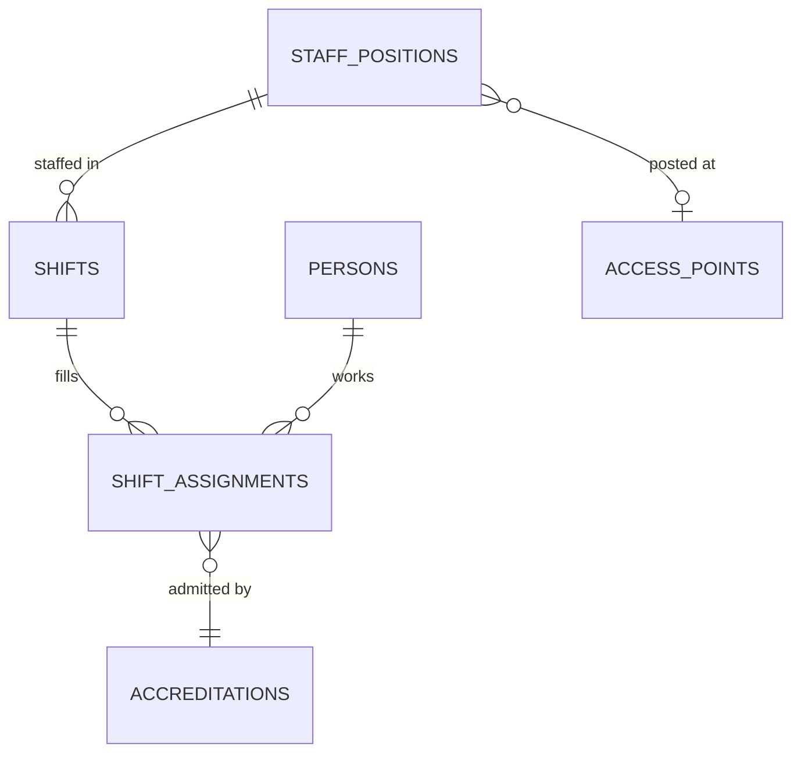

# Staffing and Manpower

**Status:** WRITTEN · **Audit date:** 2026-09-29 · **Baseline:** `develop` @ `e7228c1d`
**Classification:** New subsystem · **Priority:** P3 (ARZ-200) · **Phase:** 5
**Depends on:** `23-accreditation.md`, `09-permissions-and-roles.md`, `56-event-operations.md`
**Blocks:** `92-staff-platform.md`, `97-onsite-operations-app.md`, `38-scanner-platform.md` (operator identity)

---

## Current state — `MISSING`, 0%

`CONFIRMED`: no shift, roster, rota, timesheet, position or volunteer entity. The `staff.manage`
permission is seeded and unread (`2026_09_29_000007`).

"Staff" today means two things, neither of them a staffing model:

| Meaning | Evidence |
|---|---|
| Whoever holds a check-in list link | F3 — no identity |
| Any logged-in user of the event's account, **whatever their role**, when viewing public check-in detail | `GetCheckInListAttendeeDetailPublicHandler.php:88-99` |

### Why temporary staff must not become account users

The obvious shortcut — invite each steward as a user — is ruled out by three audit facts:

1. **Account membership is account-wide.** `ORGANIZER` passes every check in the account (`09`, `32`).
   A steward would see every order and attendee of every event.
2. **`event_users` exists but nothing reads it** — per-event scoping is not yet enforceable
   (ARZ-011/012).
3. **The invitation flow overwrites global identity.** Accepting an invitation to a second account
   **replaces the user's password and name globally** (`AcceptInvitationHandler.php:60-72`), and the
   existing-user lookup does not lowercase email while new users are stored lowercased
   (`CreateUserHandler.php`, `getExistingUser` versus `createUser`). Inviting hundreds of short-term
   staff through it is how that defect would get exercised at scale. Logged for `64`.

Staff are **people with credentials**, not platform users. A small number of supervisors need
logins, and they get scoped event roles once `09` lands.

## Decision: staff credentials come through accreditation

`23` modelled a `staff_assignment_id` credential source. **The landed CHECK covers two sources,
not four** (`32`). The same reasoning as for exhibitor staff applies:

- A staff member receives a `STAFF` (or `SECURITY`, `VOLUNTEER`, `PRODUCTION`) **accreditation**,
  typically auto-approved when created by an organizer with `staff.manage`
- Zone access comes from the accreditation type's rules — a steward gets the public halls, a
  production crew member gets backstage
- The credential, badge and access logs work unchanged

Shift assignments reference the accreditation. They do not issue credentials of their own. This
supersedes the `STAFF_ASSIGNMENTS → CREDENTIALS` edge in `06` and `23`.

## Model



```
staff_positions                  -- what needs doing, per event
  id, short_id, event_id, name,          -- "Gate 3 scanner", "Hall B steward"
  zone_id NULL, access_point_id NULL,
  accreditation_type_id NULL,            -- the access this role needs
  required_skills jsonb, notes NULL,
  timestamps, deleted_at

shifts
  id, short_id, staff_position_id,
  starts_at timestamptz, ends_at timestamptz,
  required_headcount int,
  timestamps, deleted_at
  CHECK (ends_at > starts_at)

shift_assignments
  id, short_id, shift_id, person_id,
  accreditation_id NULL → accreditations,
  status,     -- ASSIGNED | CONFIRMED | DECLINED | CHECKED_IN | COMPLETED | NO_SHOW | CANCELLED
  starts_at timestamptz, ends_at timestamptz,    -- copied from the shift
  checked_in_at NULL, checked_out_at NULL,       -- derived, see below
  timestamps
  EXCLUDE USING gist (person_id WITH =, tstzrange(starts_at, ends_at) WITH &&)
    WHERE (status NOT IN ('DECLINED', 'CANCELLED'))

staff_profiles                   -- optional, per person, per account
  person_id, account_id, languages jsonb, skills jsonb,
  certifications jsonb,          -- first aid, crowd management
  notes NULL, timestamps
```

**A person cannot be double-booked.** The exclusion constraint is the same pattern `sessions` uses
for rooms (`27`), applied to people — the database refuses overlapping active assignments rather
than trusting a rota screen to notice. The shift's times are copied onto the assignment because the
constraint needs the range on the same row; a shift time change updates its assignments in the same
transaction.

**Languages matter in Qatar.** Arabic and English at minimum at public-facing positions. It is the
first skill a rota needs to filter on.

## Shift attendance — one mechanism

The scaffold's principle: shift check-in writes to `access_logs` like any other scan.

- Each event gets a `VIRTUAL` access point, "Staff sign-in", in a `STAFF_ONLY` zone (`25`).
- A staff member signs in by scanning their own credential there — at a supervisor's device or a
  staff kiosk — producing an ordinary `access_logs` row.
- `shift_assignments.checked_in_at` is **derived** from the first such scan inside the shift window,
  and is advisory in exactly the way `attendees.checked_in_at` is (`16`).

That same scan is how the operator identifies themselves to a scanner (`38`): the staff credential
is both the timesheet punch and the operator login.

## What the command center shows

`53`'s "who is working?" block:

- Positions with fewer checked-in staff than `required_headcount`, **at gates that are open**
- No-shows 15 minutes after shift start
- Throughput per staffed access point (`20`), which is what tells a supervisor where to move people

## Out of scope

- **Running a staffing agency** — recruitment, contracts, payroll. `04` and `110` both say it:
  this document plans the system, not the business.
- Payroll calculation. **Export** timesheets — derived hours per person per day — to whatever
  payroll or agency system is used.
- Encoding labour law. Maximum hours and rest periods under Qatar labour law are `UNVERIFIED`
  here; the rota can warn on configurable limits, but compliance is not asserted by software.

## Migration

| Step | Change |
|---|---|
| 1 | Seed `STAFF`, `SECURITY`, `VOLUNTEER`, `PRODUCTION` accreditation types with default rules |
| 2 | `staff_positions`, `shifts`, `shift_assignments` with the exclusion constraint; `staff_profiles` |
| 3 | Staff sign-in access point per operated event; derivation of shift attendance |
| 4 | Rota UI; timesheet export |
| 5 | Shift notifications by SMS or push (`43`, `44`) |

## Open questions

- **Subcontracted staff** — credentials only, confirmed. Does the agency supply names in advance (bulk import) or at the door?
- **Self-service shift confirmation** — tokenized links, like exhibitors (`32`), before any staff app exists?
- **Retention of staff personal data** after the event — shorter than attendee data? `65`.
- **Staff performance** — `133` A11 declines algorithmic recommendations. Attendance and punctuality records are still personal data about workers; decide who may see them.

## Related

`23-accreditation.md` · `09-permissions-and-roles.md` · `24-access-control.md` ·
`38-scanner-platform.md` · `53-live-event-command-center.md` · `56-event-operations.md` ·
`64-security.md` · `92-staff-platform.md` · `97-onsite-operations-app.md` · `133-ai-capabilities.md`
