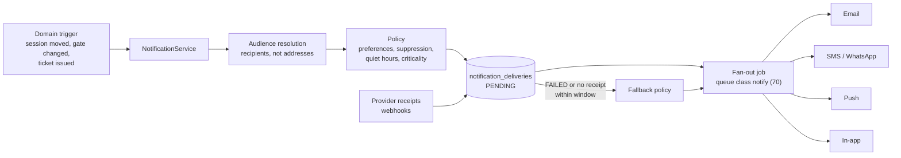

# Notification Architecture

**Status:** WRITTEN · **Audit date:** 2026-09-29 · **Baseline:** `develop` @ `e7228c1d`
**Classification:** New subsystem over a Keep (transactional email) · **Priority:** P2 — prerequisite of ARZ-140, ARZ-141, ARZ-150; the bus itself is unnumbered · **Phase:** delivery-log fixes now, the bus in Phase 3
**Depends on:** `70-background-jobs.md`, `65-privacy-gdpr.md`, `42-email-marketing.md`
**Blocks:** `43-sms-notifications.md`, `44-push-notifications.md`, `12-rsvp-registration.md` (reminders), `60-incident-management.md` (supervisor alerts), `57-manpower-and-staffing.md` (callouts)

---

## Current state — `PARTIAL`, ~30%: one mature channel, no bus

Email works and is carefully built. Everything a second channel needs — a recipient model, a
delivery record, preferences, fallback — does not exist. `42`, `43` and `44` each defer those
shared pieces here.

| Fact | Evidence |
|---|---|
| **29 mailables**, all extending `BaseMail`; 30 files in `app/Mail` including the base class (`02` counts 30) | `app/Mail/**`; no mailable lacks `extends BaseMail` |
| `BaseMail` implements `ShouldQueue` and calls `afterCommit()` in its constructor | `BaseMail.php:12-19` |
| Mail is sent from **25 files** — jobs, handlers, domain services and one Action | `ResendOrderConfirmationAction.php:27` injects `Mailer` directly |
| Liquid templates for 3 system types, resolved event → organizer → account | `EmailTemplateType.php`; `EmailTemplateService.php:21-33`; `EmailTemplateEngine::BLADE` is declared "for future use" |
| Organizer messages: `messages` + `outgoing_messages` (event, message, subject, recipient **email string**, status) — no attendee id, no provider message id | Live schema |
| `outgoing_messages.status = SENT` is written after `Mailer::send()` of a queued mailable, i.e. when it is **queued** (`42` E4) | `SendEventEmailJob.php:36-59` |
| The 29 transactional mails write **no per-recipient record at all** | Only `SendEventEmailJob` writes `outgoing_messages` |
| `announcements` target platform **users**: `ALL`/`ACCOUNTS`/`USERS`, `BANNER`/`MODAL`, one of each shown at a time; `announcement_users.user_id` → `users` | `GetActiveAnnouncementsHandler.php:24-29`; `api.php:315-316`, `:581-584` |
| `User` uses `Notifiable`; nothing calls `notify()`; no `app/Notifications`, no `notifications` table | `Models/User.php:37`; search |
| The only notification preference: `event_settings.notify_organizer_of_new_orders` | Read at `SendOrderDetailsService.php:172` |
| Consent columns: `users.marketing_opted_in_at`, `orders.opted_into_marketing_at` | Live schema |
| A `failover` mailer (smtp → postmark) is configured but is not the default | `config/mail.php:17,83-89` |
| No SMS, WhatsApp, push, or attendee in-app channel | `43`, `44` |

## Defects

| # | Defect | Evidence | Severity |
|---|---|---|---|
| N1 | "Sent" means queued; SMTP failure after queueing is invisible (`42` E4) | `SendEventEmailJob.php:36-59` | Medium |
| N2 | A recipient can carry **both** `FAILED` and `SENT` rows for one message: the job writes `FAILED`, rethrows, the worker retries (`--tries=3`), and a successful retry writes `SENT` | `SendEventEmailJob.php:40-59`; `supervisord.conf:40` | Low — reporting counts double |
| N3 | "Did this attendee get their ticket?" cannot be answered from data — transactional mail leaves no record, and a failed mail surfaces only as an anonymous `failed_jobs` row | Search | Medium on event day, when support asks exactly this |
| N4 | `Notifiable` and `EmailTemplateEngine::BLADE` are dead code | `User.php:37`; `EmailTemplateEngine.php` | Low |

N2 and N4 are small enough to fix now, independent of the roadmap.

## Decision: a thin bus of our own, not Laravel Notifications

Laravel's notification system routes a message to channels for a `Notifiable` model. Most ARZO
recipients are not users: they are attendees, persons, order buyers, staff on a shift. More
importantly, what `42`–`44` need is not routing — it is the **delivery log, suppression, fallback and
quiet hours**, none of which Laravel notifications provide. Adopting them would add a layer and still
leave all four to build.

So: a `NotificationService` (domain service) with channel adapters. The existing mailables stay as
the **email renderer**; the bus decides who, when and on which channel, and records what happened.
`Notifiable` is deleted.



## Model

```
notifications                      -- one logical send
  id, short_id, account_id, event_id NULL,
  category,          -- CRITICAL_OPERATIONAL | OPERATIONAL | REMINDER | ACCOUNT | STAFF_ALERT
  template_key,      -- e.g. session.moved; variants per channel and locale
  context jsonb,     -- allowlisted template variables only (42 merge fields)
  audience jsonb,    -- the definition, for audit; recipients are frozen as deliveries
  triggered_by_type, triggered_by_id NULL,   -- USER | SYSTEM | DEVICE
  expires_at NULL,   -- a reminder for a session that has started is dropped, not sent late
  created_at

notification_deliveries            -- one per recipient per channel; retries update the row
  id, notification_id,
  recipient_type,    -- ATTENDEE | PERSON | USER | ORDER
  recipient_id,
  channel,           -- EMAIL | SMS | WHATSAPP | PUSH | IN_APP
  address_hash,      -- sha256 of the normalized address; the address lives on the recipient
  address_masked,    -- "a***@example.com", "+974 ****1234" — enough for support
  status,            -- PENDING | SUPPRESSED | DEFERRED | SENDING | SENT | DELIVERED | READ
                     -- | FAILED | BOUNCED | EXPIRED | UNKNOWN
  provider NULL, provider_message_id NULL,
  fallback_of_id NULL → notification_deliveries,
  error_code NULL, error_detail NULL,
  queued_at, sent_at NULL, delivered_at NULL, read_at NULL, failed_at NULL
  UNIQUE (notification_id, recipient_type, recipient_id, channel)
  UNIQUE (provider, provider_message_id)
  INDEX (notification_id, status), INDEX (recipient_type, recipient_id)
```

**Status semantics are the point.** `SENT` = the provider accepted it. `DELIVERED` = the provider
reported delivery (for email, the receiving server accepted it — the best email can prove).
`READ` exists only where the channel reports it: WhatsApp, and push or in-app when the app
acknowledges display. Email opens are not tracked (`42`).

The unique key on `(notification, recipient, channel)` makes the fan-out idempotent: a retried job
cannot create a second delivery. `SENDING` is written before the provider call; a retry that finds
`SENDING` without a provider id marks `UNKNOWN` for SMS and WhatsApp rather than resending — `43`'s
rule that a paid, interrupting message is never sent twice.

`outgoing_messages` stops being written once organizer messages move onto the bus; it stays
read-only for history.

Templates are shared by **key**, with a variant per channel and locale:

```
notification_templates             -- email_templates generalized; its 3 types migrate in
  id, account_id NULL, organizer_id NULL, event_id NULL,   -- all NULL = system default
  template_key, channel, locale,
  subject NULL, body,              -- Liquid over the allowlisted context only
  provider_template_ref NULL,      -- WhatsApp templates are pre-approved by the provider (43)
  is_active, timestamps
```

Resolution keeps what `EmailTemplateService` already does — event, then organizer, then account,
then system — and then falls back from the recipient's locale to the event's default.

## Criticality and fallback

| Category | Examples | Channels, in order | Escalate when | Quiet hours |
|---|---|---|---|---|
| `CRITICAL_OPERATIONAL` | Gate moved, cancellation, postponement, same-day venue change | Push → SMS or WhatsApp → email | Push: no app acknowledgement within 2 min. SMS/WhatsApp: `FAILED`. | **Bypassed** |
| `OPERATIONAL` | Ticket issued, accreditation decision, schedule change more than 24 h ahead | Email + in-app | Email `BOUNCED`/`FAILED` → SMS if a phone and a lawful basis exist | Deferred |
| `REMINDER` | Session starting, know-before-you-go | Push or in-app; email for day-before | Never | Deferred; dropped at `expires_at` |
| `ACCOUNT` | Password reset, email confirmation | Email only | Never — auth codes do not change channel | Bypassed |
| `STAFF_ALERT` | Incident assigned, device offline, callout | Staff app push → SMS | No acknowledgement within the alert's window → next person on the rota (`86`) | Bypassed for on-shift staff |

Marketing is not on this bus in v1; it goes through the ESP (`42`).

Rules that hold across categories:

- **Web push has no delivery receipt.** A critical push is treated as unconfirmed until the app
  calls back on display; that callback is what makes the timed fallback possible.
- **Fallback never repeats a channel** and never re-sends to the same address.
- **SMS fallback spends money.** It counts against the account's SMS budget (`43`); when the budget is
  exhausted the delivery is marked `FAILED` with a reason, never silently skipped.
- **Push is not a safety system** (`44`). Life-safety instructions travel by PA and staff.

## Quiet hours

Venue-local time from the event's timezone. Default window 22:00–08:00, **provisional** — ARZO
should confirm it against its audiences, including Ramadan schedules (`UNVERIFIED`; operations to
answer). Deferred deliveries carry status `DEFERRED` and are released by the sweeper (`70`) at the
end of the window, unless `expires_at` has passed.

## Preferences and suppression

Granularity: **category × channel**, with two floors. `CRITICAL_OPERATIONAL` cannot be switched off
entirely — only its channels chosen — and `ACCOUNT` cannot be switched off at all. Attendees see
categories, not channels; the policy chooses channels.

```
notification_preferences
  id, subject_type,        -- PERSON | USER
  subject_id, event_id NULL, category, channel, enabled bool,
  source,                  -- SELF | ORGANIZER_IMPORT | SYSTEM
  updated_at
  UNIQUE (subject_type, subject_id, COALESCE(event_id, 0), category, channel)

channel_suppressions       -- generalizes 42's email_suppressions to every channel
  id, account_id NULL, channel, address_hash,
  scope,                   -- ACCOUNT | ORGANIZER | GLOBAL
  reason,                  -- UNSUBSCRIBE | STOP_REPLY | BOUNCE | COMPLAINT | MANUAL
  created_at
```

`42` proposed `email_suppressions`; this is the same table with a `channel` column, so an SMS `STOP`
(`43`) and an email bounce land in one place. The organizer-order preference becomes a
`USER` preference row for category `OPERATIONAL`, channel `EMAIL`.

## Shared audiences

Audience resolution returns **recipient identities**, never addresses. Addresses are resolved per
channel at send time, so a phone number captured after a message was scheduled is still used.
Sources: the five `MessageTypeEnum` audiences, `42`'s `audience_segments`, and domain targeting —
session registrants (`27`), credentials with a grant at an access point (`24`), staff on shift (`57`).
The resolved list is frozen as `notification_deliveries` rows; that snapshot is the audit record.

## Decision: a new attendee inbox, not `announcements`

`announcements` is a platform-to-organizer broadcast: user-keyed, account-targeted, one banner and
one modal at a time, no event scope. Reusing it for attendees would change every one of those
properties and break the admin tool that uses it today.

The attendee in-app channel is also **required by push privacy**: `44` sends lock-screen payloads with
no personal data, and the detail must be fetched after unlock. The inbox item is that detail.

```
inbox_items
  id, short_id, notification_id, delivery_id → notification_deliveries,
  recipient_type,     -- ATTENDEE | PERSON | USER (staff)
  recipient_id, event_id NULL, category,
  title, body, deep_link NULL,
  created_at, read_at NULL, expires_at NULL
  INDEX (recipient_type, recipient_id, created_at DESC)
```

`read_at` feeds the delivery's `READ` status. `announcements` stays as it is.

## Transactions and receipts

- The bus writes `notifications` and `PENDING` deliveries **inside** the business transaction and
  dispatches fan-out `afterCommit`, preserving `BaseMail`'s rule: a rolled-back transaction leaves
  no rows and sends nothing.
- The `beforeCommit()` exception (`StripeRefundExpiredOrderService.php:74`) keeps working unchanged
  and migrates last.
- The `PENDING` row is the job's truth; the queue message is a wake-up call. A sweeper re-dispatches
  deliveries stuck in `PENDING` (`70`).
- Receipts arrive by provider webhook (email bounces and deliveries, SMS DLRs, WhatsApp statuses)
  or in the send response (push 404 and 410 revoke the subscription, `44`). Each endpoint
  **verifies the provider signature before acknowledging** — the Stripe inbound defect (`76` R4)
  must not be repeated.

## Migration

| Step | Change | Risk / When |
|---|---|---|
| 1 | Fix N2 (one row per recipient, updated in place); delete `Notifiable` and `BLADE` (N4) | Low — now |
| 2 | `notifications`, `notification_deliveries`; organizer messages write deliveries; N1 closed by provider receipts | Medium — needs the ESP choice (`42`) |
| 3 | Transactional mailables routed through the bus for recording, rendering unchanged (N3) | Low — mechanical, 25 send sites |
| 4 | `notification_templates` (the 3 email types migrate in), preferences, `channel_suppressions`, quiet hours, sweeper | Low |
| 5 | SMS/WhatsApp adapter (`43`), push adapter (`44`), `inbox_items` | Phase 3 |
| 6 | Criticality fallback and staff-alert acknowledgement | With `44` step 4 and `60` |

## Open questions

- **Do organizers see per-recipient status?** Yes for operational messages, masked addresses only; confirm with `65`.
- **Retention of `notification_deliveries`?** Proposed 12 months, then aggregated counts; `65` owns the number.
- **Which email provider?** It decides how bounces and deliveries arrive; `42` holds the choice.
- **Quiet-hours defaults for multi-day events** — per event or per attendee? Per event first.
- **Escalation windows** (2 min for critical push) are guesses; tune at the pilot.

## Related

`42-email-marketing.md` · `43-sms-notifications.md` · `44-push-notifications.md` ·
`70-background-jobs.md` · `65-privacy-gdpr.md` · `30-mobile-event-app.md` · `60-incident-management.md` ·
`57-manpower-and-staffing.md` · `86-monitoring.md` · `76-reliability.md`
