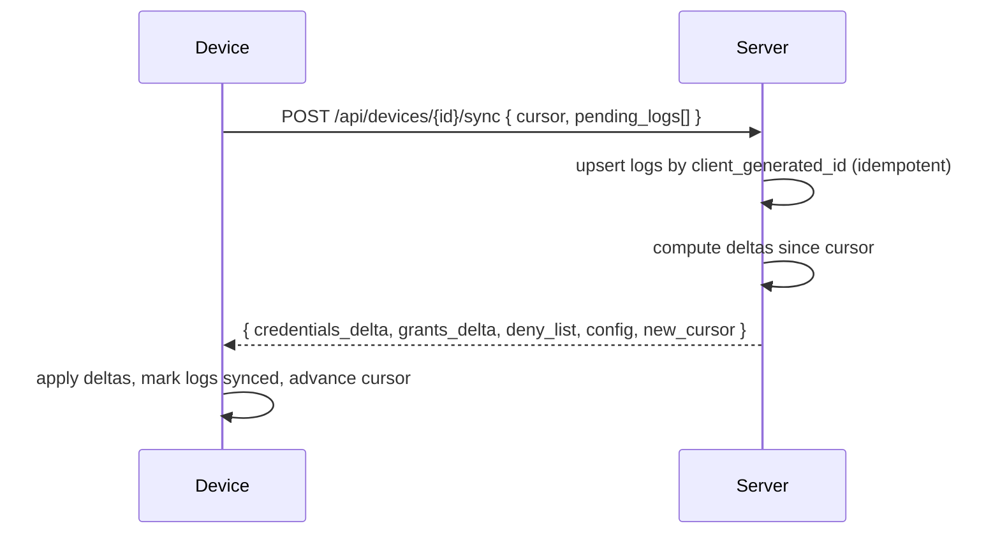

# Realtime & Offline-First Architecture

**Status:** WRITTEN · **Authority:** Authoritative for sync and realtime · **Audit date:** 2026-09-29 (refreshed; first written 2026-09-28) · **Baseline:** `develop` @ `e7228c1d`
**Classification:** New subsystem + Infrastructure
**Depends on:** `24-access-control.md`, `37-hardware-integration.md`
**Blocks:** `19-kiosk-system.md`, `53-live-event-command-center.md`, `94-mobile-scanner.md`, `96-kiosk-application.md`

---

## Why this is mandatory

Venue networks fail. Halls have dead spots, conference wifi saturates when 2,000 people arrive at
once, and a door that stops working when the network drops is an operational emergency with a
queue attached.

This is success criterion 6 in `01-executive-vision.md` and the single capability most likely to
be underestimated, because it cannot be retrofitted — offline changes the shape of every write
path it touches.

## Current state — `MISSING` on both counts

### Realtime — `MISSING`

`CONFIRMED`: `backend/config/broadcasting.php` exists but is **Laravel's unmodified stub**
(default `pusher`, sample connections, stock comments). No `BROADCAST_CONNECTION` is set in
`backend/.env.example` or either compose file. `UNVERIFIED` whether any class implements
`ShouldBroadcast` — pending the backend audit, but with no driver configured it would be inert
regardless.

`CONFIRMED`: no `laravel-echo`, `pusher-js`, or socket client in `frontend/package.json`.

**Conclusion: there is no realtime capability today.** Every UI figure is poll-or-refresh. A
command center (`53`) is therefore blocked on new transport, not on new queries.

### Offline — `MISSING`

`CONFIRMED`: no service worker, no VitePWA plugin, no Workbox, no IndexedDB usage in the frontend.
`frontend/public/site.webmanifest` and an apple-touch-icon exist, but a manifest without a service
worker is not an installable or offline-capable PWA.

The scanner at `/check-in/:checkInListShortId` is a normal online React route: every scan is a
network round-trip. `UNVERIFIED` exactly what its failure UX is mid-scan — pending frontend audit.

**Conclusion: a network drop stops check-in entirely today.**

### What has landed since the first revision — `e7228c1d`

| Piece | State |
|---|---|
| `access_logs.client_generated_id` UNIQUE, `occurred_at` / `recorded_at`, `is_offline_replay` | **In the schema** — the idempotency and replay foundations exist |
| `AccessDecisionService` | **Pure function**, 35 table-driven tests — the thing a device must reproduce |
| `devices` | Table + model + repository; **no guard, no pairing, heartbeat or sync endpoint** (`40`) |
| `access_logs.device_id` | **Missing** — add before any device writes (`40`) |
| Realtime transport | Still none |

One refinement to this document's design: "the same decision function compiles to both" cannot be
literal — the server is PHP, devices are TypeScript or native. Parity is achieved by exporting the
server's table-driven cases as **language-neutral golden vectors** run against every device build in
CI (`37`).

## Two distinct problems

Routinely conflated; they need different solutions.

| | Realtime | Offline-first |
|---|---|---|
| Problem | Push server state to connected clients fast | Keep working with no server |
| Direction | Server → client | Client → server, deferred |
| Failure | Stale dashboard | Door stops working |
| Needs | WebSocket transport | Local DB + sync + conflict rules |
| Consumers | Command center, dashboards | Scanner, kiosk, badge printing |

## Realtime design

### Transport

`CONFIRMED` available: Redis is already in the stack; queues already run
(`queue:work --queue=default,webhook-queue` under supervisord).

| Option | Assessment |
|---|---|
| **Laravel Reverb** | Self-hosted, first-party, WebSockets, Redis-backed scaling. **Recommended.** No per-message cost, no third-party data egress — relevant for attendee PII. |
| Pusher / Ably | Fastest to ship, but per-message pricing at scan volume and attendee data leaves the perimeter. |
| SSE | Simple, one-directional, no new service. A viable Phase-2 stopgap for dashboards only. |
| Polling | What exists. Fine for 30 s dashboards; useless for door events. |

**Decision: Reverb**, with SSE acceptable as an interim for the command center if Reverb slips.
`VERIFIED` (2026-09-30, ARZ-104): Reverb v1.12 resolves and runs under Laravel 13 in this codebase. A broadcast reaches it over the Pusher protocol. Two things the spike found: `config/reverb.php` must be published or the process starts and exits 0 with no apps to serve, and the base image's nginx healthcheck reports a WebSocket container unhealthy forever.

### Channels

```
private-event.{eventId}.operations    -- command center: scans, occupancy, alerts
private-event.{eventId}.devices       -- device health, heartbeats
private-event.{eventId}.queue         -- queue depth per access point
private-device.{deviceId}             -- targeted commands: revoke, reconfigure, print
private-session.{sessionId}           -- session attendance
```

Authorization uses the same tenancy rules as HTTP (`08-multi-tenancy.md`). A channel leak is a
cross-tenant data breach, so channel auth is security-critical, not plumbing.

**Broadcast volume must be throttled.** A busy gate produces many scans per second; broadcasting
each one to a dashboard is wasteful. Aggregate to 1 Hz for counters, and broadcast individual
events only for exceptions (denials, alerts, incidents).

## Offline-first design

### Scope

Offline is required for:

| Capability | Offline requirement |
|---|---|
| Access decision | **Full** — must decide locally |
| Attendee lookup | **Full** — search a local roster |
| Session check-in | **Full** |
| Badge printing | **Full** — print from cached data |
| Walk-in registration | **Partial** — capture locally, reconcile later |
| Payment | **No** — never take card payments offline |
| Reporting | **No** — read-only, degrade gracefully |

Payment is excluded deliberately: offline card capture is a PCI and chargeback problem ARZO should
not own. Offline walk-ins take cash or defer payment.

### Device-local store

```
credentials     id, identifier_hash, person_name, credential_type, status,
                photo_blob NULL, valid_from, valid_until
grants          credential_id, zone_id, session_id, windows, allow_reentry,
                max_entries, min_reentry_seconds
access_logs     client_generated_id PK, credential_id, access_point_id,
                occurred_at, direction, result, synced bool
deny_list       credential_id, revoked_at
config          event, zones, access_points, rules, device identity, sync cursor
```

Storage: SQLite on native scanner/kiosk apps; IndexedDB for a PWA. The **same decision function**
(`24-access-control.md` step 1–9) compiles to both, which is why that function is specified as
pure — two implementations that disagree at a door is the worst possible outcome.

**Encryption at rest is mandatory.** A device carries the full attendee roster with names, photos,
and possibly ID numbers. A lost unencrypted tablet is a reportable data breach. Native apps use
OS keystore-backed encryption; a PWA cannot achieve equivalent protection, which is a genuine
argument for native scanner apps at high-security events (`94-mobile-scanner.md`).

### Sync protocol



Properties, each load-bearing:

- **Idempotent.** `client_generated_id` is `UNIQUE` on `access_logs`; replay is a no-op on conflict. This is what makes at-least-once delivery safe.
- **Incremental.** Cursor-based deltas; full refresh only on first pair or version change.
- **Bidirectional in one call.** Fewer round-trips on a bad link.
- **Resumable.** Partial failure re-sends unsynced logs; nothing is lost.
- **Bounded.** Cap payload size; paginate large deltas.

Cadence: every 15–30 s when connected; immediate attempt after each scan; exponential backoff
while failing. Deny-list deltas are prioritized over roster deltas — revocation propagation
matters more than a new registration.

### Conflict resolution

Access logs are **append-only facts**, so there is no write-write conflict — this is the main
reason the model was chosen over mutable state.

Genuine conflicts and their rules:

| Conflict | Rule |
|---|---|
| Same scan submitted twice | Idempotency key — no-op |
| Two devices admit the same credential to a capacity-1 zone | Both logged. Server flags a violation for review. Not silently corrected. |
| Offline scan of a revoked credential | Logged `GRANTED`, then flagged as a retrospective violation — recorded beside the log in `access_reconciliation_findings` (`108`), never by editing the log. No such column or table exists yet. |
| Offline walk-in duplicates an existing person | Server flags for merge; never auto-merges |
| Device clock skew | Store both `occurred_at` and `recorded_at`; detect skew from heartbeats and warn |

**Principle: reconcile by surfacing, not by silently rewriting.** An access log is evidence. A
system that edits its own audit trail to look consistent is worse than one that reports the
inconsistency.

### Device identity

```
devices   id, short_id, event_id NULL, account_id,
          name, device_type,          -- SCANNER | KIOSK | PRINTER_HOST | TABLET
          platform, app_version,
          access_point_id NULL,
          api_key_hash, status,       -- PENDING | ACTIVE | SUSPENDED | RETIRED
          last_seen_at, last_sync_cursor, battery_level NULL,
          metadata jsonb, timestamps
```

Devices authenticate with their own scoped keys via the API platform (`48-api-platform.md`) — not
with a user's JWT. A shared user token on twenty tablets cannot be revoked per device, and its
scope is far too broad.

Enrolment: an operator provisions the device in the admin UI, which yields a short-lived pairing
code; the device exchanges it for a long-lived key. `40-device-management.md` covers fleet
operations.

### Emergency mode

When a device cannot sync for longer than a threshold (default 30 min), it enters a declared
degraded state rather than failing silently:

- Banner: "Offline — decisions based on data from HH:MM"
- Capacity and global anti-passback checks unavailable (steps 6 and 8 skipped)
- All scans queued and marked `is_offline_replay`
- Supervisor override remains available and logged

The operator must **know** they are degraded. Silent degradation is how over-admission incidents
happen without anyone noticing until reconciliation.

## Performance targets

| Operation | Target | Reasoning |
|---|---|---|
| Local access decision p95 | < 50 ms | Indexed local lookup |
| Sync round-trip, typical delta | < 2 s | Must finish inside a 15 s cadence on poor wifi |
| First full roster sync, 10k attendees | < 60 s | Pre-event staging, not at the door |
| Realtime scan → dashboard | < 2 s | Perceived as live |
| Deny-list propagation p95 | < 30 s online | Revocation urgency |

## Testing

Offline is where systems look fine in dev and fail at the venue. `79-testing-strategy.md` owns
this; it must include:

- Network partition simulation — drop, restore, flap
- Clock skew injection
- Duplicate and out-of-order replay
- Concurrent multi-device admission to a capacity-limited zone
- Battery-death mid-sync with unsynced logs
- Full roster sync under throttled bandwidth
- Reconciliation correctness after an 8-hour offline day

## Open questions

- **PWA or native for scanners?** PWA is one codebase; native gives encrypted-at-rest storage, background sync, and hardware scanner access. Leaning native for scanner/kiosk, PWA for the attendee app. Decide in `94`/`96`.
- **Peer-to-peer deny-list gossip.** Devices on the same venue LAN could share revocations without the internet. Valuable at high-security events, meaningful complexity. Phase 4+.
- **Retention on device.** How long does a device keep synced logs? Shorter is better for breach exposure; longer helps field debugging.
- **Reverb under Laravel 13.** `VERIFIED` — see the transport section.

## Related

`24-access-control.md` (the decision function) · `37-hardware-integration.md` ·
`40-device-management.md` · `48-api-platform.md` (device auth) ·
`53-live-event-command-center.md` · `70-background-jobs.md` · `74-performance.md` ·
`79-testing-strategy.md` · `94-mobile-scanner.md` · `96-kiosk-application.md`
