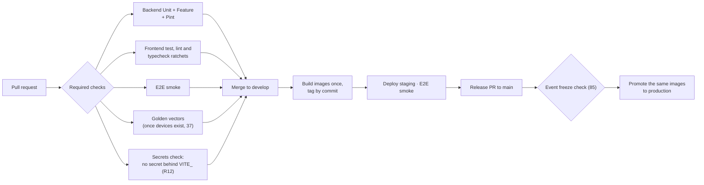

# DevOps

**Status:** WRITTEN · **Audit date:** 2026-09-29 · **Baseline:** `develop` @ `e7228c1d`
**Classification:** Fix + New (ARZO's own pipeline) · **Priority:** **P0** for repository and CI (`123` RS1–RS3); P1 otherwise · **Phase:** now
**Depends on:** `123-release-strategy.md`, `79-testing-strategy.md`
**Blocks:** `85-deployment.md`, `129-quality-gates.md`, `80-qa-strategy.md`

---

Pipeline, environments and developer experience. Earlier revisions scored this 75% on the strength
of the GitHub workflows. Those workflows are **upstream Hi.Events' pipeline**. ARZO forked the code,
not the pipeline, and today has no pipeline of its own.

## Current state — `PARTIAL`, ~30%: a good reference pipeline, none running for ARZO

### ARZO's repository — `CONFIRMED`

| Fact | Evidence |
|---|---|
| One remote, the public upstream repository | `git remote -v` → `origin https://github.com/HiEventsDev/Hi.Events.git` |
| ARZO cannot push to it | `gh api repos/HiEventsDev/Hi.Events` → `"push": false` |
| **All ARZO work exists on one workstation**: 14 commits, `455585b3` to `e7228c1d`, plus a large uncommitted tree | `git status -sb` → `develop...origin/develop [ahead 14]` |
| **ARZO's code has never run in CI**; recent Actions runs are upstream contributors' | `gh run list` |

This is the most serious finding in the document. A disk failure loses the master plan, the Phase 0
fixes and the Phase 1–2 schema. And the Phase 0 gates — architecture tests, cross-tenant suite,
frontend runner (ARZ-004 to ARZ-007) — are gates only when someone remembers to run them.

### The upstream workflows ARZO inherited — `CONFIRMED`

| Workflow | Trigger | What it does | Blocks anything? |
|---|---|---|---|
| `tests.yml` | Push to `main`, `develop`, `v*-*`; PRs touching `backend/**` | Unit then Feature, PHP 8.3 / 8.4 / 8.5, Postgres 17 service (`:20,27,91,111`) | Only via branch protection — upstream's settings `UNVERIFIED`; ARZO has none |
| `frontend-tests.yml` | Push and PRs touching `frontend/**` | Compile catalogues, Vitest (24 tests), lint ratchet 768, typecheck ratchet 46 (`:41,44,51,68`) | Same |
| `e2e.yml` | Push to `main`/`develop`, PRs, nightly 03:00 UTC (`:3-21`) | Builds backend and SSR images, runs the hermetic stack; PRs smoke only unless labelled `full-e2e`, else 2 shards (`:35-41`) | Same |
| `deploy.yml` | Push to `main` → production, `develop` → staging, plus `feature/vapor-env-updates` (`:4-8`) | Vapor deploy, then DigitalOcean frontend | **Not gated on tests** — no `needs:` on any test workflow |
| `post-release-push-images.yml` | GitHub release published | Multi-arch images to Docker Hub `daveearley/*` | — |
| `cla.yml` | PRs and comments | Upstream's contributor licence agreement | — |
| `dependabot.yml` | Weekly | Composer (`/backend`) and npm (`/frontend`) | — |

`deploy.yml` authenticates to AWS `eu-west-1` and pulls an encrypted env file from
`s3://hi.events-env-secrets` (`:95,101`). It deploys **Hi.Events' SaaS**. It must never run under
ARZO's name (`123` RS2).

### Environments — `CONFIRMED`

| Environment | Postgres | Queue connection | Worker | Scheduler | Evidence |
|---|---|---|---|---|---|
| Dev | **15** (15.19 live) | **`sync`** | Optional `exec -d` at an interactive prompt | Same; **not running at audit time** | `docker-compose.dev.yml:116`; `backend/.env.example:52`; `start-dev.sh:214-228`; `ps` in the container |
| Backend tests | 17 | `sync` | — | — | `tests.yml:27`; `.env.testing:33` |
| E2E | 17 | **`sync`** | None | None | `docker-compose.e2e.yml:71`; `docker/e2e/.env:28` |
| All-in-one | 17 | `redis` | supervisord: `default,webhook-queue,occurrences` | `schedule:run` loop | `all-in-one/docker-compose.yml:72`; `all-in-one/.env.example:22`; `supervisord.conf:40,51` |
| Upstream Vapor | Managed; version `UNVERIFIED` | SQS | Vapor | `scheduler: true` | `backend/vapor.yml` |
| **ARZO staging / production** | — | — | — | — | **None evidenced** (`84`) |

PHP differs too: CI tests 8.3–8.5, the Docker images run 8.5 (`backend/Dockerfile:1`,
`Dockerfile.all-in-one:18`), upstream's Vapor runtime is 8.3 (`production.Dockerfile:1`).

## Defects

| # | Defect | Evidence | Severity |
|---|---|---|---|
| D1 | No ARZO remote, backup or CI | Above | **Critical — fix now** (`123` RS1–RS3) |
| D2 | `deploy.yml` targets Hi.Events' infrastructure; on an ARZO repository it would fail every push, or worse, deploy somewhere ARZO does not own | `deploy.yml:95,101,116` | **High — disable before enabling Actions** |
| D3 | Every non-production environment runs queued jobs **synchronously**, so retries, backoff, `failed_jobs` and `afterCommit` ordering only ever run in production. This is how `49` W1 went unnoticed. F7's "dev worker dies on restart" is real but secondary: under `sync` the worker has nothing to consume — the scheduler is what silently stops | `.env.example:52`; `docker/e2e/.env:28` | Medium |
| D4 | Dev Postgres is still 15 against 17 everywhere else. `136` marks ARZ-008 done; `02` correctly says partly fixed | `docker-compose.dev.yml:112-116` | Low |
| D5 | Pint is not a CI step | `tests.yml` | Low |
| D6 | The MinIO image override lives in a gitignored `docker-compose.override.yml` that `start-dev.sh` never loads (it passes `-f docker-compose.dev.yml`) | `.gitignore:9`; `start-dev.sh:3` | Low — local drift |
| D7 | `tests.yml` uses the deprecated `::set-output` and v3 actions | `tests.yml:52,64,67` | Low |

## Decision: fork properly — ARZO origin, upstream as a second remote

Owned by `123` (RS1–RS4). This document adds the pipeline that follows from it.

## Decision: one queue semantics everywhere

Dev and E2E move to **Redis queues with a worker and a scheduler as compose services** — the same
image with a different command, supervised by Docker, surviving restarts. Backend unit and feature
tests stay on `sync`; they test logic, not delivery.

**Trade-off:** E2E specs that assumed a job had finished by the time the request returned must wait
for it. The fixtures already poll Mailpit; the same pattern covers other async effects. Slower specs
are the price of testing what production does.

## Decision: pin runtime versions once

Postgres 17 everywhere, dev included, using the dump-and-restore procedure in the compose comment.
ARZO's runtime PHP version is whatever its production image runs (`84`); the CI matrix must include
it and may drop versions ARZO never runs.

## The ARZO pipeline

- **Build once, promote the same image.** Runtime environment injection (`window.hievents`, `05`)
  already makes one image serve every environment; rebuilding per environment would test one
  artifact and ship another.
- **Nightly:** full E2E in shards, dependency audit, and the Arabic catalogue completeness check once
  `82` starts.
- **Required checks** are listed in `129`; this pipeline is what runs them.

## Decision: no per-PR preview environments yet

Staging plus the hermetic E2E stack covers what a small team needs. Previews cost money and
operational attention per branch. Revisit when more than two engineers are merging daily.

## Secrets

Upstream keeps encrypted env files in S3 for Vapor. ARZO uses the secret store of whichever platform
`84` chooses; nothing secret in the repository. `docker/development/.env` and `docker/e2e/.env` are
committed with throwaway keys and are marked as such — keep it that way.

## Developer experience

- `start-dev.sh` keeps its prompts; the worker and scheduler stop being prompts and become services.
- `php artisan dev:bootstrap` seeds a verified superadmin, organizer, events and products, and refuses
  to run in production without `--force` (`BootstrapDevDataCommand.php:53`). Keep it as the standard
  smoke-test setup.
- Device apps (Phase 4) live in the same repository — `apps/scanner`, `apps/print-host` — so the
  golden vectors sit beside `AccessDecisionService`'s tests and one change updates both (`37`).

## Migration

| Step | Change | When |
|---|---|---|
| 1 | ARZO private repository; upstream as `upstream`; branch protection (`123` RS1, RS3) | **Now** |
| 2 | Disable `deploy.yml`, `post-release-push-images.yml` and `cla.yml` on it; enable the three test workflows (RS2) | With step 1 |
| 3 | Pint step; `::set-output` and action versions updated (D5, D7) | With step 1 |
| 4 | Worker and scheduler as compose services, Redis queues in dev and E2E (D3) | Phase 1 |
| 5 | Dev Postgres to 17 (D4); commit the MinIO image choice or drop it (D6) | Phase 1 |
| 6 | Image build and promotion to ARZO staging and production | When `84` has a target |

## Open questions

- **Which host for the repository?** A private GitHub repository keeps the workflows as they are. Actions minutes and cost `UNVERIFIED`.
- **How many people hold admin on it?** At least two — the same single-person risk applies to access.
- **Keep syncing upstream?** `123` asks; the pipeline treats upstream merges as ordinary PRs through staging.
- **Retire the self-host image?** Only if the all-in-one is not part of ARZO's product (`123`).

## Related

`123-release-strategy.md` · `85-deployment.md` · `84-infrastructure.md` · `129-quality-gates.md` ·
`79-testing-strategy.md` · `80-qa-strategy.md` · `70-background-jobs.md` · `49-webhooks.md` ·
`37-hardware-integration.md` · `120-risk-register.md` · `02-current-state-audit.md` (F7)
