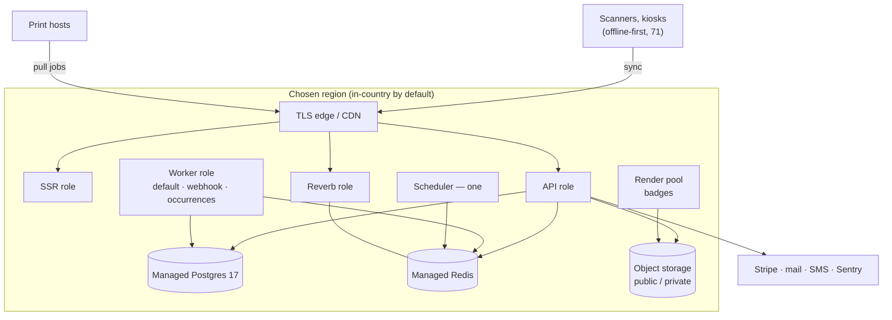

# Infrastructure

**Status:** WRITTEN · **Audit date:** 2026-09-29 · **Baseline:** `develop` @ `e7228c1d`
**Classification:** New (ARZO hosting) · **Priority:** **P0 decision** — ARZO has no production environment; P1 to build · **Phase:** decide now; build before the first ARZO-operated event runs on the platform
**Depends on:** `65-privacy-gdpr.md`, `71-realtime-architecture.md`, `123-release-strategy.md`
**Blocks:** `85-deployment.md`, `86-monitoring.md`, `77-disaster-recovery.md`, `104-onsite-infrastructure.md`

---

Where and how ARZO runs. Earlier documents (`02`, `05`) said the backend runs on Laravel Vapor in
`eu-west-1` and the frontend on DigitalOcean. That describes **upstream Hi.Events' own SaaS**. ARZO
has no hosting in evidence at all.

## Current state — `MISSING`, 0% for ARZO

### What ARZO has — `CONFIRMED`

| Fact | Evidence |
|---|---|
| No ARZO remote, deploy configuration, infrastructure-as-code or environment | `git remote -v`; `git ls-files` search for Terraform, app specs, Helm, compose for staging — none (`83`) |
| ARZO staging or production URL, account or region | `UNVERIFIED` — none evidenced |

### The upstream reference ARZO forked — `CONFIRMED`

| Component | Upstream's choice | Evidence |
|---|---|---|
| Backend | Laravel Vapor project `HiEvents` (id 69938), Docker runtime, 2048 MB, 3 warm, `api.hi.events` / `staging-api.hi.events` | `backend/vapor.yml:1-15` |
| Region | CI authenticates to `eu-west-1` and pulls its env file there; the Vapor project's region is set in Vapor, not the repo — `UNVERIFIED` | `deploy.yml:95,101` |
| Database, cache | Vapor-managed `hievents-postgres`, `hievents-redis`; Postgres version `UNVERIFIED` | `vapor.yml:14-15` |
| Queues, scheduler | SQS queues; `scheduler: true` | `vapor.yml:13,16-18` |
| PHP on Lambda | `laravelphp/vapor:php83` | `production.Dockerfile:1` |
| Frontend | DigitalOcean App Platform; the app spec is not in the repository | `deploy.yml:129-232` |
| Self-host | One container: nginx, php-fpm, Node SSR, queue worker, scheduler under supervisord; Postgres 17, Redis 7 | `Dockerfile.all-in-one`; `supervisord.conf`; `all-in-one/docker-compose.yml` |
| Object storage | S3 API with an endpoint override, so any S3-compatible store works — MinIO in dev proves it | `config/filesystems.php:48-68` |
| Health | `/up` returns a static `{"status":"ok"}` | `routes/web.php:20-22` |

### Where personal data already leaves the application — `CONFIRMED`

Residency is not only about the database. Today's processors: Stripe (payments), the mail provider,
Sentry (when a DSN is set), Anthropic (event content only, SaaS mode), Google Places,
OpenExchangeRates, and **Bunny Fonts**, which receives every visitor's IP address on themed event
pages (`homepageFonts.ts:60-63`). Each needs a line in `65`'s processor register.

## What ARZO must host

| Component | Runtime shape | Notes |
|---|---|---|
| API (Laravel) | Stateless HTTP | |
| SSR (Node) | Stateless HTTP | |
| Queue workers | Long-running | `default`, `webhook-queue`, `occurrences`; later a badge-render pool and sync reconciliation (`70`) |
| Scheduler | Exactly one instance | Every-minute jobs (`Kernel.php:17-26`) |
| **Reverb** | Long-running WebSocket server, Redis-backed | `71`, ARZ-104 — cannot run on Lambda |
| Badge renderer | CPU-bursty; headless Chromium if dompdf fails the Arabic test (`39`, `82`) | Separate pool so a print burst cannot starve checkout |
| Postgres 17 | Managed, point-in-time recovery | Pinned to one version (`83` D4) |
| Redis | Managed | Queues, cache, Reverb fan-out |
| Object storage | S3-compatible, public and private buckets | Photos and ID scans private (`73`) |
| Mail, SMS | Providers | `42`, `43` |
| On site | Devices and print hosts | They **pull**; the server never connects into a venue LAN (`37`, `39`, `104`) |

## Decision: containers, not Lambda

**One container image, run in roles** — web, SSR, worker, scheduler, Reverb, renderer — on a managed
container platform or a small set of VMs.

1. **Reverb needs a persistent process** (`05`, `71`). On Vapor, ARZO would run a second platform
   beside Lambda anyway.
2. **Headless Chromium** for badge rendering is heavy and bursty; it belongs in a sized worker pool,
   not a function with a cold start.
3. **The all-in-one image already proves the shape.** Splitting its supervisord programs into roles
   is configuration, not a rewrite.
4. **Portability.** The Qatar regions below are not AWS, and Vapor is AWS-only.

**Trade-off:** Vapor gives autoscaling and patching for free; containers need someone to own base
images, scaling rules and patch cadence. A managed container service keeps most of that burden off a
small team. **Objection:** "upstream runs Vapor happily." It runs a ticketing SaaS with no WebSockets,
no device fleet and no badge rendering.

## Decision: residency is decided by law and contract, not by preference

Region facts, accessed 2026-09-29 — managed-service availability and price in each region need
procurement confirmation:

| Option | Location | Evidence |
|---|---|---|
| Microsoft Azure **Qatar Central** | Doha, 3 availability zones, **no paired region** | `https://learn.microsoft.com/en-us/azure/reliability/regions-list` |
| Google Cloud **Doha** (`me-central1`) | Doha, 3 zones; launched 2023-03-31 with Compute Engine, Cloud Run, Cloud SQL, GKE among others | `https://cloud.google.com/blog/products/infrastructure/new-google-cloud-region-now-open-in-qatar`; the region id is from Google's documentation search results, not the blog |
| AWS **me-central-1** (UAE), **me-south-1** (Bahrain) | Gulf, not Qatar; opt-in regions | `https://docs.aws.amazon.com/global-infrastructure/latest/regions/aws-regions.html` — **no AWS region in Qatar** |
| AWS eu-west-1 | Ireland — upstream's | `deploy.yml:95` |

Whether Qatari personal data must stay in Qatar, and whether government clients will require it, is
`UNVERIFIED` — `65` and Qatari counsel answer it.

**Recommendation: default to an in-country region** (Azure Qatar Central or Google Cloud Doha)
unless counsel says residency is irrelevant *and* no target client will ask. Moving regions later is a
migration of everything; starting in-country costs little extra.

**The honest objection:** newer regions carry fewer managed services, and neither Doha region has an
in-country pair. Disaster-recovery copies must therefore live in a second region — **outside Qatar**,
which is itself a residency question — or rely on zone redundancy alone (`77`).

Choose between the two Doha regions on: managed Postgres 17 with point-in-time recovery, managed
Redis, a container service with WebSocket support, object storage with an S3-compatible API — all
`UNVERIFIED` per region — and the team's familiarity.

## Decision: Reverb beside the application, not a hosted socket service

`71` rejected Pusher and Ably on per-message cost and data egress. Reverb runs as its own role in the
same region, behind the same TLS edge, sharing Redis. Connections are dashboards, supervisors and
devices — hundreds, not tens of thousands — so one instance is enough to start. The edge must pass
WebSocket upgrades.

## Target shape

## Environments

| Environment | Where | Data |
|---|---|---|
| Dev | Local compose (`83`) | Seeded (`dev:bootstrap`) |
| E2E | CI, ephemeral | Seeded per test |
| Staging | Same region as production, smaller | **Synthetic only** — never a copy of production personal data (`65`) |
| Production | Chosen region | Real |

## Baseline controls

Private networking for Postgres and Redis; TLS everywhere; secrets in the platform's store;
least-privilege service identities; provider encryption at rest; object versioning on the private
bucket; point-in-time recovery with a **rehearsed** restore (`77`, `126`). Health endpoints that check
dependencies replace the static `/up` (`76`).

## Sizing

Unknown, deliberately. `74`'s concurrency figures are low-confidence, and the largest event ARZO
intends to run is still unanswered (`04`). Start small, load-test (`125`), then size.

## Migration

| Step | Change | When |
|---|---|---|
| 1 | Residency ruling from counsel (`65`) | **Now** — it gates the rest |
| 2 | Choose provider and region; procurement confirms the managed services above | After step 1 |
| 3 | Infrastructure as code in the ARZO repository — the tool matters less than having it | With step 2 |
| 4 | Staging, then production, fed by `83`'s image pipeline | Before the first ARZO event on the platform |
| 5 | Reverb role | With ARZ-104 |
| 6 | Render pool | With ARZ-071 |
| 7 | First restore rehearsal | Before production carries a live event |

## Open questions

- **Does Qatari law or a target client require in-country hosting?** The load-bearing question — `65`, counsel.
- **Where may disaster-recovery copies live?** Neither Doha region has an in-country pair.
- **Is the self-host all-in-one part of ARZO's product?** If yes, it must track the role split; if no, retire it (`123`).
- **Sentry's data region** (EU or US) and the mail provider's — `UNVERIFIED`, both processors under `65`.
- **An on-site server for very large events?** Offline-first makes it optional; `104` decides per event.

## Related

`65-privacy-gdpr.md` · `71-realtime-architecture.md` · `05-product-architecture.md` · `83-devops.md` ·
`85-deployment.md` · `86-monitoring.md` · `76-reliability.md` · `77-disaster-recovery.md` ·
`104-onsite-infrastructure.md` · `123-release-strategy.md` · `74-performance.md` · `125-performance-testing-plan.md`
