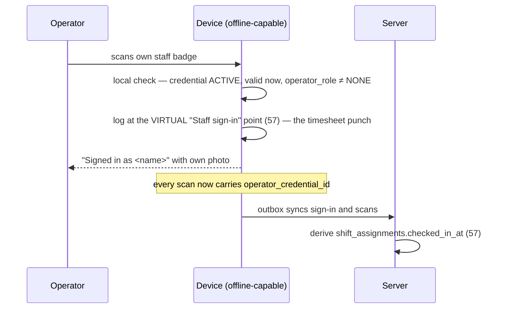

# Staff Surface

**Status:** WRITTEN · **Audit date:** 2026-09-29 · **Baseline:** `develop` @ `e7228c1d`
**Classification:** Replace (link auth) + New (operator identity, self-service) · **Priority:** P2 (ARZ-152, ARZ-200) on P1 prerequisites (ARZ-092, ARZ-100, ARZ-051) · **Phase:** 4 for sign-in; 5 for self-service
**Depends on:** `09-permissions-and-roles.md`, `23-accreditation.md`, `40-device-management.md`, `57-manpower-and-staffing.md`
**Blocks:** `94-mobile-scanner.md` (operator sign-in), `97-onsite-operations-app.md`

---

What event staff use, and — the harder half — how the system knows who they are. `57` settled that
staff are **people with credentials, not platform users**. This document turns that into an identity
model that works at a door with no network, and assigns each staff role to a surface. How the apps
are built is `94`, `96` and `97`.

## Current state — `PARTIAL`, ~10%: a scanner with no identity behind it

| Fact | Evidence |
|---|---|
| The only staff surface is the web scanner, authenticated by the check-in list `short_id` in the URL (F3) | `api.php:655-661`; `router.tsx:664`; `api/client.ts:13` (`ALLOWED_UNAUTHENTICATED_PATHS`) |
| Any logged-in user of the event's account, **whatever their role**, gets the "staff" detail view on the public scanner | `GetCheckInListAttendeeDetailPublicHandler.php:88-99` |
| Three roles: `SUPERADMIN`, `ADMIN`, `ORGANIZER` | `DomainObjects/Enums/Role.php` |
| `attendee.checkin`, `access.override`, `badge.reprint`, `staff.manage`, `incident.manage`, `device.submit_scan` are seeded; nothing reads them | Live DB, `permissions` (43 rows) |
| `event_users` exists; nothing reads it | Live DB; `57` |
| **`access_logs.operator_user_id` and `override_by` reference `users` only** | Live DB foreign keys |
| **`persons` has no link to `users`** | Live DB columns |
| No position, shift or assignment table | Live DB, `to_regclass` |
| The in-progress `access-scans` route records the logged-in user as operator — uncommitted, in progress at audit time | `RecordAccessScanAction.php:32` (working tree) |

The two bold facts are the problem this document solves. The settled mechanism — a steward signs in
by scanning their own staff credential (`38`, `57`) — produces a **person**, and the only operator
columns point at **users**. Today a scan made by a volunteer can be attributed to no one.

## Defects

| # | Defect | Evidence | Severity |
|---|---|---|---|
| SP1 | Public scanner treats every account user as staff, regardless of role | `GetCheckInListAttendeeDetailPublicHandler.php:88-99` | Medium — fixed by per-event roles (ARZ-012) |
| SP2 | Operator and override attribution can only name platform users | `access_logs` FKs | High for Phase 4 — the schema cannot record the settled sign-in |
| SP3 | `09` defines three principals (user, API key, device); **staff are none of them** | `09-permissions-and-roles.md`, "Non-user principals" | High — a gap in the authoritative model |

## Decision: two identity mechanisms, not one

| Mechanism | For | What it is |
|---|---|---|
| **Operator attribution** | Staff working on an ARZO device | Not an authentication principal. The device key (`arzod_`, `40`) authenticates the tablet; the operator's credential scan says who is holding it. Every write carries both. |
| **Person session** | Staff and exhibitor staff on their own phones (`93`) | A narrow fourth principal: a person who is not a user, authenticated by a magic link, scoped to one purpose at one event |

SP3 is closed by adding both to `09`. Neither makes a steward an account member, which `57` ruled out
for good reasons (account-wide visibility; the invitation flow's global password overwrite).

## Decision: sign in by scanning your own credential — no interim PIN

`38` proposed a PIN until staff credentials exist. **Not needed.** Staff credentials come from
`STAFF`, `SECURITY` and `VOLUNTEER` accreditations (Phase 2, ARZ-051); the native app is Phase 4. The
credential exists before the app does. The rota (ARZ-200) enriches sign-in but is not required for
it.



- **Session ends** on sign-out, after 20 minutes without a scan (a starting value), at the end of a
  rostered shift, or when another operator scans in.
- **Not rostered at this gate: allowed, and surfaced** to the supervisor. People are moved on the day
  faster than a rota is edited; refusing sign-in would stop a door. The record follows the person.
- **Honest limit:** a borrowed badge signs in as its owner. This is possession, not proof. Mitigations
  are visibility, not locks: the operator's own photo on screen at sign-in, and one staff credential
  signed in on two devices at once flagged for review.

## Decision: operator roles live on the accreditation type

A device must decide offline whether this person may override a denial. Platform permissions cannot
answer that — staff are not users, and `persons` has no user link. The accreditation type can, and it
is already in the device roster.

```
accreditation_types
  + operator_role varchar(16) NOT NULL DEFAULT 'NONE'   -- NONE | OPERATOR | SUPERVISOR

access_logs                                   -- follow-on migration, with 40's device_id
  + device_id NULL → devices
  + operator_credential_id NULL → credentials   -- the staff credential scanned at sign-in
  + override_by_credential_id NULL → credentials
  -- operator_user_id / override_by remain for writes by platform users (dashboard, in-progress route)

person_login_links                            -- magic links: single purpose, short-lived
  id, person_id, event_id,
  purpose,          -- STAFF_SELF_SERVICE | EXHIBITOR_PORTAL | LEAD_CAPTURE
  subject_type NULL, subject_id NULL,         -- e.g. the event_exhibitors row (93)
  token_hash, expires_at, max_uses, use_count,
  created_by NULL → users, created_at

person_sessions                               -- what a link is exchanged for
  id, person_id, event_id, purpose, subject_type NULL, subject_id NULL,
  token_prefix, token_hash,                   -- prefix proposed arzop_, resolved by 48's resolver
  expires_at, last_used_at NULL, user_agent NULL,
  revoked_at NULL, revoked_by NULL, created_at
  INDEX (token_prefix), (person_id, event_id)
```

- `operator_credential_id` records **what was presented**. The person follows through the
  credential; the credential is the evidence.
- `person_login_links` supersedes the `exhibitor_staff.portal_token_*` columns in `32` before either
  is built — one magic-link mechanism for staff and exhibitors, not two.
- Tokens are hashed at rest. `ticket_lookup_tokens` stores its token in plaintext
  (`SendTicketLookupEmailHandler.php:74`); that part of the precedent is not copied.
- `09`'s per-event roles (ARZ-012) still govern the dashboard. A supervisor who also has a login uses
  the web command center through it; on a device, their accreditation type decides.

## Who uses what

| Person | Identity | Surface | Can |
|---|---|---|---|
| Steward, gate scanner | Credential scan, `OPERATOR` | Staff app, gate mode (`94`) | Scan at the configured point |
| Session door staff | Same | Staff app, session mode | Record session attendance |
| Help-desk staff | Same | Staff app, lookup mode | Search by name or order reference — never email |
| Badge-desk operator | Same | Station, desk mode (`96`) | Print, reprint with reason, void |
| Supervisor | Credential scan, `SUPERVISOR` | Staff app, ops mode (`97`) | Override, raise and acknowledge incidents, request reprints, reassign |
| Event manager | JWT + per-event role (ARZ-012) | Organizer dashboard, web command center (`53`) | What the role grants |
| Self-serve organizer's volunteer | Device-bound link | Web scanner (`94`) | Online check-in |
| Any staff member, own phone | Person session | Self-service at `/m/staff` | Own shifts only |

## Self-service — `/m/staff`

- **In:** my shifts, confirm or decline (`57` `CONFIRMED`/`DECLINED`), where and when to report,
  briefing documents (`73`), my credential's status.
- **Out:** rota editing, other staff, any attendee data.
- Lives under the `/m/` prefix of the SSR app (`95`), so the shift card is cached by the same service
  worker and readable without signal. The link arrives by email or SMS (`43`).

## The volunteer link survives, bound to a device

`18` and `38` warn that losing link-sharing will be worked around. Once device keys exist, the
organizer issues the link **from** a device record: opening it pairs that browser as a device with a
key that expires with the event. The operator then scans their staff badge with the camera — or, for
self-serve organizers with no accreditation, types a name. A typed name is weak attribution; it is
still better than an IP address.

## Migration

| Step | Change | Backlog |
|---|---|---|
| 1 | `accreditation_types.operator_role`; seed staff types (`57` step 1) | With ARZ-051 |
| 2 | `access_logs` operator and device columns | With ARZ-100 (`40` step 2) |
| 3 | Operator sign-in in `arzo-core` and the native app | ARZ-152 |
| 4 | Device-bound web links; sign-in on the web scanner | unnumbered — add to `136` when scheduled |
| 5 | `person_login_links`, `person_sessions`, `/m/staff` | ARZ-200 |
| 6 | Shift reminders by SMS or push | `57` step 5; ARZ-140, ARZ-141 |

## Open questions

- **Idle timeout** — 20 minutes is a guess that trades re-scans against unattributed scans after a handover. Tune at the pilot.
- **Supervisor PIN at high-security events?** A PIN hash on the device is brute-forceable offline; badge plus photo is probably the honest ceiling. Leaning: no PIN.
- **Agency staff** — bulk import of names ahead of the event, or accreditation at the door (`57`)?
- **Retention of sign-in and timesheet data** — shorter than attendee data? `65`.
- **Who may see attendance records of staff?** They are personal data about workers (`57`, `133` A11).

## Related

`57-manpower-and-staffing.md` · `09-permissions-and-roles.md` · `23-accreditation.md` ·
`38-scanner-platform.md` · `40-device-management.md` · `48-api-platform.md` ·
`94-mobile-scanner.md` · `96-kiosk-application.md` · `97-onsite-operations-app.md` ·
`93-exhibitor-platform.md` · `95-mobile-event-app.md` · `18-check-in.md` · `65-privacy-gdpr.md`
