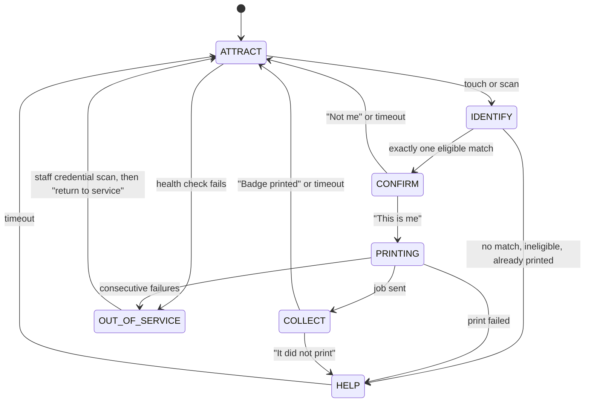

# Kiosk Application

**Status:** WRITTEN · **Audit date:** 2026-09-29 · **Baseline:** `develop` @ `e7228c1d`
**Classification:** New subsystem — one desktop application with a kiosk mode and a desk mode · **Priority:** P2 (ARZ-110, ARZ-111, ARZ-121) · **Phase:** 4
**Depends on:** `19-kiosk-system.md`, `39-printer-integration.md`, `40-device-management.md`, `71-realtime-architecture.md`, `94-mobile-scanner.md`, `81-accessibility.md`
**Blocks:** nothing directly

---

`19` decided what a kiosk does and must never do: self check-in and badge print, no payment, no
judgement, and above all **detect its own failure and take itself out of service**. This document
picks the platform, with `39`'s printer argument in view, and specifies how the application is built,
recovered and released.

## Current state — `MISSING`, 0%

| Fact | Evidence |
|---|---|
| No kiosk mode, attract screen, lockdown or unattended flow | Search; `19` |
| No print host and no printer registry; `badge_print_jobs` has only a free-text `printer_identifier` | Live DB; `39` |
| All printing is `window.print()` | `39` (`PrintProduct/index.tsx:19` and two more) |
| `devices.device_type` is free `varchar` (`KIOSK` is a documented value, not an enum); 0 rows | Live DB; `40` |
| The only keyboard-wedge decoder reads `e.key` and breaks under an Arabic layout (S1) | `CheckIn/index.tsx:429-474` |
| No Arabic locale; RTL never exercised | `lingui.config.ts`; `82` |
| No automated accessibility tests | `81` |

## Decision: Windows, in an Electron application that is also the print host

| | Android (lock task) | iPad (Guided Access / Single App Mode) | **Windows** |
|---|---|---|---|
| Lockdown | Android Enterprise dedicated device — mature | Supervised single-app mode — mature | Assigned Access or Shell Launcher — which edition runs a desktop app as a single-app kiosk is `UNVERIFIED` |
| Printer drivers and SDKs (`39`) | Per-model mobile SDKs, `UNVERIFIED` | Weakest — no USB driver path | **Strongest** — desktop-first (`37`, `39`) |
| Where the print host runs | A second box on the LAN | A second box | **The kiosk itself** |
| Screen → printer path | LAN hop to the host | LAN hop | Localhost |
| Badge raster parity with a Chromium server renderer (`22`) | — | — | Same engine |
| UI code | React Native, shared with `94` | React Native | React DOM — web components, Mantine theme, Lingui catalogs |
| Unit cost, fleet management | Cheapest; MDM mature | High | Higher; Windows Update must be deferred |

**Three reasons decide it.**

1. **The kiosk's defining failure is the unnoticed printer fault** (`19`). Every hop between the
   screen and the printer is a place where a fault stops being visible. On Windows the printer's
   status sits next to the state machine, over USB, with no network involved.
2. **The badge desk needs a print host and a screen anyway.** One application with two modes —
   attended desk and unattended kiosk — is fewer apps than a kiosk app plus a desk app plus a host.
3. **Android or iPad would need a device-to-host LAN protocol that does not exist.** `39`'s only path
   is hosts pulling jobs from the server. An offline tablet cannot reach a host without a new local
   channel, its own authentication and its own failure modes.

**The objection:** a third runtime beside the SSR web app and the React Native staff app. It is not a
new deployable — `37` already made the print host one. Electron is the print host with a screen. The
second objection, Windows fleet management, is real: updates are deferred by MDM and the image is
frozen from staging (`123`). Unit cost is a procurement decision (`102`).

"Native" here means what `30` and `71` meant by it: an installed application with OS-protected keys,
a local encrypted store and hardware access — not a browser tab.

## Stack

| Layer | Choice |
|---|---|
| Main process (Node) | Print host core in TypeScript behind `37`'s interfaces (`BadgePrinter`, `CredentialReader`, `CredentialEncoder`, `HealthReporter`); `arzo-core` sync and decision (`94`) |
| Store | SQLite with SQLCipher — library `UNVERIFIED`, chosen in the K0 spike; key sealed with Electron `safeStorage` (DPAPI on Windows) |
| Renderer | React DOM, Mantine, Lingui; context isolation on, no Node integration; typed IPC to main |
| Identifier input | Fixed 2D presentation imager over USB; keyboard-wedge fallback decoded from `KeyboardEvent.code` (S1) with the OS layout pinned |
| NFC | PC/SC USB reader for UID read and encode at the desk (`36`) — Node bindings `UNVERIFIED` |
| Output | Raster at printer DPI (`39`), rendered offscreen by Chromium from the cached, version-pinned template (`22`) |
| Headless | The same main process runs as a Windows service where a site needs a host without a screen |

This closes three of `37`'s open questions: print host platform (Windows), per desk or per site (per
desk and per kiosk), and language (TypeScript).

## Two modes

| | **Kiosk** (unattended) | **Desk** (attended) |
|---|---|---|
| Identity | Device key only (`19`) | Device key + operator credential scan (`92`) |
| Find the attendee | Scan the QR; or surname **and** booking reference, exact match only | Search name, order reference, email |
| Print | Once. A second request goes to HELP | Print, reprint with reason, void (ARZ-073) |
| Walk-in | Later, cash-free only (ARZ-111) | Yes (`17`) |
| Photo capture | No | Yes (ARZ-074) |
| Printer fault | Takes itself out of service | The operator sees it |

## The kiosk state machine



- **Every state but `OUT_OF_SERVICE` times out to `ATTRACT`**, after a "Need more time?" prompt.
- **Entering `ATTRACT` wipes the session**: the renderer tree remounts under a fresh key and the main
  process drops everything it held for that person. A kiosk that shows the previous user's name is a
  privacy incident (`19`).
- `CONFIRM` shows first name, surname initial and badge type — the person behind is reading the screen.
- `COLLECT` asks "Did your badge print?". The answer is how a kiosk reaches `39`'s `CONFIRMED` when the
  printer cannot report it; "No" counts as a failure.
- A completed check-in writes an `access_logs` row at the kiosk's access point with `source = KIOSK`.
- Surname-plus-reference lookup allows three misses per session, then HELP — the kiosk holds names and
  must not become a directory.

## Self-health and out of service

| Condition | Action |
|---|---|
| Printer not `READY` — paper out, head open, ribbon, offline | `OUT_OF_SERVICE` at once |
| Two consecutive failures, or two "It did not print" answers (a starting value) | `OUT_OF_SERVICE` |
| Supplies below threshold | Stays in service; alert to `53` |
| Imager disconnected | Stays in service with name lookup only; alert |
| Clock skew beyond threshold — validity windows depend on it | `OUT_OF_SERVICE` |
| Storage nearly full | `OUT_OF_SERVICE` |
| Not synced recently | **Stays in service** — offline is normal (`71`); degraded flag to `53` |
| Renderer crash | Watchdog restarts to `ATTRACT`; three in ten minutes → `OUT_OF_SERVICE` |

The out-of-service screen is readable from a distance, in Arabic and English, and names the nearest
working kiosk or the desk. **Recovery needs no keyboard:** a staff member scans their credential
(`operator_role` of `OPERATOR` or above, `92`) and gets a maintenance menu — test print, confirm
refill (resets the counter), acknowledge jam, force sync, restart, return to service. Every action is
logged with the operator.

## Offline store

```
-- SQLite + SQLCipher; key sealed by safeStorage to the machine
roster      identifier_hash, legacy_hash NULL, first_name, last_name,
            booking_reference_hash, accreditation type, status,
            badge field snapshot, collected_at NULL
templates   badge template versions with fonts and images (22)
printers    attached printers (39 registry rows) + counters since last refill
outbox      check-ins, badge rows, print-job reports, health transitions — client_generated_id
-- nothing else: no email, phone, ID document, date of birth, payment, answers
```

## Accessibility

`81` owns the standard; kiosks are where it is sharpest (`19`, R20). Legal obligations for public
self-service terminals in Qatar are `UNVERIFIED` — legal and `81` to answer.

| Requirement | How |
|---|---|
| Reach | A "lower screen" mode moves every control into the lower half; mounting height is hardware (`102`) |
| Contrast in daylight | High-contrast theme; WCAG 2.1 AA contrast as the floor |
| Touch targets | Larger than the web app's; size set with `81` |
| Audio | Spoken steps through Chromium speech synthesis — Arabic voice availability on Windows `UNVERIFIED` — and a headphone jack (hardware) |
| Time | No hard countdowns; "Need more time?" before any reset |
| Language | Arabic and English from the attract screen; RTL (`82`) |
| Way out | "Get help" on every screen, which also notifies the desk |

## Release, telemetry, tests

| Concern | Approach |
|---|---|
| Release | Signed installer (a code-signing certificate — cost `UNVERIFIED`); auto-update from a private feed with `pilot` and `stable` channels; MDM as installer of record; frozen from `BUILD_UP` (`123`); N and N-1 supported |
| Telemetry to `40`/`53` | `40`'s heartbeat with peripherals, plus: kiosk state, sessions per hour, median session time, abandonments by state, HELP exits by cause, consecutive failures, watchdog restarts. Entering `OUT_OF_SERVICE` is a `device_status_events` transition and a High alert in `53` |
| Unit | Adapters against fakes — `37`'s `FakePrinter` that fails on the fifth job; every timeout path; the wipe on `ATTRACT` |
| Parity | `arzo-core` golden vectors (`94`); local-versus-server badge raster diffs, with Arabic names in the fixtures |
| E2E | Renderer flows against a mocked main process; Playwright's Electron support is a candidate, maturity `UNVERIFIED` |
| Hardware and soak | The rig with each procured printer family — paper out, head open, USB unplug, power cycle mid-job (`37`, `128` gate 24); a 12-hour unattended soak before the first public deployment |

## Build order

| Stage | Content | Backlog |
|---|---|---|
| K0 | Print host core with fakes; the procured printer family's adapter; printer registry; store spike | ARZ-121 |
| K1 | Desk mode online: search, print, reprint, void | ARZ-072, ARZ-073 |
| K2 | Offline: store, local raster from cached templates, outbox, parity tests | ARZ-101, ARZ-071 |
| K3 | Kiosk mode: state machine, self-health, out of service, maintenance by credential | ARZ-110 |
| K4 | Accessibility audit; Arabic | R20; `82` |
| K5 | Walk-in, cash-free | ARZ-111 |
| K6 | UID read and encode at the desk | ARZ-122 |

`117`'s rule holds: no kiosk date before the sync prototype passes partition and replay tests.

## Open questions

- **Assigned Access or Shell Launcher**, and on which Windows edition? `UNVERIFIED`; the MDM engineer and `102` answer it before hardware is ordered.
- **One printer per kiosk — confirmed here** (`19`'s question). A shared network printer is fewer printers and one fault silencing several kiosks.
- **Who refills stock and clears jams** (`19`, `106`)? The maintenance flow assumes a roaming staff member. If nobody is assigned, kiosks are not viable.
- **All-in-one touch PC or a tablet PC in an enclosure?** Procurement (`102`), with accessibility (`81`) in the room.
- **Walk-in at the kiosk at all?** `19` recommends check-in first. Walk-in stays cash-free and after K3.

## Related

`19-kiosk-system.md` · `39-printer-integration.md` · `37-hardware-integration.md` ·
`22-badge-design-printing.md` · `40-device-management.md` · `71-realtime-architecture.md` ·
`94-mobile-scanner.md` · `92-staff-platform.md` · `81-accessibility.md` · `82-localization.md` ·
`17-onsite-registration.md` · `53-live-event-command-center.md` · `102-hardware-procurement.md` ·
`103-hardware-deployment.md` · `117-phase-4.md` · `123-release-strategy.md`
